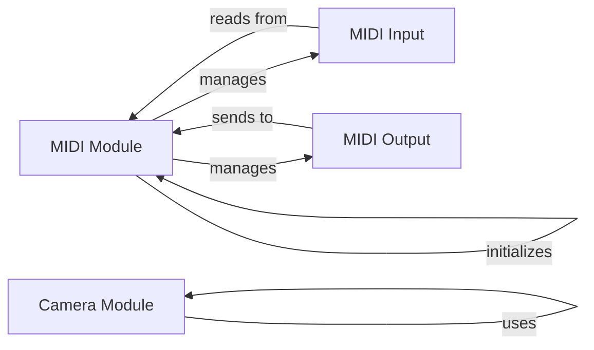

## Component Details

### Camera Module
The Camera Module provides a unified interface for accessing camera devices. It handles initialization, camera listing, and image capture, abstracting away backend-specific details. It relies on platform-specific implementations like OpenCV or VideoCapture.
- **Related Classes/Methods**: `repos.pygame.src_py.camera`, `repos.pygame.src_py._camera_opencv`, `repos.pygame.src_py._camera_vidcapture`

### MIDI Module
The MIDI Module enables interaction with MIDI devices. It provides functionalities for initializing and quitting the MIDI subsystem, querying devices, sending and receiving MIDI messages. It manages the internal state of the MIDI system and provides classes for input and output devices.
- **Related Classes/Methods**: `repos.pygame.src_py.midi`

### MIDI Input
The MIDI Input component represents a MIDI input device. It allows reading MIDI events from a specific device. It handles device opening, closing, polling for events, and reading the event data.
- **Related Classes/Methods**: `repos.pygame.src_py.midi.Input`

### MIDI Output
The MIDI Output component represents a MIDI output device. It allows sending MIDI messages to a specific device. It provides methods for sending various types of MIDI messages, including short messages, system exclusive messages, and note on/off events.
- **Related Classes/Methods**: `repos.pygame.src_py.midi.Output`
