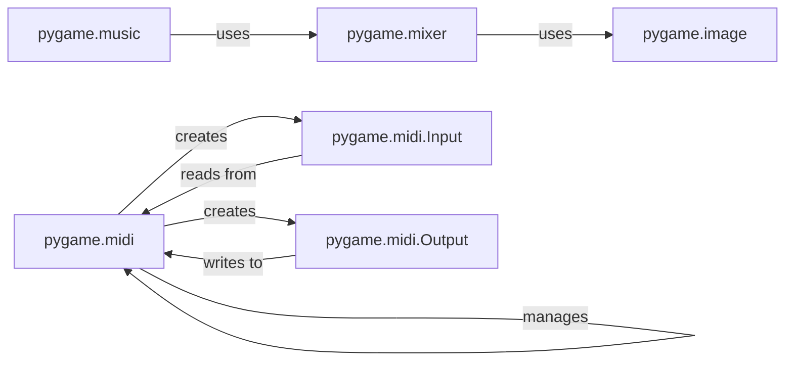

## Component Details

The Multimedia Integration component in Pygame provides functionalities for handling images, sounds, and music, enriching the game experience. It encompasses modules for loading, decoding, and playing multimedia files. The core modules involved are `pygame.image` for image handling, `pygame.mixer` for sound management, `pygame.music` for music streaming, and `pygame.midi` for MIDI support. These modules enable developers to incorporate audio and visual elements into their games, ranging from simple sound effects to complex musical scores and graphical assets.

### pygame.image
This module handles image loading, saving, and manipulation. It allows loading images from various file formats and converting them into Surface objects for display. It also provides functions for basic image transformations.
- **Related Classes/Methods**: `pygame.image`

### pygame.mixer
The mixer module manages sound playback. It allows loading sound files, controlling volume, and playing sounds on different channels. It also supports sound effects and background music.
- **Related Classes/Methods**: `pygame.mixer`

### pygame.music
This module provides streaming music playback. It allows loading and playing music files in various formats. It supports looping, pausing, and resuming music playback.
- **Related Classes/Methods**: `pygame.music`

### pygame.midi
This module provides MIDI (Musical Instrument Digital Interface) support. It allows sending and receiving MIDI messages, enabling interaction with MIDI devices such as keyboards and synthesizers. It includes functionalities for initializing the MIDI system, querying MIDI devices, and creating input and output streams.
- **Related Classes/Methods**: `pygame.src_py.midi`

### pygame.midi.Input
The `Input` class represents a MIDI input stream. It allows users to open a specific MIDI input device and read MIDI events from it.
- **Related Classes/Methods**: `pygame.src_py.midi.Input`

### pygame.midi.Output
The `Output` class represents a MIDI output stream. It allows users to open a specific MIDI output device and send MIDI messages to it.
- **Related Classes/Methods**: `pygame.src_py.midi.Output`
