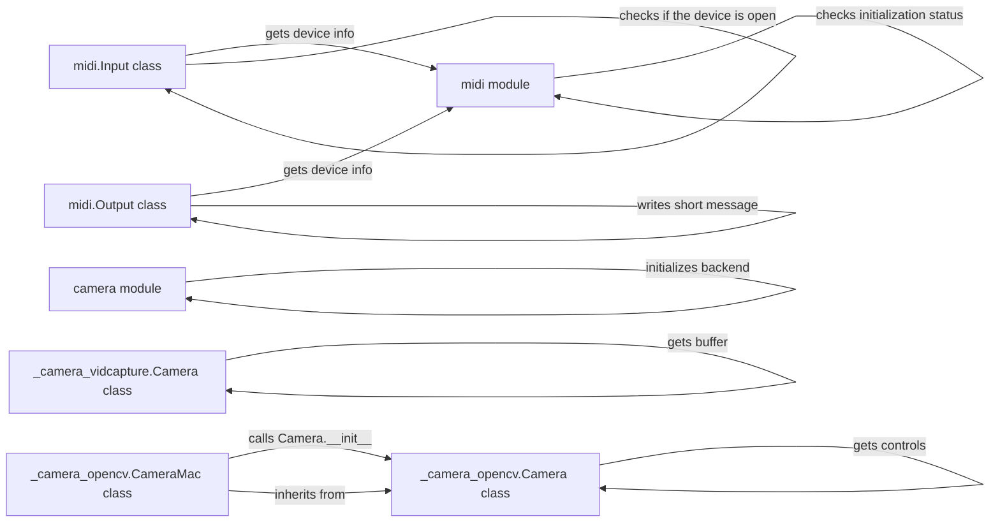

## Component Details

The Multimedia Interface component in Pygame provides the necessary tools for integrating camera and MIDI functionalities into Pygame applications. It offers platform-specific camera implementations using OpenCV and VideoCapture, along with a comprehensive MIDI interface for device interaction and message handling. This allows developers to capture video, control MIDI devices, and create interactive multimedia experiences within their Pygame projects.

### midi module
The midi module serves as the entry point for MIDI functionality in Pygame. It handles the initialization and quitting of the MIDI system, provides functions for querying available MIDI devices, and offers access to default input and output devices. It also includes utility functions for checking the initialization status and retrieving the current time.

**Related Classes/Methods**:

- <a href="https://github.com/pygame/pygame/blob/master/src_py/midi.py#L74-L85" target="_blank" rel="noopener noreferrer">`src_py.midi:init` (74:85)</a>
- <a href="https://github.com/pygame/pygame/blob/master/src_py/midi.py#L88-L100" target="_blank" rel="noopener noreferrer">`src_py.midi:quit` (88:100)</a>
- <a href="https://github.com/pygame/pygame/blob/master/src_py/midi.py#L103-L111" target="_blank" rel="noopener noreferrer">`src_py.midi:get_init` (103:111)</a>
- <a href="https://github.com/pygame/pygame/blob/master/src_py/midi.py#L114-L116" target="_blank" rel="noopener noreferrer">`src_py.midi:_check_init` (114:116)</a>
- <a href="https://github.com/pygame/pygame/blob/master/src_py/midi.py#L119-L127" target="_blank" rel="noopener noreferrer">`src_py.midi:get_count` (119:127)</a>
- <a href="https://github.com/pygame/pygame/blob/master/src_py/midi.py#L130-L177" target="_blank" rel="noopener noreferrer">`src_py.midi:get_default_input_id` (130:177)</a>
- <a href="https://github.com/pygame/pygame/blob/master/src_py/midi.py#L180-L227" target="_blank" rel="noopener noreferrer">`src_py.midi:get_default_output_id` (180:227)</a>
- <a href="https://github.com/pygame/pygame/blob/master/src_py/midi.py#L230-L245" target="_blank" rel="noopener noreferrer">`src_py.midi:get_device_info` (230:245)</a>
- <a href="https://github.com/pygame/pygame/blob/master/src_py/midi.py#L622-L629" target="_blank" rel="noopener noreferrer">`src_py.midi:time` (622:629)</a>
- <a href="https://github.com/pygame/pygame/blob/master/src_py/midi.py#L60-L71" target="_blank" rel="noopener noreferrer">`src_py.midi._module_init` (60:71)</a>

### midi.Input class
The midi.Input class represents a MIDI input device. It provides methods for opening and closing the device, reading incoming MIDI events, and polling for new events. It interacts with the underlying MIDI system to receive MIDI data from the connected device.

**Related Classes/Methods**:

- <a href="https://github.com/pygame/pygame/blob/master/src_py/midi.py#L257-L296" target="_blank" rel="noopener noreferrer">`src_py.midi.Input:__init__` (257:296)</a>
- <a href="https://github.com/pygame/pygame/blob/master/src_py/midi.py#L298-L300" target="_blank" rel="noopener noreferrer">`src_py.midi.Input:_check_open` (298:300)</a>
- <a href="https://github.com/pygame/pygame/blob/master/src_py/midi.py#L302-L312" target="_blank" rel="noopener noreferrer">`src_py.midi.Input:close` (302:312)</a>
- <a href="https://github.com/pygame/pygame/blob/master/src_py/midi.py#L314-L324" target="_blank" rel="noopener noreferrer">`src_py.midi.Input:read` (314:324)</a>
- <a href="https://github.com/pygame/pygame/blob/master/src_py/midi.py#L326-L343" target="_blank" rel="noopener noreferrer">`src_py.midi.Input:poll` (326:343)</a>
- <a href="https://github.com/pygame/pygame/blob/master/src_py/midi.py#L230-L245" target="_blank" rel="noopener noreferrer">`src_py.midi.get_device_info` (230:245)</a>

### midi.Output class
The midi.Output class represents a MIDI output device. It allows opening and closing the device, sending MIDI messages, and controlling various aspects of MIDI output, such as note on/off events, instrument selection, and pitch bending. It interacts with the underlying MIDI system to transmit MIDI data to the connected device.

**Related Classes/Methods**:

- <a href="https://github.com/pygame/pygame/blob/master/src_py/midi.py#L374-L435" target="_blank" rel="noopener noreferrer">`src_py.midi.Output:__init__` (374:435)</a>
- <a href="https://github.com/pygame/pygame/blob/master/src_py/midi.py#L437-L442" target="_blank" rel="noopener noreferrer">`src_py.midi.Output:_check_open` (437:442)</a>
- <a href="https://github.com/pygame/pygame/blob/master/src_py/midi.py#L444-L454" target="_blank" rel="noopener noreferrer">`src_py.midi.Output:close` (444:454)</a>
- <a href="https://github.com/pygame/pygame/blob/master/src_py/midi.py#L456-L470" target="_blank" rel="noopener noreferrer">`src_py.midi.Output:abort` (456:470)</a>
- <a href="https://github.com/pygame/pygame/blob/master/src_py/midi.py#L472-L497" target="_blank" rel="noopener noreferrer">`src_py.midi.Output:write` (472:497)</a>
- <a href="https://github.com/pygame/pygame/blob/master/src_py/midi.py#L499-L516" target="_blank" rel="noopener noreferrer">`src_py.midi.Output:write_short` (499:516)</a>
- <a href="https://github.com/pygame/pygame/blob/master/src_py/midi.py#L518-L533" target="_blank" rel="noopener noreferrer">`src_py.midi.Output:write_sys_ex` (518:533)</a>
- <a href="https://github.com/pygame/pygame/blob/master/src_py/midi.py#L535-L549" target="_blank" rel="noopener noreferrer">`src_py.midi.Output:note_on` (535:549)</a>
- <a href="https://github.com/pygame/pygame/blob/master/src_py/midi.py#L551-L565" target="_blank" rel="noopener noreferrer">`src_py.midi.Output:note_off` (551:565)</a>
- <a href="https://github.com/pygame/pygame/blob/master/src_py/midi.py#L567-L579" target="_blank" rel="noopener noreferrer">`src_py.midi.Output:set_instrument` (567:579)</a>
- <a href="https://github.com/pygame/pygame/blob/master/src_py/midi.py#L581-L607" target="_blank" rel="noopener noreferrer">`src_py.midi.Output:pitch_bend` (581:607)</a>
- <a href="https://github.com/pygame/pygame/blob/master/src_py/midi.py#L230-L245" target="_blank" rel="noopener noreferrer">`src_py.midi.get_device_info` (230:245)</a>

### camera module
The camera module serves as the main interface for camera functionality. It provides functions for initializing the camera system and setting up the appropriate backend based on available libraries (e.g., OpenCV, VideoCapture). It also allows querying the available camera backends.

**Related Classes/Methods**:

- <a href="https://github.com/pygame/pygame/blob/master/src_py/camera.py#L172-L201" target="_blank" rel="noopener noreferrer">`src_py.camera:init` (172:201)</a>
- <a href="https://github.com/pygame/pygame/blob/master/src_py/camera.py#L125-L169" target="_blank" rel="noopener noreferrer">`src_py.camera:get_backends` (125:169)</a>
- <a href="https://github.com/pygame/pygame/blob/master/src_py/camera.py#L87-L122" target="_blank" rel="noopener noreferrer">`src_py.camera:_setup_backend` (87:122)</a>

### _camera_opencv.Camera class
The _camera_opencv.Camera class implements the camera interface using the OpenCV library. It provides methods for getting and setting camera properties (e.g., size, controls), querying images from the camera, and retrieving the image data as a Pygame surface or raw buffer. It interacts directly with OpenCV to capture and process camera frames.

**Related Classes/Methods**:

- <a href="https://github.com/pygame/pygame/blob/master/src_py/_camera_opencv.py#L126-L129" target="_blank" rel="noopener noreferrer">`src_py._camera_opencv.Camera:get_size` (126:129)</a>
- <a href="https://github.com/pygame/pygame/blob/master/src_py/_camera_opencv.py#L131-L141" target="_blank" rel="noopener noreferrer">`src_py._camera_opencv.Camera:set_controls` (131:141)</a>
- <a href="https://github.com/pygame/pygame/blob/master/src_py/_camera_opencv.py#L143-L146" target="_blank" rel="noopener noreferrer">`src_py._camera_opencv.Camera:get_controls` (143:146)</a>
- <a href="https://github.com/pygame/pygame/blob/master/src_py/_camera_opencv.py#L148-L154" target="_blank" rel="noopener noreferrer">`src_py._camera_opencv.Camera:query_image` (148:154)</a>
- <a href="https://github.com/pygame/pygame/blob/master/src_py/_camera_opencv.py#L156-L186" target="_blank" rel="noopener noreferrer">`src_py._camera_opencv.Camera:get_image` (156:186)</a>
- <a href="https://github.com/pygame/pygame/blob/master/src_py/_camera_opencv.py#L188-L195" target="_blank" rel="noopener noreferrer">`src_py._camera_opencv.Camera:get_raw` (188:195)</a>
- <a href="https://github.com/pygame/pygame/blob/master/src_py/_camera_opencv.py#L122-L124" target="_blank" rel="noopener noreferrer">`src_py._camera_opencv.Camera._check_open` (122:124)</a>
- <a href="https://github.com/pygame/pygame/blob/master/src_py/_camera_opencv.py#L63-L86" target="_blank" rel="noopener noreferrer">`src_py._camera_opencv.Camera.__init__` (63:86)</a>

### _camera_opencv.CameraMac class
The _camera_opencv.CameraMac class is a subclass of _camera_opencv.Camera specifically for macOS. It handles macOS-specific initialization of the camera using OpenCV.

**Related Classes/Methods**:

- <a href="https://github.com/pygame/pygame/blob/master/src_py/_camera_opencv.py#L199-L210" target="_blank" rel="noopener noreferrer">`src_py._camera_opencv.CameraMac:__init__` (199:210)</a>

### _camera_vidcapture.Camera class
The _camera_vidcapture.Camera class implements the camera interface using a generic video capture library. It provides methods for retrieving images from the camera as Pygame surfaces or raw buffers. This class offers a more general approach to camera access, potentially supporting a wider range of camera devices.

**Related Classes/Methods**:

- <a href="https://github.com/pygame/pygame/blob/master/src_py/_camera_vidcapture.py#L94-L96" target="_blank" rel="noopener noreferrer">`src_py._camera_vidcapture.Camera:get_image` (94:96)</a>
- <a href="https://github.com/pygame/pygame/blob/master/src_py/_camera_vidcapture.py#L98-L110" target="_blank" rel="noopener noreferrer">`src_py._camera_vidcapture.Camera:get_surface` (98:110)</a>
- <a href="https://github.com/pygame/pygame/blob/master/src_py/_camera_vidcapture.py#L81-L83" target="_blank" rel="noopener noreferrer">`src_py._camera_vidcapture.Camera:get_buffer` (81:83)</a>