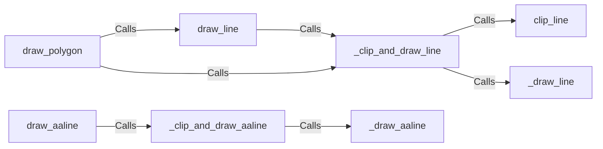

## Component Details

The Rendering Engine in Pygame is responsible for drawing various shapes and lines onto a Surface. The process typically involves clipping the shape or line to the Surface's boundaries, and then drawing the visible portion. Different functions handle different types of shapes and lines, including regular lines, anti-aliased lines, and polygons. The engine provides both high-level functions for ease of use and low-level functions for performance when clipping is already handled.

### draw_line
Draws a straight line on the Surface. It handles clipping and delegates to internal functions for the actual drawing.
- **Related Classes/Methods**: `pygame.src_py.draw_py:draw_line`

### _draw_line
The low-level function that actually draws the line. It assumes that clipping has already been handled.
- **Related Classes/Methods**: `pygame.src_py.draw_py:_draw_line`

### clip_line
Clips a line to a rectangle. Returns a tuple of the clipped line's start and end points, or None if the line is completely outside the rectangle.
- **Related Classes/Methods**: `pygame.src_py.draw_py:clip_line`

### _clip_and_draw_line
Clips the line and then draws it. Combines clipping and drawing for efficiency.
- **Related Classes/Methods**: `pygame.src_py.draw_py:_clip_and_draw_line`

### draw_aaline
Draws an anti-aliased line on the Surface. It handles clipping and delegates to internal functions for the actual drawing.
- **Related Classes/Methods**: `pygame.src_py.draw_py:draw_aaline`

### _draw_aaline
The low-level function that actually draws the anti-aliased line. It assumes that clipping has already been handled.
- **Related Classes/Methods**: `pygame.src_py.draw_py:_draw_aaline`

### _clip_and_draw_aaline
Clips the anti-aliased line and then draws it. Combines clipping and drawing for efficiency.
- **Related Classes/Methods**: `pygame.src_py.draw_py:_clip_and_draw_aaline`

### draw_polygon
Draws a polygon on the Surface. It uses line drawing functions to draw the edges of the polygon.
- **Related Classes/Methods**: `pygame.src_py.draw_py:draw_polygon`
