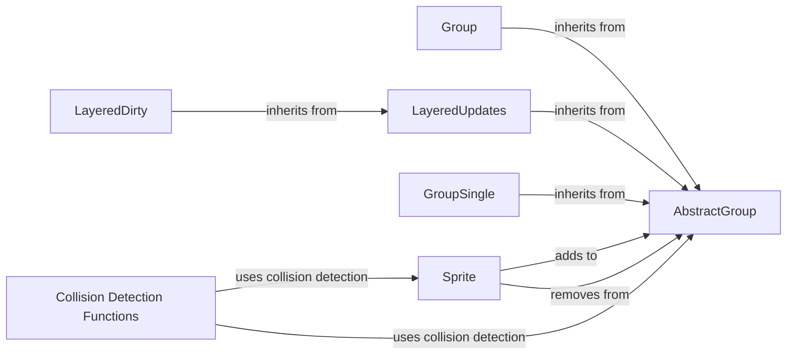

## Component Details

The Sprite and Object Manager component provides a set of classes for managing game objects (Sprites) and their interactions within a game. It offers functionalities for grouping sprites, handling layering, and optimizing rendering. The core of this component revolves around the `Sprite` class, which serves as the base for all visible game objects, and various `AbstractGroup` implementations that manage collections of sprites. Collision detection functions are also included to facilitate interactions between sprites.

### Sprite
The Sprite class is the fundamental building block for visible game objects. It encapsulates the sprite's image, position, and rectangular area, and provides methods for adding and removing the Sprite from Groups. It also manages the Sprite's Groups.

**Related Classes/Methods**:

- <a href="https://github.com/pygame/pygame/blob/master/src_py/sprite.py#L99-L248" target="_blank" rel="noopener noreferrer">`src_py.sprite.Sprite` (99:248)</a>
- <a href="https://github.com/pygame/pygame/blob/master/src_py/sprite.py#L114-L117" target="_blank" rel="noopener noreferrer">`src_py.sprite.Sprite.__init__` (114:117)</a>
- <a href="https://github.com/pygame/pygame/blob/master/src_py/sprite.py#L119-L135" target="_blank" rel="noopener noreferrer">`src_py.sprite.Sprite.add` (119:135)</a>
- <a href="https://github.com/pygame/pygame/blob/master/src_py/sprite.py#L137-L153" target="_blank" rel="noopener noreferrer">`src_py.sprite.Sprite.remove` (137:153)</a>
- <a href="https://github.com/pygame/pygame/blob/master/src_py/sprite.py#L185-L198" target="_blank" rel="noopener noreferrer">`src_py.sprite.Sprite.kill` (185:198)</a>
- <a href="https://github.com/pygame/pygame/blob/master/src_py/sprite.py#L210-L217" target="_blank" rel="noopener noreferrer">`src_py.sprite.Sprite.alive` (210:217)</a>
- <a href="https://github.com/pygame/pygame/blob/master/src_py/sprite.py#L200-L208" target="_blank" rel="noopener noreferrer">`src_py.sprite.Sprite.groups` (200:208)</a>
- <a href="https://github.com/pygame/pygame/blob/master/src_py/sprite.py#L171-L183" target="_blank" rel="noopener noreferrer">`src_py.sprite.Sprite.update` (171:183)</a>
- <a href="https://github.com/pygame/pygame/blob/master/src_py/sprite.py#L198-L201" target="_blank" rel="noopener noreferrer">`src_py.sprite.Sprite.dirty` (198:201)</a>
- <a href="https://github.com/pygame/pygame/blob/master/src_py/sprite.py#L209-L212" target="_blank" rel="noopener noreferrer">`src_py.sprite.Sprite.get_layer` (209:212)</a>
- <a href="https://github.com/pygame/pygame/blob/master/src_py/sprite.py#L220-L223" target="_blank" rel="noopener noreferrer">`src_py.sprite.Sprite.change_layer` (220:223)</a>
- <a href="https://github.com/pygame/pygame/blob/master/src_py/sprite.py#L223-L236" target="_blank" rel="noopener noreferrer">`src_py.sprite.Sprite.layer` (223:236)</a>

### AbstractGroup
The AbstractGroup class serves as a base class for different group implementations. It manages a collection of Sprite objects and provides methods for adding, removing, iterating over, and performing actions on the Sprites within the Group. Concrete group implementations inherit from this class.

**Related Classes/Methods**:

- <a href="https://github.com/pygame/pygame/blob/master/src_py/sprite.py#L363-L639" target="_blank" rel="noopener noreferrer">`src_py.sprite.AbstractGroup` (363:639)</a>
- <a href="https://github.com/pygame/pygame/blob/master/src_py/sprite.py#L427-L438" target="_blank" rel="noopener noreferrer">`src_py.sprite.AbstractGroup.copy` (427:438)</a>
- <a href="https://github.com/pygame/pygame/blob/master/src_py/sprite.py#L440-L441" target="_blank" rel="noopener noreferrer">`src_py.sprite.AbstractGroup.__iter__` (440:441)</a>
- <a href="https://github.com/pygame/pygame/blob/master/src_py/sprite.py#L443-L444" target="_blank" rel="noopener noreferrer">`src_py.sprite.AbstractGroup.__contains__` (443:444)</a>
- <a href="https://github.com/pygame/pygame/blob/master/src_py/sprite.py#L446-L479" target="_blank" rel="noopener noreferrer">`src_py.sprite.AbstractGroup.add` (446:479)</a>
- <a href="https://github.com/pygame/pygame/blob/master/src_py/sprite.py#L481-L511" target="_blank" rel="noopener noreferrer">`src_py.sprite.AbstractGroup.remove` (481:511)</a>
- <a href="https://github.com/pygame/pygame/blob/master/src_py/sprite.py#L513-L544" target="_blank" rel="noopener noreferrer">`src_py.sprite.AbstractGroup.has` (513:544)</a>
- <a href="https://github.com/pygame/pygame/blob/master/src_py/sprite.py#L546-L556" target="_blank" rel="noopener noreferrer">`src_py.sprite.AbstractGroup.update` (546:556)</a>
- <a href="https://github.com/pygame/pygame/blob/master/src_py/sprite.py#L558-L586" target="_blank" rel="noopener noreferrer">`src_py.sprite.AbstractGroup.draw` (558:586)</a>
- <a href="https://github.com/pygame/pygame/blob/master/src_py/sprite.py#L613-L623" target="_blank" rel="noopener noreferrer">`src_py.sprite.AbstractGroup.empty` (613:623)</a>
- <a href="https://github.com/pygame/pygame/blob/master/src_py/sprite.py#L625-L626" target="_blank" rel="noopener noreferrer">`src_py.sprite.AbstractGroup.__bool__` (625:626)</a>
- <a href="https://github.com/pygame/pygame/blob/master/src_py/sprite.py#L628-L636" target="_blank" rel="noopener noreferrer">`src_py.sprite.AbstractGroup.__len__` (628:636)</a>
- <a href="https://github.com/pygame/pygame/blob/master/src_py/sprite.py#L395-L406" target="_blank" rel="noopener noreferrer">`src_py.sprite.AbstractGroup.add_internal` (395:406)</a>
- <a href="https://github.com/pygame/pygame/blob/master/src_py/sprite.py#L408-L417" target="_blank" rel="noopener noreferrer">`src_py.sprite.AbstractGroup.remove_internal` (408:417)</a>
- <a href="https://github.com/pygame/pygame/blob/master/src_py/sprite.py#L462-L479" target="_blank" rel="noopener noreferrer">`src_py.sprite.AbstractGroup._clear` (462:479)</a>

### Group
The Group class is a concrete implementation of AbstractGroup. It stores the Sprites in a simple list, providing basic group management functionality.

**Related Classes/Methods**:

- <a href="https://github.com/pygame/pygame/blob/master/src_py/sprite.py#L642-L664" target="_blank" rel="noopener noreferrer">`src_py.sprite.Group` (642:664)</a>
- <a href="https://github.com/pygame/pygame/blob/master/src_py/sprite.py#L662-L664" target="_blank" rel="noopener noreferrer">`src_py.sprite.Group.__init__` (662:664)</a>

### LayeredUpdates
The LayeredUpdates class is a type of Group that manages Sprites in different layers, allowing control over the rendering order. This is useful for creating visual effects where some sprites appear in front of or behind others.

**Related Classes/Methods**:

- <a href="https://github.com/pygame/pygame/blob/master/src_py/sprite.py#L729-L1059" target="_blank" rel="noopener noreferrer">`src_py.sprite.LayeredUpdates` (729:1059)</a>
- <a href="https://github.com/pygame/pygame/blob/master/src_py/sprite.py#L741-L759" target="_blank" rel="noopener noreferrer">`src_py.sprite.LayeredUpdates.__init__` (741:759)</a>
- <a href="https://github.com/pygame/pygame/blob/master/src_py/sprite.py#L798-L839" target="_blank" rel="noopener noreferrer">`src_py.sprite.LayeredUpdates.add` (798:839)</a>
- <a href="https://github.com/pygame/pygame/blob/master/src_py/sprite.py#L577-L586" target="_blank" rel="noopener noreferrer">`src_py.sprite.LayeredUpdates.remove` (577:586)</a>
- <a href="https://github.com/pygame/pygame/blob/master/src_py/sprite.py#L866-L890" target="_blank" rel="noopener noreferrer">`src_py.sprite.LayeredUpdates.draw` (866:890)</a>
- <a href="https://github.com/pygame/pygame/blob/master/src_py/sprite.py#L1025-L1045" target="_blank" rel="noopener noreferrer">`src_py.sprite.LayeredUpdates.get_sprites_from_layer` (1025:1045)</a>
- <a href="https://github.com/pygame/pygame/blob/master/src_py/sprite.py#L915-L923" target="_blank" rel="noopener noreferrer">`src_py.sprite.LayeredUpdates.remove_sprites_of_layer` (915:923)</a>
- <a href="https://github.com/pygame/pygame/blob/master/src_py/sprite.py#L994-L1004" target="_blank" rel="noopener noreferrer">`src_py.sprite.LayeredUpdates.move_to_front` (994:1004)</a>
- <a href="https://github.com/pygame/pygame/blob/master/src_py/sprite.py#L1006-L1015" target="_blank" rel="noopener noreferrer">`src_py.sprite.LayeredUpdates.move_to_back` (1006:1015)</a>
- <a href="https://github.com/pygame/pygame/blob/master/src_py/sprite.py#L970-L976" target="_blank" rel="noopener noreferrer">`src_py.sprite.LayeredUpdates.get_layer_of_sprite` (970:976)</a>
- <a href="https://github.com/pygame/pygame/blob/master/src_py/sprite.py#L1047-L1059" target="_blank" rel="noopener noreferrer">`src_py.sprite.LayeredUpdates.switch_layer` (1047:1059)</a>

### LayeredDirty
The LayeredDirty class extends LayeredUpdates and tracks dirty areas for optimized rendering of layered sprites. It combines layering with dirty rectangle management to minimize the amount of screen that needs to be redrawn, improving performance.

**Related Classes/Methods**:

- <a href="https://github.com/pygame/pygame/blob/master/src_py/sprite.py#L1062-L1397" target="_blank" rel="noopener noreferrer">`src_py.sprite.LayeredDirty` (1062:1397)</a>
- <a href="https://github.com/pygame/pygame/blob/master/src_py/sprite.py#L1089-L1115" target="_blank" rel="noopener noreferrer">`src_py.sprite.LayeredDirty.__init__` (1089:1115)</a>
- <a href="https://github.com/pygame/pygame/blob/master/src_py/sprite.py#L684-L693" target="_blank" rel="noopener noreferrer">`src_py.sprite.LayeredDirty.add` (684:693)</a>
- <a href="https://github.com/pygame/pygame/blob/master/src_py/sprite.py#L697-L706" target="_blank" rel="noopener noreferrer">`src_py.sprite.LayeredDirty.remove` (697:706)</a>
- <a href="https://github.com/pygame/pygame/blob/master/src_py/sprite.py#L1139-L1229" target="_blank" rel="noopener noreferrer">`src_py.sprite.LayeredDirty.draw` (1139:1229)</a>
- <a href="https://github.com/pygame/pygame/blob/master/src_py/sprite.py#L1347-L1358" target="_blank" rel="noopener noreferrer">`src_py.sprite.LayeredDirty.change_layer` (1347:1358)</a>
- <a href="https://github.com/pygame/pygame/blob/master/src_py/sprite.py#L1360-L1377" target="_blank" rel="noopener noreferrer">`src_py.sprite.LayeredDirty.set_timing_treshold` (1360:1377)</a>
- <a href="https://github.com/pygame/pygame/blob/master/src_py/sprite.py#L746-L749" target="_blank" rel="noopener noreferrer">`src_py.sprite.LayeredDirty.get_layer` (746:749)</a>
- <a href="https://github.com/pygame/pygame/blob/master/src_py/sprite.py#L753-L756" target="_blank" rel="noopener noreferrer">`src_py.sprite.LayeredDirty.get_dirty` (753:756)</a>
- <a href="https://github.com/pygame/pygame/blob/master/src_py/sprite.py#L1314-L1325" target="_blank" rel="noopener noreferrer">`src_py.sprite.LayeredDirty.repaint_rect` (1314:1325)</a>
- <a href="https://github.com/pygame/pygame/blob/master/src_py/sprite.py#L1306-L1312" target="_blank" rel="noopener noreferrer">`src_py.sprite.LayeredDirty.clear` (1306:1312)</a>
- <a href="https://github.com/pygame/pygame/blob/master/src_py/sprite.py#L1327-L1337" target="_blank" rel="noopener noreferrer">`src_py.sprite.LayeredDirty.set_clip` (1327:1337)</a>

### GroupSingle
The GroupSingle class is a specialized Group that can only contain a single Sprite. It is useful for representing objects that are unique or have a one-to-one relationship with another object.

**Related Classes/Methods**:

- <a href="https://github.com/pygame/pygame/blob/master/src_py/sprite.py#L1400-L1467" target="_blank" rel="noopener noreferrer">`src_py.sprite.GroupSingle` (1400:1467)</a>
- <a href="https://github.com/pygame/pygame/blob/master/src_py/sprite.py#L1412-L1416" target="_blank" rel="noopener noreferrer">`src_py.sprite.GroupSingle.__init__` (1412:1416)</a>
- <a href="https://github.com/pygame/pygame/blob/master/src_py/sprite.py#L1418-L1419" target="_blank" rel="noopener noreferrer">`src_py.sprite.GroupSingle.copy` (1418:1419)</a>
- <a href="https://github.com/pygame/pygame/blob/master/src_py/sprite.py#L1426-L1430" target="_blank" rel="noopener noreferrer">`src_py.sprite.GroupSingle.add_internal` (1426:1430)</a>
- <a href="https://github.com/pygame/pygame/blob/master/src_py/sprite.py#L1438-L1441" target="_blank" rel="noopener noreferrer">`src_py.sprite.GroupSingle._set_sprite` (1438:1441)</a>
- <a href="https://github.com/pygame/pygame/blob/master/src_py/sprite.py#L1444-L1450" target="_blank" rel="noopener noreferrer">`src_py.sprite.GroupSingle.sprite` (1444:1450)</a>
- <a href="https://github.com/pygame/pygame/blob/master/src_py/sprite.py#L1456-L1460" target="_blank" rel="noopener noreferrer">`src_py.sprite.GroupSingle.remove_internal` (1456:1460)</a>

### Collision Detection Functions
The sprite module provides functions for detecting collisions between sprites and groups. These functions allow for determining if two sprites are overlapping, or if any sprite in a group is colliding with another sprite or group.

**Related Classes/Methods**:

- <a href="https://github.com/pygame/pygame/blob/master/src_py/sprite.py#L1692-L1741" target="_blank" rel="noopener noreferrer">`src_py.sprite.spritecollide` (1692:1741)</a>
- <a href="https://github.com/pygame/pygame/blob/master/src_py/sprite.py#L1780-L1813" target="_blank" rel="noopener noreferrer">`src_py.sprite.spritecollideany` (1780:1813)</a>
- <a href="https://github.com/pygame/pygame/blob/master/src_py/sprite.py#L1744-L1777" target="_blank" rel="noopener noreferrer">`src_py.sprite.groupcollide` (1744:1777)</a>