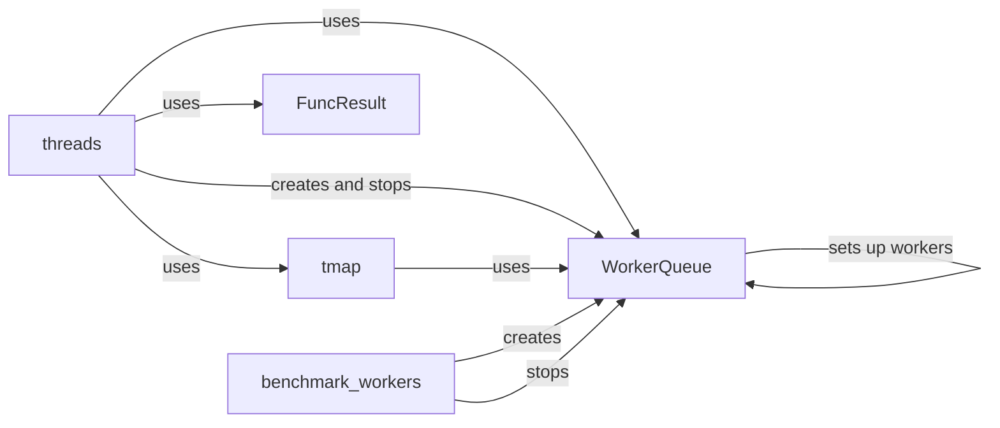

## Component Details

The `threads` module provides utilities for parallel processing using threads. It includes a `WorkerQueue` class for managing a pool of worker threads and a `tmap` function for applying a function to a sequence in parallel. The `FuncResult` class is used to store the result of a function call, including any exceptions. The `benchmark_workers` function helps determine the optimal number of worker threads for a given task.

### threads
The `threads` module serves as a container for the threading utilities, providing a central location for accessing the `WorkerQueue`, `tmap`, `FuncResult`, and `benchmark_workers` components.

**Related Classes/Methods**:

- <a href="https://github.com/pygame/pygame/blob/master/src_py/threads/__init__.py#L0-L114" target="_blank" rel="noopener noreferrer">`src_py.threads.__init__` (0:114)</a>

### WorkerQueue
The `WorkerQueue` class manages a pool of worker threads, distributing tasks among them for parallel execution. It uses a queue to hold tasks and provides methods for adding tasks, waiting for completion, and stopping the workers. It initializes worker threads upon creation and manages their lifecycle.

**Related Classes/Methods**:

- <a href="https://github.com/pygame/pygame/blob/master/src_py/threads/__init__.py#L127-L173" target="_blank" rel="noopener noreferrer">`src_py.threads.__init__.WorkerQueue` (127:173)</a>
- <a href="https://github.com/pygame/pygame/blob/master/src_py/threads/__init__.py#L128-L131" target="_blank" rel="noopener noreferrer">`src_py.threads.__init__.WorkerQueue.__init__` (128:131)</a>
- <a href="https://github.com/pygame/pygame/blob/master/src_py/threads/__init__.py#L133-L144" target="_blank" rel="noopener noreferrer">`src_py.threads.__init__.WorkerQueue._setup_workers` (133:144)</a>
- <a href="https://github.com/pygame/pygame/blob/master/src_py/threads/__init__.py#L150-L154" target="_blank" rel="noopener noreferrer">`src_py.threads.__init__.WorkerQueue.stop` (150:154)</a>

### tmap
The `tmap` function provides a simple interface for parallelizing the application of a function to a sequence of elements. It leverages the `WorkerQueue` to distribute the work across multiple threads, returning a list of the results. It handles the submission of tasks to the queue and retrieves the results.

**Related Classes/Methods**:

- <a href="https://github.com/pygame/pygame/blob/master/src_py/threads/__init__.py#L205-L271" target="_blank" rel="noopener noreferrer">`src_py.threads.__init__.tmap` (205:271)</a>

### FuncResult
The `FuncResult` class is a data structure for encapsulating the result of a function call, including any exception that may have occurred during execution. It allows the `tmap` function to capture and propagate exceptions from worker threads.

**Related Classes/Methods**:

- <a href="https://github.com/pygame/pygame/blob/master/src_py/threads/__init__.py#L176-L202" target="_blank" rel="noopener noreferrer">`src_py.threads.__init__.FuncResult` (176:202)</a>

### benchmark_workers
The `benchmark_workers` function is designed to determine the optimal number of worker threads for a given task by measuring the performance of different `WorkerQueue` configurations. It creates and stops `WorkerQueue` instances with varying numbers of workers to assess their impact on performance.

**Related Classes/Methods**:

- <a href="https://github.com/pygame/pygame/blob/master/src_py/threads/__init__.py#L64-L124" target="_blank" rel="noopener noreferrer">`src_py.threads.__init__.benchmark_workers` (64:124)</a>