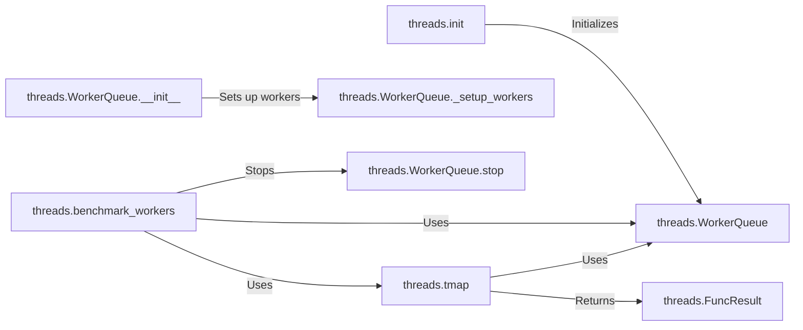

## Component Details

### threads.init
Initializes the threads module, setting up worker queues and benchmarking workers. It determines the number of worker threads to use based on the available CPU cores and initializes the worker queue. It also handles benchmarking to optimize the number of threads.
- **Related Classes/Methods**: `repos.pygame.src_py.threads:init`

### threads.benchmark_workers
Benchmarks the performance of worker threads to determine the optimal number of threads to use. It measures the execution time of tasks with different numbers of threads and selects the configuration that provides the best performance. It can also stop the worker queue if benchmarking is disabled.
- **Related Classes/Methods**: `repos.pygame.src_py.threads:benchmark_workers`

### threads.WorkerQueue
Manages a queue of worker threads for parallel processing. It provides methods for adding tasks to the queue, starting and stopping the worker threads, and waiting for all tasks to complete. The WorkerQueue distributes tasks to available worker threads and collects the results.
- **Related Classes/Methods**: `repos.pygame.src_py.threads.WorkerQueue`

### threads.WorkerQueue.__init__
Initializes the WorkerQueue, setting up the worker threads. It creates a specified number of worker threads and starts them. The constructor also sets up necessary synchronization primitives.
- **Related Classes/Methods**: `repos.pygame.src_py.threads.WorkerQueue.__init__`

### threads.WorkerQueue._setup_workers
Sets up the worker threads within the WorkerQueue. This involves creating and starting the threads. Each worker thread is assigned a target function to execute tasks from the queue.
- **Related Classes/Methods**: `repos.pygame.src_py.threads.WorkerQueue._setup_workers`

### threads.WorkerQueue.stop
Stops the worker threads in the WorkerQueue. It signals the threads to exit and waits for them to terminate. This ensures that all worker threads are properly shut down before the program exits.
- **Related Classes/Methods**: `repos.pygame.src_py.threads.WorkerQueue.stop`

### threads.tmap
Applies a function to a sequence of values using worker threads. It distributes the work across the available threads and collects the results. This function enables parallel execution of the given function on the input sequence.
- **Related Classes/Methods**: `repos.pygame.src_py.threads:tmap`

### threads.FuncResult
Represents the result of a function executed by a worker thread. It stores the result value and any exception that occurred during execution. This class is used to encapsulate the outcome of a task executed by a worker thread.
- **Related Classes/Methods**: `repos.pygame.src_py.threads.FuncResult`
