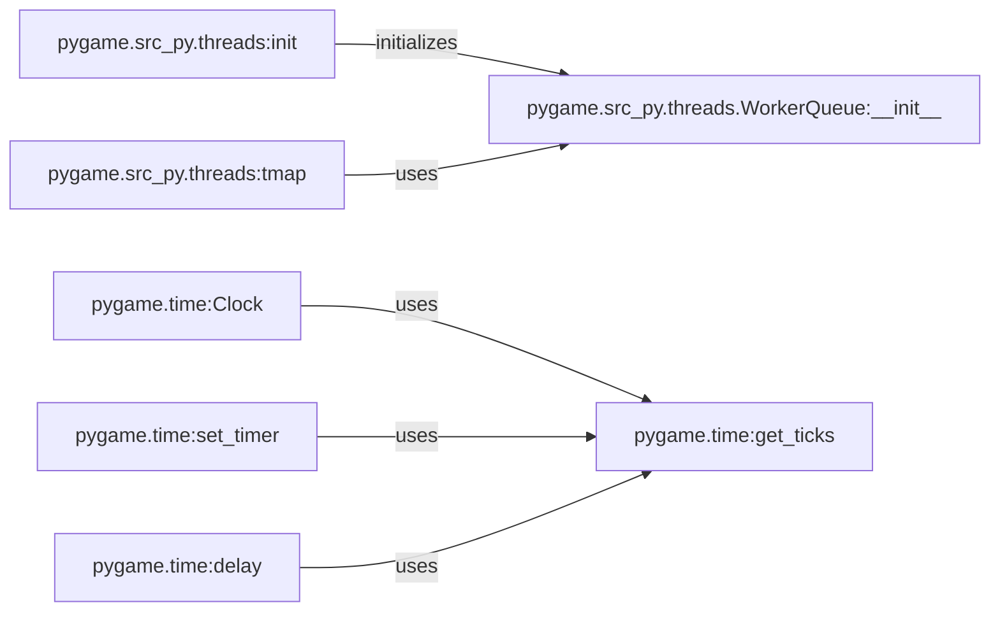

## Component Details

The Timing and Scheduling component in Pygame provides functionalities for managing time, controlling the game's frame rate, and scheduling events. It includes modules for initializing threads, managing worker queues, and providing time-related functions for MIDI operations. The core of this component revolves around the `pygame.time` module, which offers essential functions for measuring elapsed time, delaying execution, and setting timers. These features are crucial for creating smooth and consistent gameplay by regulating the game's pace and timing events accurately.

### pygame.src_py.threads:init
Initializes the threading module within Pygame, setting up resources and configurations for thread management to enable multi-threading capabilities.
- **Related Classes/Methods**: `pygame.src_py.threads`

### pygame.src_py.threads.WorkerQueue:__init__
Initializes a worker queue, a data structure used to manage tasks executed by worker threads. It involves creating a queue and setting up mechanisms for adding and retrieving tasks, enabling efficient task distribution and management.
- **Related Classes/Methods**: `pygame.src_py.threads.WorkerQueue`

### pygame.src_py.threads:tmap
Applies a function to a sequence of elements in parallel using threads, distributing the work across multiple threads to speed up processing and enhance performance for computationally intensive tasks.
- **Related Classes/Methods**: `pygame.src_py.threads`

### pygame.time:Clock
The Clock class in pygame.time is used to manage the frame rate of the game. It provides methods to track time and limit the frame rate, ensuring smooth and consistent gameplay.
- **Related Classes/Methods**: `pygame.time`

### pygame.time:get_ticks
Returns the number of milliseconds since pygame.init() was called. This function is used to measure elapsed time in the game.
- **Related Classes/Methods**: `pygame.time`

### pygame.time:delay
Pauses the program for a specified number of milliseconds. This function is used to control the timing of events in the game.
- **Related Classes/Methods**: `pygame.time`

### pygame.time:set_timer
Creates a user event that is added to the event queue every given number of milliseconds. This function is used to schedule events in the game.
- **Related Classes/Methods**: `pygame.time`
