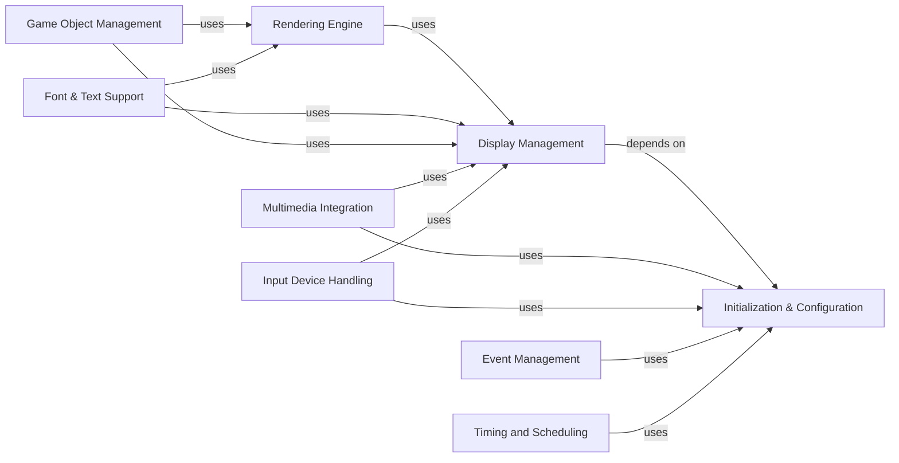

## Component Details

Pygame is a 2D game development library that provides a wide range of functionalities for creating games and multimedia applications. The library is structured into several core components that handle different aspects of game development, such as initialization, display management, event handling, drawing, sprite management, font rendering, multimedia support, input devices, and time management. These components work together to provide a comprehensive set of tools for game developers.

### Initialization & Configuration
This component is responsible for setting up the Pygame environment. It handles platform-specific configurations, manages dependencies, and ensures that all necessary resources are available before the game starts. It acts as the foundation upon which all other components rely.
- **Related Classes/Methods**: `pygame.buildconfig.config`, `pygame.buildconfig.config_win`, `pygame.buildconfig.config_msys2`, `pygame.buildconfig.config_unix`, `pygame.buildconfig.config_darwin`, `pygame.buildconfig.download_win_prebuilt`, `pygame.buildconfig.download_msys2_prebuilt`, `pygame.buildconfig.vstools`, `pygame.buildconfig.setup_win_common`

### Display Management
This component manages the game window and screen. It handles tasks such as creating the display, setting the display mode, and managing the screen surface. It provides the interface between the game and the user's monitor.
- **Related Classes/Methods**: `pygame.display`

### Event Management
This component handles user input and system events. It manages the event queue, processes events such as keyboard presses and mouse movements, and allows the game to respond to user interactions. It is crucial for creating interactive games.
- **Related Classes/Methods**: `pygame.src_py.fastevent`, `pygame.event`

### Rendering Engine
This component provides the tools for drawing shapes, images, and text on the screen. It includes functionalities for basic drawing, antialiasing, and pixel manipulation. It is responsible for creating the visual elements of the game.
- **Related Classes/Methods**: `pygame.src_py.draw_py`, `pygame.draw`

### Game Object Management
This component provides classes for managing game objects (sprites) and groups of sprites. It includes functionalities for collision detection, layering, and rendering, simplifying the management of game entities. It provides a structured way to organize and interact with game objects.
- **Related Classes/Methods**: `pygame.src_py.sprite`, `pygame.sprite`

### Font & Text Support
This component provides classes for rendering text using system fonts and FreeType fonts. It includes functionalities for font loading, glyph rendering, and text surface creation, enabling the display of text in the game. It allows developers to easily add text to their games.
- **Related Classes/Methods**: `pygame.src_py.sysfont`, `pygame.src_py.ftfont`, `pygame.font`

### Multimedia Integration
This component provides functionalities for handling images, sounds, and music. It includes functions for loading, decoding, and playing multimedia files, enriching the game experience. It allows developers to add audio and visual elements to their games.
- **Related Classes/Methods**: `pygame.image`, `pygame.mixer`, `pygame.music`

### Input Device Handling
This component provides classes for capturing images from cameras and interacting with MIDI devices. It supports different camera backends and MIDI message handling, expanding the input possibilities for the game. It allows developers to add alternative input methods to their games.
- **Related Classes/Methods**: `pygame.src_py.camera`, `pygame.src_py._camera_opencv`, `pygame.src_py._camera_vidcapture`, `pygame.src_py.midi`

### Timing and Scheduling
This component provides functions for managing time, including getting the current time, delaying execution, and setting timers. It allows for controlling the game's pace and timing events. It is essential for creating smooth and consistent gameplay.
- **Related Classes/Methods**: `pygame.time`