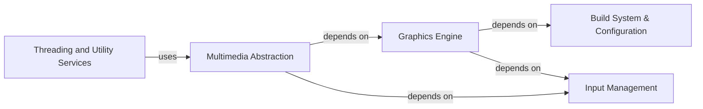

## Component Details

### Build System & Configuration
This component manages the build process of Pygame across different platforms. It handles dependency resolution, downloads prebuilt libraries, and generates the necessary build files. It ensures that Pygame can be compiled and installed correctly on various operating systems, abstracting away platform-specific complexities.
- **Related Classes/Methods**: `repos.pygame.buildconfig.config`, `repos.pygame.buildconfig.config_win`, `repos.pygame.buildconfig.config_unix`, `repos.pygame.buildconfig.config_darwin`, `repos.pygame.buildconfig.config_msys2`, `repos.pygame.buildconfig.config_conan`, `repos.pygame.buildconfig.download_win_prebuilt`, `repos.pygame.buildconfig.download_msys2_prebuilt`, `repos.pygame.buildconfig.setup_win_common`, `repos.pygame.buildconfig.vstools`, `repos.pygame.buildconfig.bundle_docs`

### Graphics Engine
The Graphics Engine is responsible for rendering all visual elements in Pygame. It provides functionalities for drawing basic shapes, images, and text on surfaces. This includes font rendering, sprite management, and low-level drawing operations. It forms the core of Pygame's visual capabilities.
- **Related Classes/Methods**: `repos.pygame.src_py.draw_py`, `repos.pygame.src_py.sysfont`, `repos.pygame.src_py.ftfont`, `repos.pygame.src_py.sprite`

### Input Management
This component handles all user input events, including keyboard, mouse, and joystick interactions. It provides a fast event queue for processing these events and functions for managing the mouse cursor. It is crucial for creating interactive games and applications.
- **Related Classes/Methods**: `repos.pygame.src_py.fastevent`, `repos.pygame.src_py.cursors`

### Multimedia Abstraction
The Multimedia Abstraction layer provides interfaces for working with audio, video, and MIDI devices. It includes modules for playing sounds, capturing images from cameras, and interacting with MIDI controllers. This component allows Pygame applications to incorporate rich multimedia content.
- **Related Classes/Methods**: `repos.pygame.src_py.midi`, `repos.pygame.src_py.camera`, `repos.pygame.src_py._camera_opencv`, `repos.pygame.src_py._camera_vidcapture`

### Threading and Utility Services
This component offers utilities for multithreading, including a worker queue and a thread mapping function. It enables parallel processing and improves performance, especially in tasks such as image processing or complex calculations. It also provides other helper functions used throughout the Pygame library.
- **Related Classes/Methods**: `repos.pygame.src_py.threads`