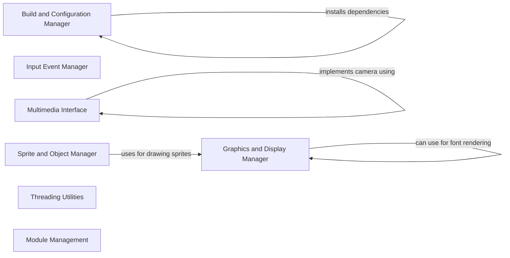

## Component Details

Pygame is a Python library designed for making games and multimedia applications. The architecture revolves around managing various aspects such as build configurations, graphics rendering, input events, multimedia devices, and sprite management. The core flow involves initializing the display, handling user input, updating game state, rendering graphics, and managing audio. The library provides a set of modules that abstract the complexities of low-level programming, allowing developers to focus on game logic and design.

### Build and Configuration Manager
This component is responsible for managing the build process of Pygame, including dependency management, platform-specific configurations, and downloading prebuilt binaries. It handles configurations for Windows, macOS, and Unix systems, and integrates with Visual Studio tools for DLL definition dumping. It also manages documentation bundling, ensuring that the library is properly built and configured for different environments.

**Related Classes/Methods**:

- <a href="https://github.com/pygame/pygame/blob/master/buildconfig/config.py#LNone-LNone" target="_blank" rel="noopener noreferrer">`buildconfig.config` (full file reference)</a>
- <a href="https://github.com/pygame/pygame/blob/master/buildconfig/config_win.py#LNone-LNone" target="_blank" rel="noopener noreferrer">`buildconfig.config_win` (full file reference)</a>
- <a href="https://github.com/pygame/pygame/blob/master/buildconfig/config_darwin.py#LNone-LNone" target="_blank" rel="noopener noreferrer">`buildconfig.config_darwin` (full file reference)</a>
- <a href="https://github.com/pygame/pygame/blob/master/buildconfig/config_unix.py#LNone-LNone" target="_blank" rel="noopener noreferrer">`buildconfig.config_unix` (full file reference)</a>
- <a href="https://github.com/pygame/pygame/blob/master/buildconfig/config_msys2.py#LNone-LNone" target="_blank" rel="noopener noreferrer">`buildconfig.config_msys2` (full file reference)</a>
- <a href="https://github.com/pygame/pygame/blob/master/buildconfig/download_win_prebuilt.py#LNone-LNone" target="_blank" rel="noopener noreferrer">`buildconfig.download_win_prebuilt` (full file reference)</a>
- <a href="https://github.com/pygame/pygame/blob/master/buildconfig/download_msys2_prebuilt.py#LNone-LNone" target="_blank" rel="noopener noreferrer">`buildconfig.download_msys2_prebuilt` (full file reference)</a>
- <a href="https://github.com/pygame/pygame/blob/master/buildconfig/bundle_docs.py#LNone-LNone" target="_blank" rel="noopener noreferrer">`buildconfig.bundle_docs` (full file reference)</a>
- <a href="https://github.com/pygame/pygame/blob/master/buildconfig/setup_win_common.py#LNone-LNone" target="_blank" rel="noopener noreferrer">`buildconfig.setup_win_common` (full file reference)</a>
- <a href="https://github.com/pygame/pygame/blob/master/buildconfig/vstools.py#LNone-LNone" target="_blank" rel="noopener noreferrer">`buildconfig.vstools` (full file reference)</a>
- <a href="https://github.com/pygame/pygame/blob/master/buildconfig/macdependencies/install_mac_deps.py#LNone-LNone" target="_blank" rel="noopener noreferrer">`buildconfig.macdependencies.install_mac_deps` (full file reference)</a>

### Graphics and Display Manager
This component manages the graphical aspects of Pygame, including drawing shapes, lines, and images on surfaces. It provides functionalities for antialiasing, clipping, and surface manipulation. It also handles font rendering using FreeType and system fonts, enabling the display of text in various styles and sizes. This component is central to rendering the game or application visuals.

**Related Classes/Methods**:

- <a href="https://github.com/pygame/pygame/blob/master/src_py/draw_py.py#LNone-LNone" target="_blank" rel="noopener noreferrer">`src_py.draw_py` (full file reference)</a>
- <a href="https://github.com/pygame/pygame/blob/master/src_py/ftfont.py#LNone-LNone" target="_blank" rel="noopener noreferrer">`src_py.ftfont` (full file reference)</a>
- <a href="https://github.com/pygame/pygame/blob/master/src_py/sysfont.py#LNone-LNone" target="_blank" rel="noopener noreferrer">`src_py.sysfont` (full file reference)</a>

### Input Event Manager
This component handles user input events, such as keyboard presses, mouse movements, and joystick input. It uses a fast event queue for efficient event processing and manages mouse cursor functionalities. By efficiently capturing and processing input events, this component allows the application to respond to user interactions in real-time.

**Related Classes/Methods**:

- <a href="https://github.com/pygame/pygame/blob/master/src_py/fastevent.py#LNone-LNone" target="_blank" rel="noopener noreferrer">`src_py.fastevent` (full file reference)</a>
- <a href="https://github.com/pygame/pygame/blob/master/src_py/cursors.py#LNone-LNone" target="_blank" rel="noopener noreferrer">`src_py.cursors` (full file reference)</a>

### Multimedia Interface
This component provides interfaces for camera devices and MIDI input/output. It includes platform-specific implementations for camera access using OpenCV and VideoCapture, and classes for handling MIDI devices. This allows Pygame applications to integrate multimedia functionalities such as video capture and MIDI control.

**Related Classes/Methods**:

- <a href="https://github.com/pygame/pygame/blob/master/src_py/camera.py#LNone-LNone" target="_blank" rel="noopener noreferrer">`src_py.camera` (full file reference)</a>
- <a href="https://github.com/pygame/pygame/blob/master/src_py/_camera_opencv.py#LNone-LNone" target="_blank" rel="noopener noreferrer">`src_py._camera_opencv` (full file reference)</a>
- <a href="https://github.com/pygame/pygame/blob/master/src_py/_camera_vidcapture.py#LNone-LNone" target="_blank" rel="noopener noreferrer">`src_py._camera_vidcapture` (full file reference)</a>
- <a href="https://github.com/pygame/pygame/blob/master/src_py/midi.py#LNone-LNone" target="_blank" rel="noopener noreferrer">`src_py.midi` (full file reference)</a>

### Sprite and Object Manager
This component manages sprites and sprite groups, providing functionalities for collision detection, layering, and drawing. It relies on the Graphics and Display Manager for drawing sprites. This component simplifies the management of game objects and their interactions, making it easier to create complex game environments.

**Related Classes/Methods**:

- <a href="https://github.com/pygame/pygame/blob/master/src_py/sprite.py#LNone-LNone" target="_blank" rel="noopener noreferrer">`src_py.sprite` (full file reference)</a>

### Threading Utilities
This component offers threading utilities for parallel processing, enabling concurrent execution of tasks. This allows developers to improve performance by distributing workload across multiple cores.

**Related Classes/Methods**:

- <a href="https://github.com/pygame/pygame/blob/master/src_py/threads/__init__.py#LNone-LNone" target="_blank" rel="noopener noreferrer">`src_py.threads.__init__` (full file reference)</a>

### Module Management
This component handles missing modules, issuing warnings when they are accessed, ensuring that the system gracefully handles optional dependencies. This prevents the application from crashing when optional modules are not available.

**Related Classes/Methods**:

- <a href="https://github.com/pygame/pygame/blob/master/src_py/__init__.py#L53-L84" target="_blank" rel="noopener noreferrer">`src_py.__init__.MissingModule` (53:84)</a>