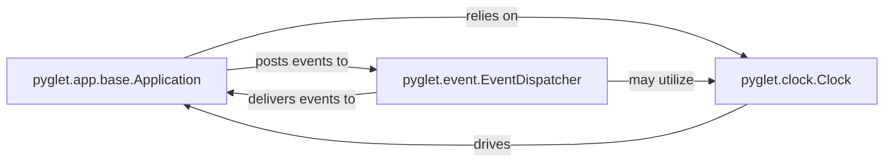

## Details

The Application Core subsystem operates as a tightly integrated unit, forming the heart of the Pyglet application. The Application component acts as the central coordinator, leveraging the Clock for precise timing and scheduling of updates, and interacting with the EventDispatcher to process and propagate events throughout the system. The EventDispatcher facilitates decoupled communication, allowing various parts of the application to react to events without direct dependencies. The Clock underpins the real-time nature of the framework, ensuring that all time-sensitive operations, including those triggered by events, are executed accurately. This symbiotic relationship ensures the smooth and responsive operation of any Pyglet application.

### pyglet.app.base.Application
The central orchestrator of the Pyglet application, managing the main event loop, application lifecycle (startup, shutdown), and global event dispatching. It schedules updates and processes events from various subsystems. This component is fundamental as it defines the application's execution flow, a core pattern in game development libraries.

**Related Classes/Methods**:

- <a href="https://github.com/pyglet/pyglet/blob/master/pyglet/app/base.py" target="_blank" rel="noopener noreferrer">`pyglet.app.base.Application`</a>

### pyglet.event.EventDispatcher
Provides a generic, decoupled mechanism for event handling. It allows components to register/unregister handlers and efficiently dispatches events to appropriate listeners. This component is critical for the Event-Driven Architecture pattern, enabling flexible and decoupled communication between various parts of the multimedia framework.

**Related Classes/Methods**:

- <a href="https://github.com/pyglet/pyglet/blob/master/pyglet/event.py#L144-L511" target="_blank" rel="noopener noreferrer">`pyglet.event.EventDispatcher`:144-511</a>

### pyglet.clock.Clock
Manages the application's internal time, provides functionalities for scheduling one-time or interval-based function calls, and unscheduling tasks. Essential for animations, game logic, and consistent frame rates. This component is vital for real-time interaction and performance, a key architectural bias for game development and multimedia frameworks.

**Related Classes/Methods**:

- <a href="https://github.com/pyglet/pyglet/blob/master/pyglet/clock.py#L102-L501" target="_blank" rel="noopener noreferrer">`pyglet.clock.Clock`:102-501</a>

### [FAQ](https://github.com/CodeBoarding/GeneratedOnBoardings/tree/main?tab=readme-ov-file#faq)