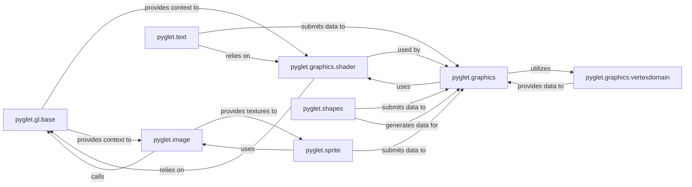

## Details

The `Graphics & Scene Rendering` subsystem in `pyglet` is the core visual engine, responsible for managing OpenGL contexts, processing graphical data, and rendering all visual elements from low-level primitives to high-level sprites and text. It adheres to a layered architecture, abstracting OpenGL complexities while providing efficient rendering capabilities.

### pyglet.gl.base
Manages the OpenGL rendering context, including activation and deactivation, and handles the lifecycle of fundamental OpenGL resources like textures and buffers. It acts as the low-level interface to OpenGL.

**Related Classes/Methods**:

- <a href="https://github.com/pyglet/pyglet/blob/master/pyglet/gl/base.py" target="_blank" rel="noopener noreferrer">`pyglet.gl.base`</a>

### pyglet.graphics.shader
Responsible for compiling, linking, and managing OpenGL shader programs, including handling uniform and attribute introspection and updates. It enables modern programmable pipeline rendering.

**Related Classes/Methods**:

- <a href="https://github.com/pyglet/pyglet/blob/master/pyglet/graphics/shader.py" target="_blank" rel="noopener noreferrer">`pyglet.graphics.shader`</a>

### pyglet.graphics.vertexdomain
Manages vertex buffer objects (VBOs) and element buffer objects (EBOs), handling memory allocation, resizing, and drawing subsets of vertex data for efficient rendering. It optimizes data transfer to the GPU.

**Related Classes/Methods**:

- <a href="https://github.com/pyglet/pyglet/blob/master/pyglet/graphics/vertexdomain.py" target="_blank" rel="noopener noreferrer">`pyglet.graphics.vertexdomain`</a>

### pyglet.image
Loads, manipulates, and converts image data into OpenGL textures, supporting advanced features like atlases and array textures for optimized rendering. It bridges image files to GPU-ready textures.

**Related Classes/Methods**:

- <a href="https://github.com/pyglet/pyglet/blob/master/pyglet/image" target="_blank" rel="noopener noreferrer">`pyglet.image`</a>

### pyglet.graphics
The central orchestrator for drawing operations. It manages `Batch` objects and `Group` hierarchies for efficient rendering, provides default shaders, and coordinates drawing primitives. It acts as a facade for the rendering pipeline.

**Related Classes/Methods**:

- <a href="https://github.com/pyglet/pyglet/blob/master/pyglet/graphics" target="_blank" rel="noopener noreferrer">`pyglet.graphics`</a>

### pyglet.sprite
Provides a high-level, user-friendly interface for rendering 2D sprites, abstracting away low-level details and managing sprite properties like position, rotation, scale, color, and animation.

**Related Classes/Methods**:

- <a href="https://github.com/pyglet/pyglet/blob/master/pyglet/sprite.py" target="_blank" rel="noopener noreferrer">`pyglet.sprite`</a>

### pyglet.shapes
Simplifies the drawing of common 2D geometric shapes by generating and rendering their vertex data, providing an easy way to add basic visual elements without direct OpenGL calls.

**Related Classes/Methods**:

- <a href="https://github.com/pyglet/pyglet/blob/master/pyglet/shapes.py" target="_blank" rel="noopener noreferrer">`pyglet.shapes`</a>

### pyglet.text
Provides comprehensive text rendering capabilities, including font loading, glyph management, complex text layout (word wrapping, line breaking), and efficient rendering of text elements.

**Related Classes/Methods**:

- <a href="https://github.com/pyglet/pyglet/blob/master/pyglet/font/base.py" target="_blank" rel="noopener noreferrer">`pyglet.font.base`</a>
- <a href="https://github.com/pyglet/pyglet/blob/master/pyglet/text/layout" target="_blank" rel="noopener noreferrer">`pyglet.text.layout`</a>

### [FAQ](https://github.com/CodeBoarding/GeneratedOnBoardings/tree/main?tab=readme-ov-file#faq)