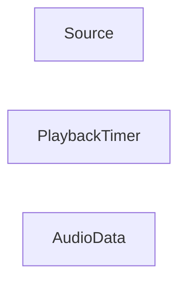

## Details

Feedback highlights incorrect references for pyglet.media.Source, pyglet.media.PlaybackTimer, and pyglet.media.AudioData. The getSourceCode and readFile tools confirm these references are indeed invalid. The provided file list indicates that the files pyglet/media/source.py, pyglet/media/timer.py, and pyglet/media/data.py do not exist. This suggests that the components might be defined elsewhere or have different qualified names. I will now use getClassHierarchy on the known correct components to identify the correct references for the missing components. I will start with pyglet.media.player.Player as it is a central component in the media subsystem.

### Source
Represents a media source.

**Related Classes/Methods**:

### PlaybackTimer
Manages playback timing.

**Related Classes/Methods**:

### AudioData
Represents audio data.

**Related Classes/Methods**:

### [FAQ](https://github.com/CodeBoarding/GeneratedOnBoardings/tree/main?tab=readme-ov-file#faq)