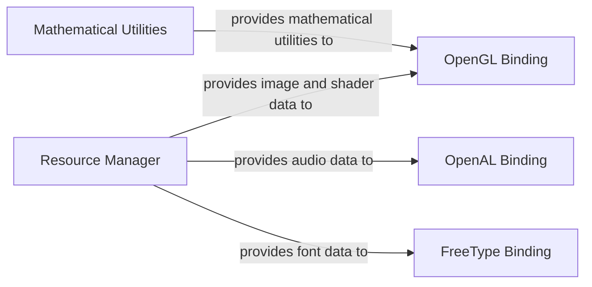

## Details

The `System Services & Resources` subsystem in pyglet is defined by the following core modules and their responsibilities: pyglet.resource: Handles the discovery, loading, and caching of various application assets. pyglet.math: Provides fundamental mathematical primitives and operations. pyglet.gl.lib: Offers low-level ctypes bindings and error handling for OpenGL. pyglet.media.drivers.openal.lib_openal: Provides ctypes bindings for the OpenAL audio library. pyglet.font.freetype_lib: Supplies ctypes bindings for the FreeType font rendering library.

### Resource Manager
Centralized management for loading, locating, and caching diverse application resources (images, audio, fonts, shaders) from various sources (files, ZIPs). It abstracts the complexities of file system interaction and resource indexing.

**Related Classes/Methods**:

- <a href="https://github.com/pyglet/pyglet/blob/master/pyglet/resource.py" target="_blank" rel="noopener noreferrer">`pyglet.resource`</a>

### Mathematical Utilities
Provides fundamental mathematical operations for 2D/3D vectors, matrices, and quaternions. These utilities are crucial for graphics transformations, physics calculations, and general game logic, offering a robust set of tools for spatial computations.

**Related Classes/Methods**:

- <a href="https://github.com/pyglet/pyglet/blob/master/pyglet/math.py" target="_blank" rel="noopener noreferrer">`pyglet.math`</a>

### OpenGL Binding
A low-level interface and error handling layer for OpenGL, enabling pyglet to render graphics by interacting directly with the GPU. It provides the necessary ctypes bindings to the underlying OpenGL library functions.

**Related Classes/Methods**:

- <a href="https://github.com/pyglet/pyglet/blob/master/pyglet/gl/lib.py" target="_blank" rel="noopener noreferrer">`pyglet.gl.lib`</a>

### OpenAL Binding
Provides ctypes bindings to the OpenAL library for audio playback and manipulation. This component allows pyglet to manage sound effects and music by interfacing with the system's audio capabilities.

**Related Classes/Methods**:

- <a href="https://github.com/pyglet/pyglet/blob/master/pyglet/media/drivers/openal/lib_openal.py" target="_blank" rel="noopener noreferrer">`pyglet.media.drivers.openal.lib_openal`</a>

### FreeType Binding
Offers ctypes bindings to the FreeType library for robust font rendering and text manipulation. This component is crucial for displaying high-quality text within pyglet applications.

**Related Classes/Methods**:

- <a href="https://github.com/pyglet/pyglet/blob/master/pyglet/font/freetype_lib.py" target="_blank" rel="noopener noreferrer">`pyglet.font.freetype_lib`</a>

### [FAQ](https://github.com/CodeBoarding/GeneratedOnBoardings/tree/main?tab=readme-ov-file#faq)