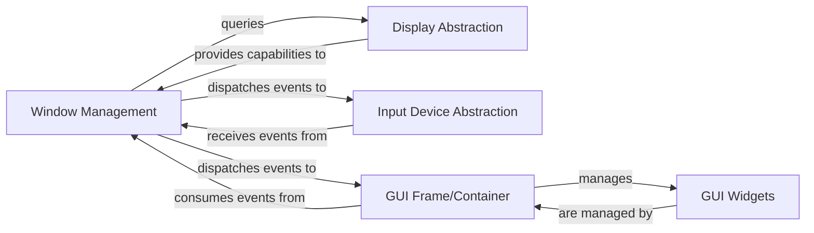

## Details

The feedback highlights a violation of the "max 2 relationships per component pair" rule, specifically for the `GUI Frame/Container` and `GUI Widgets` pair. The original analysis listed three relationships: `(GUI Frame/Container, manages, GUI Widgets)`, `(GUI Widgets, are managed by, GUI Frame/Container)`, and `(GUI Widgets, process events from, GUI Frame/Container)`. As per the feedback's interpretation, the first two relationships (management and its inverse) already count as two, making the third relationship (`process events from`) an excess. To address this, the most direct approach is to remove the third relationship, `(GUI Widgets, process events from, GUI Frame/Container)`. While event processing is a crucial interaction, the "manages" relationship (and its inverse) captures the fundamental structural and lifecycle control that the `GUI Frame/Container` exerts over `GUI Widgets`. The event dispatching and processing can be inferred from the component descriptions, where `GUI Frame/Container` is responsible for dispatching events and `GUI Widgets` for processing them. This adjustment ensures adherence to the specified constraint without compromising the core understanding of the subsystem.

### Window Management
This component is the core of the windowing system, responsible for creating, configuring, and managing application windows. It handles the OpenGL context, buffer swapping, and acts as the primary dispatcher for low-level operating system input events (keyboard, mouse).

**Related Classes/Methods**:

- <a href="https://github.com/pyglet/pyglet/blob/master/pyglet/window" target="_blank" rel="noopener noreferrer">`pyglet.window`</a>

### Display Abstraction
Provides a platform-independent interface for querying and managing display devices, screens, and display modes. It abstracts away OS-specific details of display management.

**Related Classes/Methods**:

- <a href="https://github.com/pyglet/pyglet/blob/master/pyglet/display/base.py" target="_blank" rel="noopener noreferrer">`pyglet.display.base`</a>

### Input Device Abstraction
Defines an abstract interface for various input devices (e.g., keyboard, mouse, joystick). It provides methods for opening/closing devices and adding controls, standardizing input handling across different hardware.

**Related Classes/Methods**:

- <a href="https://github.com/pyglet/pyglet/blob/master/pyglet/input/base.py" target="_blank" rel="noopener noreferrer">`pyglet.input.base`</a>

### GUI Frame/Container
Acts as a container for pyglet.gui.widgets. It manages their layout, addition/removal, and is responsible for dispatching user interaction events (mouse, keyboard, text) to the appropriate widgets within its bounds.

**Related Classes/Methods**:

- <a href="https://github.com/pyglet/pyglet/blob/master/pyglet/gui/frame.py" target="_blank" rel="noopener noreferrer">`pyglet.gui.frame`</a>

### GUI Widgets
Implements individual interactive graphical user interface elements such as buttons, sliders, and text input fields. Each widget manages its own state, position, appearance, and processes specific user interactions relevant to its type.

**Related Classes/Methods**:

- <a href="https://github.com/pyglet/pyglet/blob/master/pyglet/gui/widgets.py" target="_blank" rel="noopener noreferrer">`pyglet.gui.widgets`</a>

### [FAQ](https://github.com/CodeBoarding/GeneratedOnBoardings/tree/main?tab=readme-ov-file#faq)