```mermaid
graph LR
    Application_Core["Application Core"]
    User_Interface_Interaction["User Interface & Interaction"]
    Graphics_Scene_Rendering["Graphics & Scene Rendering"]
    Multimedia_Playback["Multimedia Playback"]
    System_Services_Resources["System Services & Resources"]
    Application_Core -- "initiates and manages" --> User_Interface_Interaction
    User_Interface_Interaction -- "dispatches events to" --> Application_Core
    Application_Core -- "controls" --> Multimedia_Playback
    Multimedia_Playback -- "notifies of events" --> Application_Core
    User_Interface_Interaction -- "provides context to" --> Graphics_Scene_Rendering
    Graphics_Scene_Rendering -- "performs operations within context of" --> User_Interface_Interaction
    Graphics_Scene_Rendering -- "requests assets from" --> System_Services_Resources
    System_Services_Resources -- "provides data to" --> Graphics_Scene_Rendering
    Multimedia_Playback -- "requests resources from" --> System_Services_Resources
    System_Services_Resources -- "provides data to" --> Multimedia_Playback
    System_Services_Resources -- "provides low-level bindings to" --> Graphics_Scene_Rendering
    System_Services_Resources -- "provides low-level bindings to" --> Multimedia_Playback
    click Application_Core href "https://github.com/CodeBoarding/GeneratedOnBoardings/blob/main/pyglet/Application_Core.md" "Details"
    click User_Interface_Interaction href "https://github.com/CodeBoarding/GeneratedOnBoardings/blob/main/pyglet/User_Interface_Interaction.md" "Details"
    click Graphics_Scene_Rendering href "https://github.com/CodeBoarding/GeneratedOnBoardings/blob/main/pyglet/Graphics_Scene_Rendering.md" "Details"
    click Multimedia_Playback href "https://github.com/CodeBoarding/GeneratedOnBoardings/blob/main/pyglet/Multimedia_Playback.md" "Details"
    click System_Services_Resources href "https://github.com/CodeBoarding/GeneratedOnBoardings/blob/main/pyglet/System_Services_Resources.md" "Details"
```

## Details

The Pyglet application is structured around a core event-driven architecture, with the Application Core acting as the central hub. This core component is responsible for managing the application's lifecycle, scheduling updates, and dispatching events to other subsystems. The User Interface & Interaction component handles all aspects of user interaction, including window management and input processing, and dispatches user-generated events back to the Application Core. Visual elements are managed by the Graphics & Scene Rendering component, which leverages OpenGL for rendering sprites, shapes, and text. This component relies on the System Services & Resources component to load and manage various assets like images, fonts, and shaders, and also utilizes low-level bindings provided by System Services for direct OpenGL operations. Similarly, the Multimedia Playback component handles audio and video, requesting resources from System Services and notifying the Application Core of playback events. System Services also provides essential mathematical utilities and dynamic library loading capabilities, serving as a foundational layer for both graphics and multimedia.

### Application Core [[Expand]](./Application_Core.md)
The central orchestrator of the Pyglet application, managing the main event loop, application lifecycle, and global event dispatching. It schedules updates and processes events from various subsystems.

**Related Classes/Methods**:

- <a href="https://github.com/pyglet/pyglet/blob/master/pyglet/app/base.py" target="_blank" rel="noopener noreferrer">`pyglet.app.base`</a>
- <a href="https://github.com/pyglet/pyglet/blob/master/pyglet/event.py" target="_blank" rel="noopener noreferrer">`pyglet.event`</a>
- <a href="https://github.com/pyglet/pyglet/blob/master/pyglet/clock.py" target="_blank" rel="noopener noreferrer">`pyglet.clock`</a>

### User Interface & Interaction [[Expand]](./User_Interface_Interaction.md)
Manages the creation, configuration, and management of application windows, handles user input from various devices, and provides components for building interactive graphical user interfaces.

**Related Classes/Methods**:

- <a href="https://github.com/pyglet/pyglet/blob/master/pyglet/window" target="_blank" rel="noopener noreferrer">`pyglet.window`</a>
- <a href="https://github.com/pyglet/pyglet/blob/master/pyglet/display/base.py" target="_blank" rel="noopener noreferrer">`pyglet.display.base`</a>
- <a href="https://github.com/pyglet/pyglet/blob/master/pyglet/input/base.py" target="_blank" rel="noopener noreferrer">`pyglet.input.base`</a>
- <a href="https://github.com/pyglet/pyglet/blob/master/pyglet/gui" target="_blank" rel="noopener noreferrer">`pyglet.gui`</a>
- <a href="https://github.com/pyglet/pyglet/blob/master/pyglet/gui/frame.py" target="_blank" rel="noopener noreferrer">`pyglet.gui.frame`</a>
- <a href="https://github.com/pyglet/pyglet/blob/master/pyglet/gui/widgets.py" target="_blank" rel="noopener noreferrer">`pyglet.gui.widgets`</a>

### Graphics & Scene Rendering [[Expand]](./Graphics_Scene_Rendering.md)
Provides the core rendering capabilities, managing OpenGL contexts, vertex data, shader programs, and texture binding for drawing all visual elements. It includes high-level abstractions for drawing sprites, shapes, and text.

**Related Classes/Methods**:

- <a href="https://github.com/pyglet/pyglet/blob/master/pyglet/graphics" target="_blank" rel="noopener noreferrer">`pyglet.graphics`</a>
- <a href="https://github.com/pyglet/pyglet/blob/master/pyglet/gl/base.py" target="_blank" rel="noopener noreferrer">`pyglet.gl.base`</a>
- <a href="https://github.com/pyglet/pyglet/blob/master/pyglet/graphics/shader.py" target="_blank" rel="noopener noreferrer">`pyglet.graphics.shader`</a>
- <a href="https://github.com/pyglet/pyglet/blob/master/pyglet/graphics/vertexdomain.py" target="_blank" rel="noopener noreferrer">`pyglet.graphics.vertexdomain`</a>
- <a href="https://github.com/pyglet/pyglet/blob/master/pyglet/image" target="_blank" rel="noopener noreferrer">`pyglet.image`</a>
- <a href="https://github.com/pyglet/pyglet/blob/master/pyglet/sprite.py" target="_blank" rel="noopener noreferrer">`pyglet.sprite`</a>
- <a href="https://github.com/pyglet/pyglet/blob/master/pyglet/shapes.py" target="_blank" rel="noopener noreferrer">`pyglet.shapes`</a>
- <a href="https://github.com/pyglet/pyglet/blob/master/pyglet/font/base.py" target="_blank" rel="noopener noreferrer">`pyglet.font.base`</a>
- <a href="https://github.com/pyglet/pyglet/blob/master/pyglet/text/layout" target="_blank" rel="noopener noreferrer">`pyglet.text.layout`</a>

### Multimedia Playback [[Expand]](./Multimedia_Playback.md)
Manages the playback of audio and video files, including decoding, buffering, synchronization, and output to audio devices, abstracting underlying multimedia libraries.

**Related Classes/Methods**:

- <a href="https://github.com/pyglet/pyglet/blob/master/pyglet/media/player.py" target="_blank" rel="noopener noreferrer">`pyglet.media.player`</a>
- <a href="https://github.com/pyglet/pyglet/blob/master/pyglet/media/codecs/ffmpeg.py" target="_blank" rel="noopener noreferrer">`pyglet.media.codecs.ffmpeg`</a>
- <a href="https://github.com/pyglet/pyglet/blob/master/pyglet/media/drivers/openal/adaptation.py" target="_blank" rel="noopener noreferrer">`pyglet.media.drivers.openal.adaptation`</a>

### System Services & Resources [[Expand]](./System_Services_Resources.md)
Offers a unified interface for locating, loading, and caching various types of application resources (e.g., images, sounds, fonts, shaders). It also provides a crucial layer for dynamic loading and binding to external C/C++ libraries via ctypes and common mathematical utilities.

**Related Classes/Methods**:

- <a href="https://github.com/pyglet/pyglet/blob/master/pyglet/resource.py" target="_blank" rel="noopener noreferrer">`pyglet.resource`</a>
- <a href="https://github.com/pyglet/pyglet/blob/master/pyglet/math.py" target="_blank" rel="noopener noreferrer">`pyglet.math`</a>
- <a href="https://github.com/pyglet/pyglet/blob/master/pyglet/gl/lib.py" target="_blank" rel="noopener noreferrer">`pyglet.gl.lib`</a>
- <a href="https://github.com/pyglet/pyglet/blob/master/pyglet/media/drivers/openal/lib_openal.py" target="_blank" rel="noopener noreferrer">`pyglet.media.drivers.openal.lib_openal`</a>
- <a href="https://github.com/pyglet/pyglet/blob/master/pyglet/font/freetype_lib.py" target="_blank" rel="noopener noreferrer">`pyglet.font.freetype_lib`</a>

### [FAQ](https://github.com/CodeBoarding/GeneratedOnBoardings/tree/main?tab=readme-ov-file#faq)