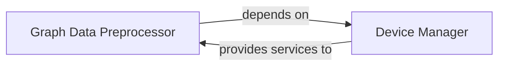

## Details

The `pygod` project's core anomaly detection subsystem is structured around two primary components: the `Graph Data Preprocessor` and the `Device Manager`. The `Graph Data Preprocessor` is crucial for preparing diverse graph data into a standardized format, handling tasks like normalization and feature engineering, making it ready for anomaly detection models. This component relies on the `Device Manager` to ensure that all computational tasks are executed on the appropriate hardware (CPU or GPU), optimizing performance and managing resources efficiently. The `Device Manager` also provides essential utility functions for parameter validation across the library, ensuring data integrity and operational stability. This clear separation of concerns facilitates robust data handling and efficient resource utilization, forming a solid foundation for the anomaly detection processes within the system.

### Graph Data Preprocessor
This component is responsible for standardizing and transforming raw input graph data (features, adjacency matrices, etc.) into a consistent format suitable for various anomaly detection models. This often involves normalization, feature engineering, handling missing values, and structural adjustments to the graph representation. It acts as the primary data ingestion and transformation layer, ensuring data consistency and readiness for consumption by the Detectors.

**Related Classes/Methods**:

- <a href="https://github.com/pygod-team/pygod/blob/main/pygod/detector/anomalydae.py#L154-L155" target="_blank" rel="noopener noreferrer">`process_graph`:154-155</a>

### Device Manager
This component ensures that computational operations are performed on the correct and available device (CPU or GPU), optimizing performance and preventing device-related errors. It also includes general utility functions for parameter validation across the library. It provides a foundational utility for managing hardware resources, critical for deep learning models that often leverage GPUs.

**Related Classes/Methods**:

- <a href="https://github.com/pygod-team/pygod/blob/main/pygod/utils/utility.py#L22-L56" target="_blank" rel="noopener noreferrer">`validate_device`:22-56</a>
- <a href="https://github.com/pygod-team/pygod/blob/main/pygod/utils/utility.py#L59-L131" target="_blank" rel="noopener noreferrer">`check_parameter`:59-131</a>

### [FAQ](https://github.com/CodeBoarding/GeneratedOnBoardings/tree/main?tab=readme-ov-file#faq)