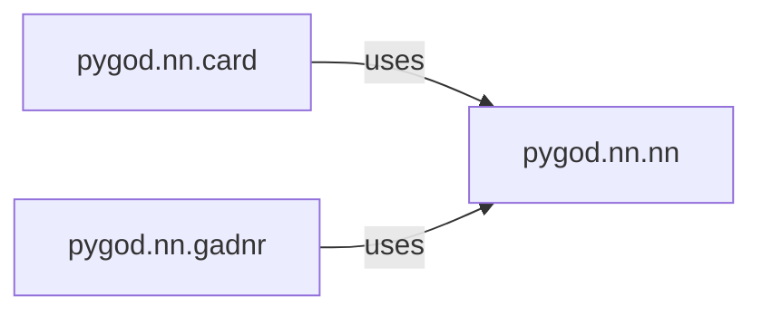

## Details

The Neural Network Modules subsystem (pygod.nn) serves as the computational backbone for various detectors, providing reusable Graph Neural Network (GNN) architectures and other neural models for feature learning and anomaly scoring.

### pygod.nn.card
Implements the neural network specific to the CARD (Clustering-based Anomaly Detection) model. It manages the forward pass and the training of the subgraph network, which is crucial for learning representations used in anomaly detection.

**Related Classes/Methods**:

- <a href="https://github.com/pygod-team/pygod/blob/main/pygod/nn/card.py" target="_blank" rel="noopener noreferrer">`pygod.nn.card`</a>

### pygod.nn.gadnr
Implements the neural network for the GADNR (Graph Anomaly Detection with Neighborhood Reconstruction) model. It handles the forward pass and the complex neighborhood reconstruction process, supporting both mini-batch and full-batch processing for scalability.

**Related Classes/Methods**:

- <a href="https://github.com/pygod-team/pygod/blob/main/pygod/nn/gadnr.py" target="_blank" rel="noopener noreferrer">`pygod.nn.gadnr`</a>

### pygod.nn.nn
Provides generic and reusable neural network building blocks and utilities. This component acts as a foundational library, offering common layers, activation functions, and helper modules that can be composed to construct more complex GNN architectures used by other models within pygod.nn.

**Related Classes/Methods**:

- <a href="https://github.com/pygod-team/pygod/blob/main/pygod/nn/nn.py" target="_blank" rel="noopener noreferrer">`pygod.nn.nn`</a>

### [FAQ](https://github.com/CodeBoarding/GeneratedOnBoardings/tree/main?tab=readme-ov-file#faq)