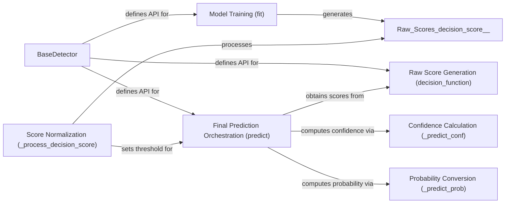

## Details

The `pygod.detector.base` subsystem, centered around the `BaseDetector` abstract class, provides a foundational framework for anomaly detection. The `Model Training (fit)` component is responsible for learning from data and producing initial `Raw Scores (decision_score_)`. These training scores are then processed by `Score Normalization (_process_decision_score)` to establish a `threshold_` for anomaly classification. The `Final Prediction Orchestration (predict)` component serves as the primary user interface, leveraging the `threshold_` and either utilizing the stored training scores or invoking `Raw Score Generation (decision_function)` for new data. It further refines predictions by integrating `Confidence Calculation (_predict_conf)` and `Probability Conversion (_predict_prob)` to provide comprehensive anomaly insights. This architecture ensures a clear separation of concerns between model training, score generation, and post-processing for robust anomaly detection.

### BaseDetector
The abstract base class for all anomaly detectors in `pygod`. It defines the common API and provides foundational implementations for training, raw score generation, and post-processing of anomaly scores. It acts as the central orchestrator for the entire detection pipeline.

**Related Classes/Methods**:

- <a href="https://github.com/pygod-team/pygod/blob/main/pygod/detector/base.py" target="_blank" rel="noopener noreferrer">`pygod.detector.base.BaseDetector`</a>

### Model Training (fit)
This component is responsible for training the underlying anomaly detection model using the input data. It prepares the detector to generate anomaly scores by learning the data distribution or anomaly patterns, and populates the `decision_score_` attribute with raw training scores.

**Related Classes/Methods**:

- <a href="https://github.com/pygod-team/pygod/blob/main/pygod/detector/base.py" target="_blank" rel="noopener noreferrer">`pygod.detector.base.BaseDetector:fit`</a>

### Raw Score Generation (decision_function)
This component computes and returns the raw, untransformed anomaly scores for the input data. These scores represent the initial output of the detector's core anomaly detection logic before any post-processing.

**Related Classes/Methods**:

- <a href="https://github.com/pygod-team/pygod/blob/main/pygod/detector/base.py" target="_blank" rel="noopener noreferrer">`pygod.detector.base.BaseDetector:decision_function`</a>

### Score Normalization (_process_decision_score)
An internal utility method that standardizes or normalizes the raw anomaly scores from the training phase. This method calculates the `threshold_` and `label_` attributes based on the `decision_score_` and contamination level, ensuring consistency across different detectors and preparing scores for further interpretation or comparison.

**Related Classes/Methods**:

- <a href="https://github.com/pygod-team/pygod/blob/main/pygod/detector/base.py" target="_blank" rel="noopener noreferrer">`pygod.detector.base.BaseDetector:_process_decision_score`</a>

### Confidence Calculation (_predict_conf)
An internal method that calculates a confidence score for each anomaly prediction. This provides a measure of certainty for the model's output, enhancing the interpretability of the anomaly detection results.

**Related Classes/Methods**:

- <a href="https://github.com/pygod-team/pygod/blob/main/pygod/detector/base.py" target="_blank" rel="noopener noreferrer">`pygod.detector.base.BaseDetector:_predict_conf`</a>

### Probability Conversion (_predict_prob)
An internal method that transforms anomaly scores into probabilities, indicating the likelihood of each data point being an anomaly. This often involves applying a sigmoid or similar function to the scores.

**Related Classes/Methods**:

- <a href="https://github.com/pygod-team/pygod/blob/main/pygod/detector/base.py" target="_blank" rel="noopener noreferrer">`pygod.detector.base.BaseDetector:_predict_prob`</a>

### Final Prediction Orchestration (predict)
The primary public interface for users to obtain final anomaly predictions. It orchestrates the retrieval of raw anomaly scores (via `decision_function` for new data or using stored training scores) and their subsequent transformation into confidence levels and probabilities using the internal post-processing methods. It utilizes the `threshold_` set during the post-training phase to generate binary predictions.

**Related Classes/Methods**:

- <a href="https://github.com/pygod-team/pygod/blob/main/pygod/detector/base.py" target="_blank" rel="noopener noreferrer">`pygod.detector.base.BaseDetector:predict`</a>

### [FAQ](https://github.com/CodeBoarding/GeneratedOnBoardings/tree/main?tab=readme-ov-file#faq)