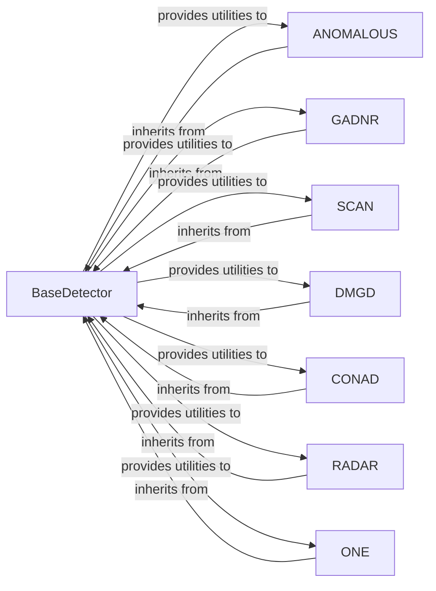

## Details

The `pygod.detector` subsystem is designed around a clear inheritance hierarchy for anomaly detection algorithms. The `BaseDetector` component serves as the foundational abstract class, defining a common interface (`fit`, `decision_function`, `predict`) and providing shared utilities for all specific anomaly detection algorithms. Concrete implementations such as `ANOMALOUS`, `GADNR`, `SCAN`, `DMGD`, `CONAD`, `RADAR`, and `ONE` inherit from `BaseDetector`, specializing its abstract methods to implement their unique anomaly detection logic. This architecture promotes code reusability and ensures a consistent API across various detection methods, allowing for easy integration and interchangeability of algorithms within the `pygod` framework.

### BaseDetector
Defines the common API (fit, decision_function, predict) and provides shared utilities (__init__, process_graph) that all specific detectors can leverage. It acts as the abstract base for all anomaly detection algorithms.

**Related Classes/Methods**:

- <a href="https://github.com/pygod-team/pygod/blob/main/pygod/detector/base.py" target="_blank" rel="noopener noreferrer">`pygod.detector.base.BaseDetector:fit`</a>
- <a href="https://github.com/pygod-team/pygod/blob/main/pygod/detector/base.py" target="_blank" rel="noopener noreferrer">`pygod.detector.base.BaseDetector:decision_function`</a>
- <a href="https://github.com/pygod-team/pygod/blob/main/pygod/detector/base.py" target="_blank" rel="noopener noreferrer">`pygod.detector.base.BaseDetector:predict`</a>
- <a href="https://github.com/pygod-team/pygod/blob/main/pygod/detector/base.py" target="_blank" rel="noopener noreferrer">`pygod.detector.base.BaseDetector:__init__`</a>
- <a href="https://github.com/pygod-team/pygod/blob/main/pygod/detector/base.py" target="_blank" rel="noopener noreferrer">`pygod.detector.base.BaseDetector:process_graph`</a>

### ANOMALOUS
Implements the fit and decision_function methods for the ANOMALOUS algorithm, handling its specific training logic and anomaly scoring.

**Related Classes/Methods**:

- <a href="https://github.com/pygod-team/pygod/blob/main/pygod/detector/anomalous.py" target="_blank" rel="noopener noreferrer">`pygod.detector.anomalous.ANOMALOUS:fit`</a>
- <a href="https://github.com/pygod-team/pygod/blob/main/pygod/detector/anomalous.py" target="_blank" rel="noopener noreferrer">`pygod.detector.anomalous.ANOMALOUS:decision_function`</a>
- <a href="https://github.com/pygod-team/pygod/blob/main/pygod/detector/anomalous.py#L134-L141" target="_blank" rel="noopener noreferrer">`pygod.detector.anomalous.ANOMALOUSBase`:134-141</a>
- <a href="https://github.com/pygod-team/pygod/blob/main/pygod/detector/anomalous.py" target="_blank" rel="noopener noreferrer">`pygod.detector.anomalous.ANOMALOUS_loss`</a>

### GADNR
Implements the fit and decision_function methods for the GADNR algorithm, defining its unique training and scoring mechanisms.

**Related Classes/Methods**:

- <a href="https://github.com/pygod-team/pygod/blob/main/pygod/detector/gadnr.py" target="_blank" rel="noopener noreferrer">`pygod.detector.gadnr.GADNR:fit`</a>
- <a href="https://github.com/pygod-team/pygod/blob/main/pygod/detector/gadnr.py" target="_blank" rel="noopener noreferrer">`pygod.detector.gadnr.GADNR:decision_function`</a>
- <a href="https://github.com/pygod-team/pygod/blob/main/pygod/detector/gadnr.py#L242-L266" target="_blank" rel="noopener noreferrer">`pygod.detector.gadnr.comp_decision_score`:242-266</a>
- <a href="https://github.com/pygod-team/pygod/blob/main/pygod/detector/gadnr.py#L200-L217" target="_blank" rel="noopener noreferrer">`pygod.detector.gadnr.init_model`:200-217</a>

### SCAN
Implements the fit and decision_function methods for the SCAN algorithm, focusing on structural analysis for anomaly detection.

**Related Classes/Methods**:

- <a href="https://github.com/pygod-team/pygod/blob/main/pygod/detector/scan.py" target="_blank" rel="noopener noreferrer">`pygod.detector.scan.SCAN:fit`</a>
- <a href="https://github.com/pygod-team/pygod/blob/main/pygod/detector/scan.py" target="_blank" rel="noopener noreferrer">`pygod.detector.scan.SCAN:decision_function`</a>
- <a href="https://github.com/pygod-team/pygod/blob/main/pygod/detector/scan.py#L156-L158" target="_blank" rel="noopener noreferrer">`pygod.detector.scan._if_hub`:156-158</a>
- <a href="https://github.com/pygod-team/pygod/blob/main/pygod/detector/scan.py#L146-L151" target="_blank" rel="noopener noreferrer">`pygod.detector.scan._neighborhood`:146-151</a>
- <a href="https://github.com/pygod-team/pygod/blob/main/pygod/detector/scan.py#L135-L144" target="_blank" rel="noopener noreferrer">`pygod.detector.scan._similarity`:135-144</a>
- <a href="https://github.com/pygod-team/pygod/blob/main/pygod/detector/scan.py#L153-L154" target="_blank" rel="noopener noreferrer">`pygod.detector.scan._neighbors`:153-154</a>

### DMGD
Implements the fit and decision_function methods for the DMGD algorithm, providing its specific anomaly detection logic.

**Related Classes/Methods**:

- <a href="https://github.com/pygod-team/pygod/blob/main/pygod/detector/dmgd.py" target="_blank" rel="noopener noreferrer">`pygod.detector.dmgd.DMGD:fit`</a>
- <a href="https://github.com/pygod-team/pygod/blob/main/pygod/detector/dmgd.py" target="_blank" rel="noopener noreferrer">`pygod.detector.dmgd.DMGD:decision_function`</a>

### CONAD
Implements the fit and decision_function methods for the CONAD algorithm, defining its unique approach to anomaly detection.

**Related Classes/Methods**:

- <a href="https://github.com/pygod-team/pygod/blob/main/pygod/detector/conad.py" target="_blank" rel="noopener noreferrer">`pygod.detector.conad.CONAD:fit`</a>
- <a href="https://github.com/pygod-team/pygod/blob/main/pygod/detector/conad.py" target="_blank" rel="noopener noreferrer">`pygod.detector.conad.CONAD:decision_function`</a>

### RADAR
Implements the fit and decision_function methods for the RADAR algorithm, including its specific model and loss computations.

**Related Classes/Methods**:

- <a href="https://github.com/pygod-team/pygod/blob/main/pygod/detector/radar.py" target="_blank" rel="noopener noreferrer">`pygod.detector.radar.RADAR:fit`</a>
- <a href="https://github.com/pygod-team/pygod/blob/main/pygod/detector/radar.py" target="_blank" rel="noopener noreferrer">`pygod.detector.radar.RADAR:decision_function`</a>
- <a href="https://github.com/pygod-team/pygod/blob/main/pygod/detector/radar.py#L130-L137" target="_blank" rel="noopener noreferrer">`pygod.detector.radar.RadarBase`:130-137</a>
- <a href="https://github.com/pygod-team/pygod/blob/main/pygod/detector/radar.py" target="_blank" rel="noopener noreferrer">`pygod.detector.radar.RADAR_loss`</a>

### ONE
Implements the fit and decision_function methods for the ONE algorithm, providing its specific anomaly detection logic.

**Related Classes/Methods**:

- <a href="https://github.com/pygod-team/pygod/blob/main/pygod/detector/one.py" target="_blank" rel="noopener noreferrer">`pygod.detector.one.ONE:fit`</a>
- <a href="https://github.com/pygod-team/pygod/blob/main/pygod/detector/one.py" target="_blank" rel="noopener noreferrer">`pygod.detector.one.ONE:decision_function`</a>

### [FAQ](https://github.com/CodeBoarding/GeneratedOnBoardings/tree/main?tab=readme-ov-file#faq)