```mermaid
graph LR
    Data_Loading_Management["Data Loading & Management"]
    Data_Preprocessing_Graph_Utilities["Data Preprocessing & Graph Utilities"]
    Base_Detector_API["Base Detector API"]
    Specific_Detector_Implementations["Specific Detector Implementations"]
    Neural_Network_Modules["Neural Network Modules"]
    Score_Post_processing_Prediction["Score Post-processing & Prediction"]
    Data_Loading_Management -- "supplies raw graph data to" --> Data_Preprocessing_Graph_Utilities
    Data_Preprocessing_Graph_Utilities -- "provides processed graph data to" --> Base_Detector_API
    Base_Detector_API -- "orchestrates lifecycle for" --> Specific_Detector_Implementations
    Specific_Detector_Implementations -- "utilizes" --> Neural_Network_Modules
    Neural_Network_Modules -- "returns scores/embeddings to" --> Specific_Detector_Implementations
    Specific_Detector_Implementations -- "provides raw scores to" --> Score_Post_processing_Prediction
    Base_Detector_API -- "orchestrates final prediction with" --> Score_Post_processing_Prediction
    click Data_Preprocessing_Graph_Utilities href "https://github.com/CodeBoarding/GeneratedOnBoardings/blob/main/pygod/Data_Preprocessing_Graph_Utilities.md" "Details"
    click Specific_Detector_Implementations href "https://github.com/CodeBoarding/GeneratedOnBoardings/blob/main/pygod/Specific_Detector_Implementations.md" "Details"
    click Neural_Network_Modules href "https://github.com/CodeBoarding/GeneratedOnBoardings/blob/main/pygod/Neural_Network_Modules.md" "Details"
    click Score_Post_processing_Prediction href "https://github.com/CodeBoarding/GeneratedOnBoardings/blob/main/pygod/Score_Post_processing_Prediction.md" "Details"
```

## Details

The pygod project is structured as a modular Machine Learning Toolkit for Graph Anomaly Detection, emphasizing an extensible pipeline. Data flows from Data Loading & Management to Data Preprocessing & Graph Utilities for preparation. The prepared data then enters the Base Detector API, which acts as the central orchestrator, abstracting the common fit and predict operations. This API delegates specific algorithmic execution to Specific Detector Implementations, which internally leverage Neural Network Modules for core graph-based computations. Finally, raw anomaly scores are processed by Score Post-processing & Prediction to yield final, interpretable results. This design promotes clear component boundaries, allowing for easy integration of new detection algorithms and facilitating a straightforward data and control flow for diagrammatic representation.

### Data Loading & Management
Responsible for loading various graph datasets and ensuring they are in the correct format for PyGOD detectors.

**Related Classes/Methods**:

- <a href="https://github.com/pygod-team/pygod/blob/main/pygod/utils/utility.py#L134-L187" target="_blank" rel="noopener noreferrer">`pygod.utils.utility.load_data`:134-187</a>

### Data Preprocessing & Graph Utilities [[Expand]](./Data_Preprocessing_Graph_Utilities.md)
Prepares raw graph data for detector input, including graph normalization, feature handling, and device management.

**Related Classes/Methods**:

- <a href="https://github.com/pygod-team/pygod/blob/main/pygod/detector/base.py" target="_blank" rel="noopener noreferrer">`pygod.detector.base.BaseDetector.process_graph`</a>
- <a href="https://github.com/pygod-team/pygod/blob/main/pygod/utils/utility.py#L22-L56" target="_blank" rel="noopener noreferrer">`pygod.utils.utility.validate_device`:22-56</a>

### Base Detector API
The abstract interface for all graph anomaly detection algorithms, defining the standardized fit, decision_function, and predict methods, and orchestrating the high-level workflow.

**Related Classes/Methods**:

- <a href="https://github.com/pygod-team/pygod/blob/main/pygod/detector/base.py" target="_blank" rel="noopener noreferrer">`pygod.detector.base.BaseDetector.fit`</a>
- <a href="https://github.com/pygod-team/pygod/blob/main/pygod/detector/base.py" target="_blank" rel="noopener noreferrer">`pygod.detector.base.BaseDetector.decision_function`</a>
- <a href="https://github.com/pygod-team/pygod/blob/main/pygod/detector/base.py" target="_blank" rel="noopener noreferrer">`pygod.detector.base.BaseDetector.predict`</a>
- <a href="https://github.com/pygod-team/pygod/blob/main/pygod/detector/base.py" target="_blank" rel="noopener noreferrer">`pygod.detector.base.BaseDetector.init_model`</a>
- <a href="https://github.com/pygod-team/pygod/blob/main/pygod/detector/base.py" target="_blank" rel="noopener noreferrer">`pygod.detector.base.BaseDetector.forward_model`</a>

### Specific Detector Implementations [[Expand]](./Specific_Detector_Implementations.md)
Concrete implementations of various graph anomaly detection algorithms, extending the Base Detector API with algorithm-specific training logic and model definitions.

**Related Classes/Methods**:

- <a href="https://github.com/pygod-team/pygod/blob/main/pygod/detector/anomalous.py" target="_blank" rel="noopener noreferrer">`pygod.detector.anomalous.ANOMALOUS.fit`</a>
- <a href="https://github.com/pygod-team/pygod/blob/main/pygod/detector/gadnr.py" target="_blank" rel="noopener noreferrer">`pygod.detector.gadnr.GADNR.fit`</a>
- <a href="https://github.com/pygod-team/pygod/blob/main/pygod/detector/scan.py" target="_blank" rel="noopener noreferrer">`pygod.detector.scan.SCAN.fit`</a>

### Neural Network Modules [[Expand]](./Neural_Network_Modules.md)
A collection of reusable Graph Neural Network (GNN) architectures and other neural models that serve as the computational backbone for various detectors, performing core feature learning and anomaly scoring.

**Related Classes/Methods**:

- <a href="https://github.com/pygod-team/pygod/blob/main/pygod/nn/card.py" target="_blank" rel="noopener noreferrer">`pygod.nn.card.CARDBase.forward`</a>
- <a href="https://github.com/pygod-team/pygod/blob/main/pygod/nn/gadnr.py" target="_blank" rel="noopener noreferrer">`pygod.nn.gadnr.GADNRBase.forward`</a>

### Score Post-processing & Prediction [[Expand]](./Score_Post_processing_Prediction.md)
Transforms raw anomaly scores generated by detectors into final, interpretable outputs such as normalized scores, confidence levels, or binary anomaly labels.

**Related Classes/Methods**:

- <a href="https://github.com/pygod-team/pygod/blob/main/pygod/detector/base.py" target="_blank" rel="noopener noreferrer">`pygod.detector.base.BaseDetector._process_decision_score`</a>
- <a href="https://github.com/pygod-team/pygod/blob/main/pygod/detector/base.py" target="_blank" rel="noopener noreferrer">`pygod.detector.base.BaseDetector._predict_conf`</a>
- <a href="https://github.com/pygod-team/pygod/blob/main/pygod/detector/base.py" target="_blank" rel="noopener noreferrer">`pygod.detector.base.BaseDetector._predict_prob`</a>

### [FAQ](https://github.com/CodeBoarding/GeneratedOnBoardings/tree/main?tab=readme-ov-file#faq)