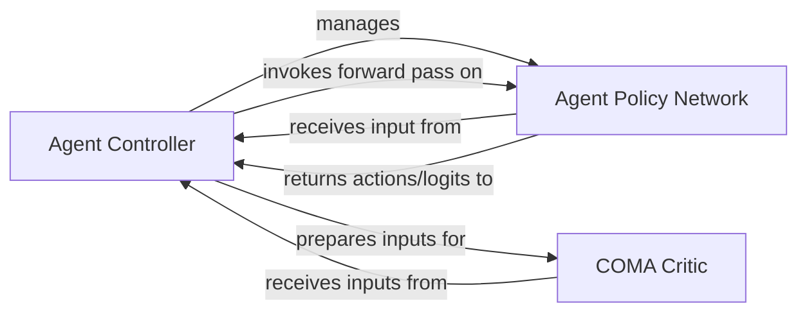

## Details

The Agent System subsystem encapsulates the core intelligence and decision-making logic of the agents within the PyMARL framework. Its boundaries are defined by the components responsible for agent policy execution, action selection, and value estimation, particularly in multi-agent contexts. This subsystem is where the "learnable entities" reside and interact with the environment through their learned policies.

### Agent Controller
This component acts as the orchestrator for agent interactions. It manages the instantiation and forward pass of the agent's policy networks, handling the process of selecting actions based on observations received from the environment. It serves as the primary interface between the environment and the individual agent policies, coordinating their actions.

**Related Classes/Methods**:

- <a href="https://github.com/oxwhirl/pymarl/blob/master/src/controllers/basic_controller.py" target="_blank" rel="noopener noreferrer">`src/controllers/basic_controller.py`</a>

### Agent Policy Network
This component implements the core neural network (e.g., an RNN) that represents an individual agent's policy. It processes observations and internal states to produce action logits or probabilities, embodying the agent's learned decision-making logic.

**Related Classes/Methods**:

- <a href="https://github.com/oxwhirl/pymarl/blob/master/src/modules/agents/rnn_agent.py" target="_blank" rel="noopener noreferrer">`src/modules/agents/rnn_agent.py`</a>

### COMA Critic
This component provides the critic network specifically tailored for the COMA (Counterfactual Multi-Agent Policy Gradients) algorithm. Its role is to evaluate the Q-values of actions taken by agents, critically considering the actions of other agents to provide a counterfactual baseline, which is essential for training multi-agent policies.

**Related Classes/Methods**:

- <a href="https://github.com/oxwhirl/pymarl/blob/master/src/modules/critics/coma.py" target="_blank" rel="noopener noreferrer">`src/modules/critics/coma.py`</a>

### [FAQ](https://github.com/CodeBoarding/GeneratedOnBoardings/tree/main?tab=readme-ov-file#faq)