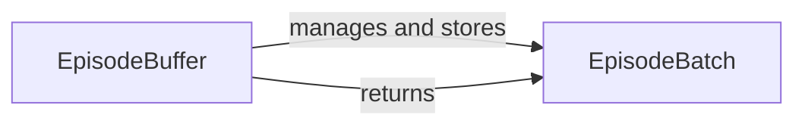

## Details

The Experience Replay subsystem, centered around the `EpisodeBuffer` and `EpisodeBatch` components, is fundamental for stabilizing reinforcement learning. The `EpisodeBuffer` acts as the primary repository, efficiently managing and storing `EpisodeBatch` instances, which encapsulate collected experience data. This buffer is responsible for accumulating data from the simulation and agent systems. When required by the learning algorithm, the `EpisodeBuffer` samples and returns `EpisodeBatch` instances, providing decorrelated data crucial for effective model training. This clear separation of concerns ensures efficient data handling and supports the iterative learning process.

### EpisodeBuffer
The central data store of the Experience Replay subsystem. It accumulates and manages experiences (transitions or full episodes) collected from the Simulation Environment and Agent System. Its primary role is to facilitate efficient sampling of past data, crucial for decorrelating sequential experiences and stabilizing the learning process in reinforcement learning.

**Related Classes/Methods**:

- <a href="https://github.com/oxwhirl/pymarl/blob/master/src/components/episode_buffer.py" target="_blank" rel="noopener noreferrer">`EpisodeBuffer`</a>

### EpisodeBatch
A structured data container representing a collection of experience data, such as a batch of episodes or individual transitions. It serves as the standardized format for data transfer within the Experience Replay subsystem and between it and external components like the Agent System and Learning Algorithm.

**Related Classes/Methods**:

- <a href="https://github.com/oxwhirl/pymarl/blob/master/src/components/episode_buffer.py#L6-L204" target="_blank" rel="noopener noreferrer">`EpisodeBatch`:6-204</a>

### [FAQ](https://github.com/CodeBoarding/GeneratedOnBoardings/tree/main?tab=readme-ov-file#faq)