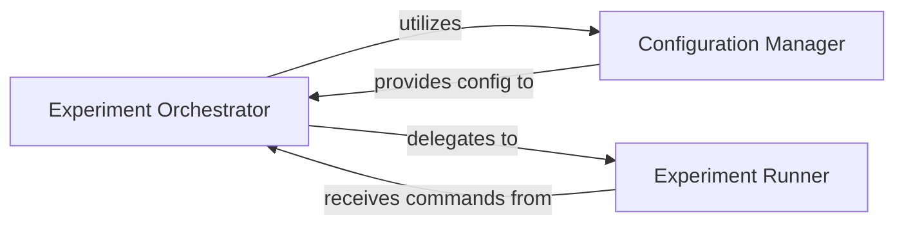

## Details

The PyMARL system's core execution flow is orchestrated by the `Experiment Orchestrator`, which initializes the experiment environment and manages the overall lifecycle. Before execution, the `Configuration Manager` is responsible for loading and consolidating experiment parameters from various configuration files, providing a unified configuration to the `Experiment Orchestrator`. Once configured, the `Experiment Orchestrator` delegates the actual training and evaluation tasks to the `Experiment Runner`, which then manages the interaction between the learning algorithms, environments, and models to execute the reinforcement learning experiments. This clear separation of concerns ensures modularity and maintainability, with a central orchestrator coordinating configuration and execution.

### Experiment Orchestrator [[Expand]](./Experiment_Orchestrator.md)
The core component responsible for initializing the system, parsing command-line arguments, loading experiment configurations, and managing the overall training and evaluation lifecycle. It acts as the conductor, delegating tasks to other components.

**Related Classes/Methods**:

- <a href="https://github.com/oxwhirl/pymarl/blob/master/src/main.py#L26-L35" target="_blank" rel="noopener noreferrer">`src.main.my_main`:26-35</a>

### Configuration Manager
Responsible for loading, parsing, and managing experiment configurations. It handles the hierarchical configuration structure (e.g., `algs`, `envs`) and provides the necessary parameters to the Experiment Orchestrator and other components.

**Related Classes/Methods**:

- <a href="https://github.com/oxwhirl/pymarl/blob/master/src/main.py#L38-L52" target="_blank" rel="noopener noreferrer">`src.main._get_config`:38-52</a>
- <a href="https://github.com/oxwhirl/pymarl/blob/master/src/main.py#L55-L61" target="_blank" rel="noopener noreferrer">`src.main.recursive_dict_update`:55-61</a>

### Experiment Runner
Executes the actual training and evaluation loops of the reinforcement learning experiments. It receives configurations from the Experiment Orchestrator and manages the interaction between the learning algorithm, environment, and model.

**Related Classes/Methods**:

- <a href="https://github.com/oxwhirl/pymarl/blob/master/src/run.py#L19-L63" target="_blank" rel="noopener noreferrer">`run.run`:19-63</a>

### [FAQ](https://github.com/CodeBoarding/GeneratedOnBoardings/tree/main?tab=readme-ov-file#faq)