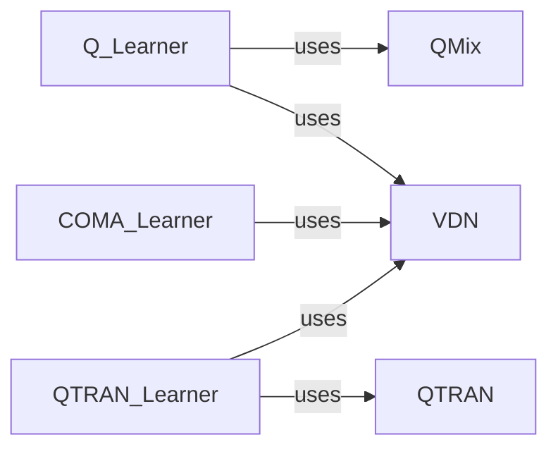

## Details

The Learning Algorithm subsystem is central to the project's reinforcement learning capabilities, focusing on the core logic for updating agent policies and value functions.

### Q_Learner
Implements the Q-learning algorithm, orchestrating training steps, managing target networks, and interacting with mixer components for multi-agent value aggregation.

**Related Classes/Methods**:

- <a href="https://github.com/oxwhirl/pymarl/blob/master/src/learners/q_learner.py" target="_blank" rel="noopener noreferrer">`Q_Learner`</a>

### COMA_Learner
Implements the Counterfactual Multi-Agent Policy Gradients (COMA) algorithm, managing training steps, target networks, and integrating value mixers for multi-agent value aggregation.

**Related Classes/Methods**:

- <a href="https://github.com/oxwhirl/pymarl/blob/master/src/learners/coma_learner.py" target="_blank" rel="noopener noreferrer">`COMA_Learner`</a>

### QTRAN_Learner
Implements the QTRAN algorithm, which focuses on decomposing joint action-values, orchestrating training steps, managing target networks, and interacting with specific mixer components.

**Related Classes/Methods**:

- <a href="https://github.com/oxwhirl/pymarl/blob/master/src/learners/qtran_learner.py" target="_blank" rel="noopener noreferrer">`QTRAN_Learner`</a>

### QMix
A value mixer component responsible for non-linearly combining individual agent Q-values into a joint Q-value, typically used in cooperative multi-agent settings.

**Related Classes/Methods**:

- <a href="https://github.com/oxwhirl/pymarl/blob/master/src/modules/mixers/qmix.py" target="_blank" rel="noopener noreferrer">`QMix`</a>

### QTRAN
A value mixer component specifically designed for the QTRAN algorithm, facilitating the transformation and decomposition of individual agent Q-values into a joint Q-value.

**Related Classes/Methods**:

- <a href="https://github.com/oxwhirl/pymarl/blob/master/src/modules/mixers/qtran.py" target="_blank" rel="noopener noreferrer">`QTRAN`</a>

### VDN
A simple value mixer component that sums individual agent Q-values to form a joint Q-value, often used as a baseline or in scenarios where value decomposition is additive.

**Related Classes/Methods**:

- <a href="https://github.com/oxwhirl/pymarl/blob/master/src/modules/mixers/vdn.py" target="_blank" rel="noopener noreferrer">`VDN`</a>

### [FAQ](https://github.com/CodeBoarding/GeneratedOnBoardings/tree/main?tab=readme-ov-file#faq)