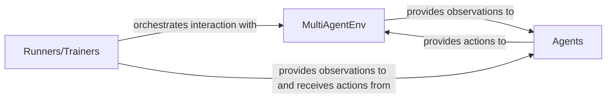

## Details

The PyMARL core subsystem is structured around a clear separation of concerns for multi-agent reinforcement learning. The `MultiAgentEnv` serves as the abstract interface for the simulated world, defining how agents interact with it through methods like `reset()` and `step()`, and how information like observations and state is retrieved. `Agents`, exemplified by `RNNAgent`, are the decision-making entities that receive these observations from the environment and produce actions. Orchestrating this entire process are the `Runners/Trainers` components, such as `EpisodeRunner` and `ParallelRunner`. These runners manage the lifecycle of episodes, drive the interaction by calling environment methods, collect data, and facilitate the training loop, ensuring a continuous flow of information and control between the simulated environment and the intelligent agents.

### MultiAgentEnv
This is the foundational abstract class that defines the contract for all multi-agent environments within the PyMARL framework. It specifies the essential methods that any concrete environment must implement to interact with agents and learning algorithms. It acts as the primary abstraction for the simulated reality.

**Related Classes/Methods**:

- <a href="https://github.com/oxwhirl/pymarl/blob/master/src/envs/multiagentenv.py" target="_blank" rel="noopener noreferrer">`pymarl.src.envs.multiagentenv.MultiAgentEnv`</a>
- <a href="https://github.com/oxwhirl/pymarl/blob/master/src/envs/multiagentenv.py" target="_blank" rel="noopener noreferrer">`pymarl.src.envs.multiagentenv.MultiAgentEnv:reset`</a>
- <a href="https://github.com/oxwhirl/pymarl/blob/master/src/envs/multiagentenv.py" target="_blank" rel="noopener noreferrer">`pymarl.src.envs.multiagentenv.MultiAgentEnv:step`</a>
- <a href="https://github.com/oxwhirl/pymarl/blob/master/src/envs/multiagentenv.py" target="_blank" rel="noopener noreferrer">`pymarl.src.envs.multiagentenv.MultiAgentEnv:get_obs`</a>
- <a href="https://github.com/oxwhirl/pymarl/blob/master/src/envs/multiagentenv.py" target="_blank" rel="noopener noreferrer">`pymarl.src.envs.multiagentenv.MultiAgentEnv:get_state`</a>
- <a href="https://github.com/oxwhirl/pymarl/blob/master/src/envs/multiagentenv.py" target="_blank" rel="noopener noreferrer">`pymarl.src.envs.multiagentenv.MultiAgentEnv:get_env_info`</a>
- <a href="https://github.com/oxwhirl/pymarl/blob/master/src/envs/multiagentenv.py" target="_blank" rel="noopener noreferrer">`pymarl.src.envs.multiagentenv.MultiAgentEnv:get_total_actions`</a>
- <a href="https://github.com/oxwhirl/pymarl/blob/master/src/envs/multiagentenv.py" target="_blank" rel="noopener noreferrer">`pymarl.src.envs.multiagentenv.MultiAgentEnv:get_obs_size`</a>
- <a href="https://github.com/oxwhirl/pymarl/blob/master/src/envs/multiagentenv.py" target="_blank" rel="noopener noreferrer">`pymarl.src.envs.multiagentenv.MultiAgentEnv:get_state_size`</a>
- <a href="https://github.com/oxwhirl/pymarl/blob/master/src/envs/multiagentenv.py" target="_blank" rel="noopener noreferrer">`pymarl.src.envs.multiagentenv.MultiAgentEnv:close`</a>

### Agents
This component represents the intelligent entities that interact with the `MultiAgentEnv`. Agents receive observations from the environment and, based on their internal policies, decide on actions to perform. The `RNNAgent` is a common implementation that uses recurrent neural networks for decision-making.

**Related Classes/Methods**:

### Runners/Trainers
This component is responsible for orchestrating the interaction between the `MultiAgentEnv` and the `Agents` over multiple episodes. It manages the simulation flow, including resetting the environment, stepping through time, collecting experiences, and potentially coordinating the training process of the agents. Both `EpisodeRunner` and `ParallelRunner` facilitate this orchestration, with `ParallelRunner` likely handling multiple environments concurrently.

**Related Classes/Methods**:

### [FAQ](https://github.com/CodeBoarding/GeneratedOnBoardings/tree/main?tab=readme-ov-file#faq)