```mermaid
graph LR
    Experiment_Orchestrator["Experiment Orchestrator"]
    Simulation_Environment["Simulation Environment"]
    Agent_System["Agent System"]
    Experience_Replay["Experience Replay"]
    Learning_Algorithm["Learning Algorithm"]
    Experiment_Orchestrator -- "Initializes" --> Simulation_Environment
    Experiment_Orchestrator -- "Initializes" --> Agent_System
    Experiment_Orchestrator -- "Initializes" --> Experience_Replay
    Experiment_Orchestrator -- "Initializes" --> Learning_Algorithm
    Simulation_Environment -- "Provides Observations To" --> Agent_System
    Simulation_Environment -- "Receives Actions From" --> Agent_System
    Agent_System -- "Generates Experiences For" --> Experience_Replay
    Agent_System -- "Updated By" --> Learning_Algorithm
    Experience_Replay -- "Provides Data To" --> Learning_Algorithm
    Learning_Algorithm -- "Samples Data From" --> Experience_Replay
    Learning_Algorithm -- "Updates" --> Agent_System
    click Experiment_Orchestrator href "https://github.com/CodeBoarding/GeneratedOnBoardings/blob/main/pymarl/Experiment_Orchestrator.md" "Details"
    click Simulation_Environment href "https://github.com/CodeBoarding/GeneratedOnBoardings/blob/main/pymarl/Simulation_Environment.md" "Details"
    click Agent_System href "https://github.com/CodeBoarding/GeneratedOnBoardings/blob/main/pymarl/Agent_System.md" "Details"
    click Experience_Replay href "https://github.com/CodeBoarding/GeneratedOnBoardings/blob/main/pymarl/Experience_Replay.md" "Details"
    click Learning_Algorithm href "https://github.com/CodeBoarding/GeneratedOnBoardings/blob/main/pymarl/Learning_Algorithm.md" "Details"
```

## Details

The `pymarl` project implements a modular and pipeline-driven architecture for multi-agent reinforcement learning. At its core, the **Experiment Orchestrator** manages the entire lifecycle, from configuration loading to initiating training and evaluation. It sets up the **Simulation Environment**, which provides the interactive world for agents. The **Agent System** interacts with this environment, generating actions and receiving observations, with its internal models being the primary learnable components. All interactions are logged into the **Experience Replay** buffer, serving as a centralized data source. The **Learning Algorithm** then periodically samples from this buffer to update the **Agent System**'s models, completing the reinforcement learning loop. This design clearly separates concerns into experiment management, environment interaction, data handling, and core learning logic, making it highly adaptable for diverse multi-agent research and development.

### Experiment Orchestrator [[Expand]](./Experiment_Orchestrator.md)
The central control unit responsible for initializing the entire system, loading configurations, and managing the overall training and evaluation lifecycle. It orchestrates the interaction between all other components.

**Related Classes/Methods**:

- <a href="https://github.com/oxwhirl/pymarl/blob/master/src/main.py" target="_blank" rel="noopener noreferrer">`src/main.py`</a>

### Simulation Environment [[Expand]](./Simulation_Environment.md)
Simulates the multi-agent world, providing observations to agents, processing their actions, and returning rewards and new states. It acts as the interface to the simulated reality.

**Related Classes/Methods**:

- <a href="https://github.com/oxwhirl/pymarl/blob/master/src/envs/multiagentenv.py" target="_blank" rel="noopener noreferrer">`src/envs/multiagentenv.py`</a>

### Agent System [[Expand]](./Agent_System.md)
Encapsulates the logic for agents, including their neural network models (policies/critics) and the mechanism for selecting actions based on observations. It represents the learnable entities within the environment.

**Related Classes/Methods**:

- <a href="https://github.com/oxwhirl/pymarl/blob/master/src/controllers/basic_controller.py" target="_blank" rel="noopener noreferrer">`src/controllers/basic_controller.py`</a>
- <a href="https://github.com/oxwhirl/pymarl/blob/master/src/modules/agents/rnn_agent.py" target="_blank" rel="noopener noreferrer">`src/modules/agents/rnn_agent.py`</a>
- <a href="https://github.com/oxwhirl/pymarl/blob/master/src/modules/critics/coma.py" target="_blank" rel="noopener noreferrer">`src/modules/critics/coma.py`</a>

### Experience Replay [[Expand]](./Experience_Replay.md)
A data store that accumulates experiences (transitions or full episodes) collected from the `Simulation Environment` by the `Agent System`. It enables efficient sampling of past data for the learning process, breaking temporal correlations.

**Related Classes/Methods**:

- <a href="https://github.com/oxwhirl/pymarl/blob/master/src/components/episode_buffer.py" target="_blank" rel="noopener noreferrer">`src/components/episode_buffer.py`</a>

### Learning Algorithm [[Expand]](./Learning_Algorithm.md)
Implements the core reinforcement learning algorithms. It samples data from the `Experience Replay` and uses it to compute updates for the models within the `Agent System`, driving the learning process. This component may also incorporate value mixers for specific multi-agent algorithms.

**Related Classes/Methods**:

- <a href="https://github.com/oxwhirl/pymarl/blob/master/src/learners/q_learner.py" target="_blank" rel="noopener noreferrer">`src/learners/q_learner.py`</a>
- <a href="https://github.com/oxwhirl/pymarl/blob/master/src/learners/coma_learner.py" target="_blank" rel="noopener noreferrer">`src/learners/coma_learner.py`</a>
- <a href="https://github.com/oxwhirl/pymarl/blob/master/src/learners/qtran_learner.py" target="_blank" rel="noopener noreferrer">`src/learners/qtran_learner.py`</a>
- <a href="https://github.com/oxwhirl/pymarl/blob/master/src/modules/mixers/qmix.py" target="_blank" rel="noopener noreferrer">`src/modules/mixers/qmix.py`</a>
- <a href="https://github.com/oxwhirl/pymarl/blob/master/src/modules/mixers/qtran.py" target="_blank" rel="noopener noreferrer">`src/modules/mixers/qtran.py`</a>
- <a href="https://github.com/oxwhirl/pymarl/blob/master/src/modules/mixers/vdn.py" target="_blank" rel="noopener noreferrer">`src/modules/mixers/vdn.py`</a>

### [FAQ](https://github.com/CodeBoarding/GeneratedOnBoardings/tree/main?tab=readme-ov-file#faq)