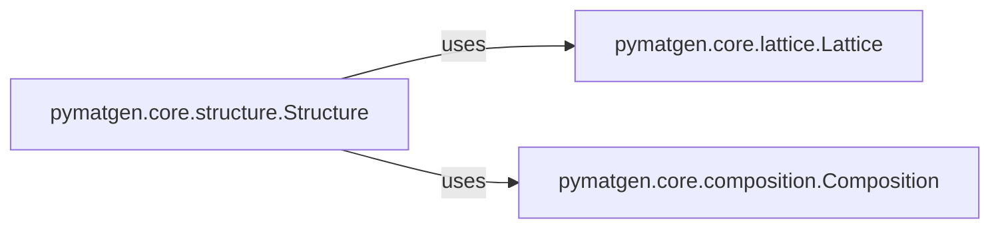

## Details

The `Core Data Models` subsystem is defined by the `pymatgen.core` package, specifically encompassing the `structure`, `composition`, and `lattice` modules. These modules provide the foundational data structures for representing materials science entities within the `pymatgen` library.

### pymatgen.core.structure.Structure
This component serves as the central aggregate for material data, representing the atomic arrangement of a material. It manages atomic sites, periodicity, and the overall chemical makeup. It embodies the "Data-centric Architecture" pattern by being the primary data container for materials.

**Related Classes/Methods**:

- <a href="https://github.com/materialsproject/pymatgen/blob/master/src/pymatgen/core/structure.py#L4153-L5075" target="_blank" rel="noopener noreferrer">`pymatgen.core.structure.Structure`:4153-5075</a>

### pymatgen.core.composition.Composition
This component models the chemical stoichiometry of a material, providing elemental ratios and related properties. It directly reflects a core materials science concept, aligning with the "Domain-Driven Design" architectural pattern.

**Related Classes/Methods**:

- <a href="https://github.com/materialsproject/pymatgen/blob/master/src/pymatgen/core/composition.py" target="_blank" rel="noopener noreferrer">`pymatgen.core.composition.Composition`</a>

### pymatgen.core.lattice.Lattice
This component defines the 3D periodic basis vectors and associated geometric properties of a crystal. It is a fundamental building block for representing any crystalline material, providing the spatial framework upon which structures are built.

**Related Classes/Methods**:

- <a href="https://github.com/materialsproject/pymatgen/blob/master/src/pymatgen/core/lattice.py" target="_blank" rel="noopener noreferrer">`pymatgen.core.lattice.Lattice`</a>

### [FAQ](https://github.com/CodeBoarding/GeneratedOnBoardings/tree/main?tab=readme-ov-file#faq)