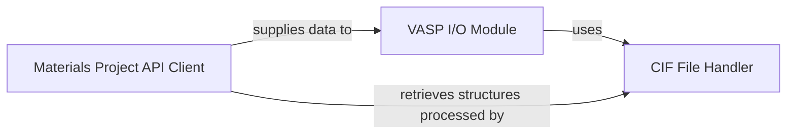

## Details

The `pymatgen.io` subsystem focuses on handling various input and output file formats crucial for computational materials science. It primarily consists of three core components: the `VASP I/O Module` for managing VASP-specific data, the `CIF File Handler` for crystallographic information files, and the `Materials Project API Client` for external data retrieval. These components interact to facilitate a seamless workflow from data acquisition to simulation input generation and output parsing. The `Materials Project API Client` acts as the initial data source, providing structures and other material properties. This data can then be processed by the `VASP I/O Module` to prepare inputs for VASP simulations or by the `CIF File Handler` for general crystallographic data manipulation. The `VASP I/O Module` may also leverage the `CIF File Handler` for converting structures to or from CIF format, ensuring interoperability across different simulation and analysis tools.

### VASP I/O Module
This comprehensive module handles all aspects of VASP (Vienna Ab initio Simulation Package) input and output. It acts as a "Data Input Generator" and "Data Output Parser" for VASP, abstracting the complexities of file formats.

**Related Classes/Methods**:

- <a href="https://github.com/materialsproject/pymatgen/blob/master/src/pymatgen/io/vasp/inputs.py" target="_blank" rel="noopener noreferrer">`pymatgen.io.vasp.inputs`</a>
- <a href="https://github.com/materialsproject/pymatgen/blob/master/src/pymatgen/io/vasp/sets.py" target="_blank" rel="noopener noreferrer">`pymatgen.io.vasp.sets`</a>
- <a href="https://github.com/materialsproject/pymatgen/blob/master/src/pymatgen/io/vasp/outputs.py" target="_blank" rel="noopener noreferrer">`pymatgen.io.vasp.outputs`</a>
- <a href="https://github.com/materialsproject/pymatgen/blob/master/src/pymatgen/io/vasp/optics.py" target="_blank" rel="noopener noreferrer">`pymatgen.io.vasp.optics`</a>

### CIF File Handler
This component provides foundational capabilities for reading, writing, and manipulating Crystallographic Information Files (CIF). It serves as the primary "File Format Handler" and "Data Deserializer/Converter" for CIF data.

**Related Classes/Methods**:

- <a href="https://github.com/materialsproject/pymatgen/blob/master/src/pymatgen/io/cif.py" target="_blank" rel="noopener noreferrer">`pymatgen.io.cif`</a>
- <a href="https://github.com/materialsproject/pymatgen/blob/master/src/pymatgen/io/cif.py#L1331-L1348" target="_blank" rel="noopener noreferrer">`pymatgen.io.cif.get_structures`:1331-1348</a>

### Materials Project API Client
This component acts as the primary client for the Materials Project REST API, facilitating data retrieval from this external database. It functions as the central "External API Client" and "Specific Data Query" component.

**Related Classes/Methods**:

- <a href="https://github.com/materialsproject/pymatgen/blob/master/src/pymatgen/ext/matproj.py#L51-L551" target="_blank" rel="noopener noreferrer">`pymatgen.ext.matproj.MPRester`:51-551</a>
- <a href="https://github.com/materialsproject/pymatgen/blob/master/src/pymatgen/ext/matproj.py#L347-L440" target="_blank" rel="noopener noreferrer">`pymatgen.ext.matproj.get_entries`:347-440</a>
- <a href="https://github.com/materialsproject/pymatgen/blob/master/src/pymatgen/ext/matproj.py#L289-L305" target="_blank" rel="noopener noreferrer">`pymatgen.ext.matproj.get_structures`:289-305</a>

### [FAQ](https://github.com/CodeBoarding/GeneratedOnBoardings/tree/main?tab=readme-ov-file#faq)