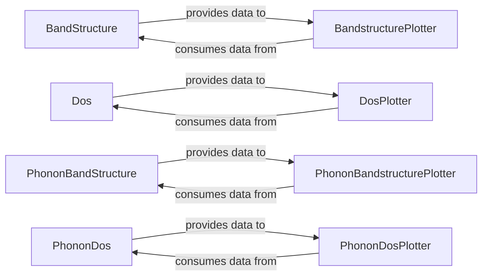

## Details

The pymatgen electronic and phonon structure analysis and visualization subsystem is composed of core data models and their corresponding plotting utilities. The BandStructure and Dos components are responsible for encapsulating electronic structure data, including k-points, energies, and densities of states, and providing methods for fundamental property calculations like band gaps. Similarly, PhononBandStructure and PhononDos handle vibrational properties and related thermodynamic data. These data-centric components serve as the primary data sources for their respective visualization counterparts: BandstructurePlotter, DosPlotter, PhononBandstructurePlotter, and PhononDosPlotter. Each plotter component is designed to consume the data from its associated data model and render it into insightful visual representations, enabling users to interpret complex material properties effectively. This clear separation of data management and visualization responsibilities ensures modularity and maintainability within the subsystem.

### BandStructure
Stores and manages electronic band structure data (k-points, band energies, projections). Provides methods for calculating key electronic properties like Valence Band Maximum (VBM), Conduction Band Minimum (CBM), and band gaps.

**Related Classes/Methods**:

- <a href="https://github.com/materialsproject/pymatgen/blob/master/src/pymatgen/analysis/solar/slme.py" target="_blank" rel="noopener noreferrer">`BandStructure`</a>

### Dos
Stores and manages electronic density of states data (energy grid, density values). Facilitates calculations of band gaps, Fermi levels, and various DOS moments.

**Related Classes/Methods**:

- <a href="https://github.com/materialsproject/pymatgen/blob/master/src/pymatgen/analysis/xps.py#L80-L100" target="_blank" rel="noopener noreferrer">`Dos`:80-100</a>

### PhononBandStructure
Represents and manages phonon band structure data (vibrational frequencies across q-points). Includes functionality to check for phonon instabilities.

**Related Classes/Methods**:

- <a href="https://github.com/materialsproject/pymatgen/blob/master/src/pymatgen/phonon/bandstructure.py#L62-L347" target="_blank" rel="noopener noreferrer">`PhononBandStructure`:62-347</a>

### PhononDos
Stores and manages phonon density of states data. Enables the calculation of thermodynamic properties such as heat capacity, entropy, internal energy, Helmholtz free energy, and zero-point energy.

**Related Classes/Methods**:

- <a href="https://github.com/materialsproject/pymatgen/blob/master/src/pymatgen/phonon/dos.py#L29-L565" target="_blank" rel="noopener noreferrer">`PhononDos`:29-565</a>

### BandstructurePlotter
Provides functionalities to visualize electronic band structures, including total and projected bands, for clear data interpretation.

**Related Classes/Methods**:

- <a href="https://github.com/materialsproject/pymatgen/blob/master/src/pymatgen/electronic_structure/plotter.py" target="_blank" rel="noopener noreferrer">`BandstructurePlotter`</a>

### DosPlotter
Offers tools for visualizing electronic density of states, supporting total, site-projected, and orbital-projected views.

**Related Classes/Methods**:

- <a href="https://github.com/materialsproject/pymatgen/blob/master/src/pymatgen/electronic_structure/boltztrap2.py" target="_blank" rel="noopener noreferrer">`DosPlotter`</a>

### PhononBandstructurePlotter
Visualizes phonon band structures, including projected bands, to aid in understanding vibrational properties.

**Related Classes/Methods**:

- <a href="https://github.com/materialsproject/pymatgen/blob/master/src/pymatgen/phonon/plotter.py" target="_blank" rel="noopener noreferrer">`PhononBandstructurePlotter`</a>

### PhononDosPlotter
Visualizes phonon density of states and derived thermodynamic properties, providing insights into material thermodynamics.

**Related Classes/Methods**:

- <a href="https://github.com/materialsproject/pymatgen/blob/master/src/pymatgen/phonon/plotter.py#L75-L305" target="_blank" rel="noopener noreferrer">`PhononDosPlotter`:75-305</a>

### [FAQ](https://github.com/CodeBoarding/GeneratedOnBoardings/tree/main?tab=readme-ov-file#faq)