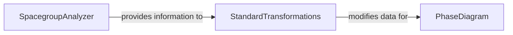

## Details

The analyzed subsystem is a core part of `pymatgen`, focusing on the analysis and manipulation of material structures. It encompasses functionalities from the `analysis`, `symmetry`, and `transformations` subpackages, demonstrating a cohesive set of operations for materials science computations. This subsystem of `pymatgen` forms a robust framework for advanced materials analysis and structural engineering. The `SpacegroupAnalyzer` component initiates the process by identifying and applying crystallographic symmetry, generating insights that are vital for understanding material behavior. These symmetry insights can then be utilized by the `StandardTransformations` component, which offers a versatile suite of operations for modifying crystal structures, enabling the creation of new hypothetical materials or the preparation of existing ones for specific simulations. The structures, once transformed, are subsequently analyzed by the `PhaseDiagram` component, which provides critical thermodynamic data on material stability and decomposition pathways. This integrated architecture facilitates a comprehensive approach to materials science research, from fundamental symmetry considerations to practical structural modifications and their thermodynamic implications.

### PhaseDiagram
This component is responsible for the thermodynamic analysis of material systems. It computes and manages phase diagrams, determining stable phases, formation energies, and decomposition pathways under various conditions. It is fundamental for understanding material stability and reactivity.

**Related Classes/Methods**:

- <a href="https://github.com/materialsproject/pymatgen/blob/master/src/pymatgen/analysis/phase_diagram.py" target="_blank" rel="noopener noreferrer">`PhaseDiagram`</a>

### SpacegroupAnalyzer
This component focuses on crystallographic symmetry. It determines and applies space group operations to crystal structures, which is essential for understanding the inherent symmetry of materials. Symmetry information is critical for many physical properties and computational analyses, including reducing computational cost.

**Related Classes/Methods**:

- <a href="https://github.com/materialsproject/pymatgen/blob/master/src/pymatgen/symmetry/analyzer.py#L84-L1015" target="_blank" rel="noopener noreferrer">`SpacegroupAnalyzer`:84-1015</a>

### StandardTransformations
This component provides a comprehensive suite of fundamental operations for modifying crystal structures. These transformations include operations like deformation, atomic substitution, supercell creation, and other structural manipulations. It is crucial for preparing structures for various simulations, analyses, or for generating new hypothetical materials. This component represents the functionalities provided within the `standard_transformations` module.

**Related Classes/Methods**:

- <a href="https://github.com/materialsproject/pymatgen/blob/master/src/pymatgen/transformations/standard_transformations.py" target="_blank" rel="noopener noreferrer">`standard_transformations`</a>

### [FAQ](https://github.com/CodeBoarding/GeneratedOnBoardings/tree/main?tab=readme-ov-file#faq)