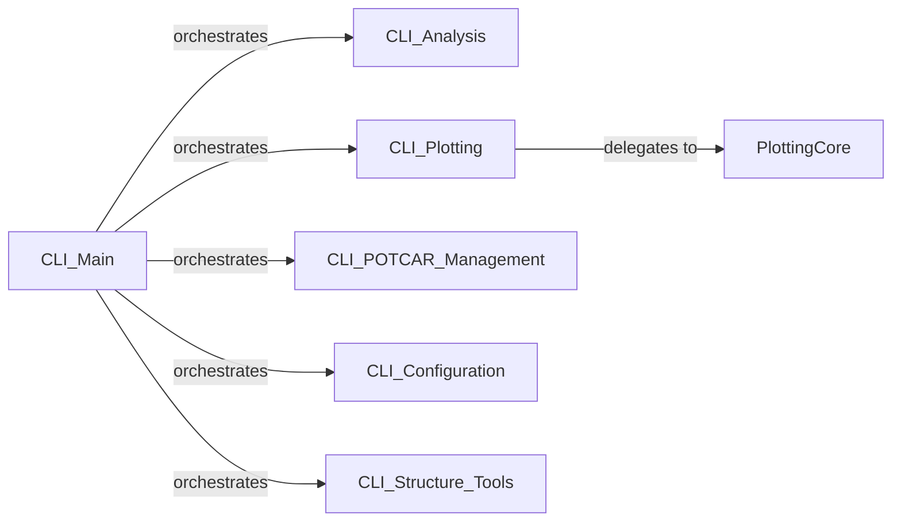

## Details

The `pymatgen` command-line interface (CLI) subsystem is designed around a central dispatcher, `CLI_Main`, which orchestrates interactions with various specialized CLI tools. These tools, including `CLI_Analysis`, `CLI_Plotting`, `CLI_POTCAR_Management`, `CLI_Configuration`, and `CLI_Structure_Tools`, provide specific functionalities for materials science tasks. The `CLI_Plotting` component further delegates to the `PlottingCore` for low-level visualization operations, ensuring a clear separation of concerns between CLI presentation and plotting backend. This architecture allows for modular expansion of CLI capabilities while maintaining a unified entry point for users.

### PlottingCore
Acts as the low-level backend for generating and managing various types of plots relevant to materials data. It provides the fundamental building blocks for visualization, abstracting away the underlying plotting library details.

**Related Classes/Methods**:

### CLI_Main
Serves as the central dispatcher for the `pymatgen` command-line interface. It parses top-level commands and routes them to the appropriate specialized CLI sub-modules for execution.

**Related Classes/Methods**:

### CLI_Analysis
Provides command-line tools specifically for executing materials data analysis routines and retrieving results, such as energy or magnetization data.

**Related Classes/Methods**:

### CLI_Plotting
Offers command-line functionalities for generating and displaying specific materials-related plots (e.g., XRD patterns, DOS, charge integration plots) by orchestrating calls to the `PlottingCore` and other data processing utilities.

**Related Classes/Methods**:

### CLI_POTCAR_Management
Manages VASP POTCAR files through command-line operations, simplifying common tasks for computational materials scientists related to pseudopotential files.

**Related Classes/Methods**:

### CLI_Configuration
Handles the configuration of `pymatgen` and its external software dependencies via the command line, ensuring proper setup for various functionalities and integrations.

**Related Classes/Methods**:

### CLI_Structure_Tools
Provides command-line utilities for various structure-related analysis and manipulation tasks, such as symmetry analysis, format conversion, and comparison of crystal structures.

**Related Classes/Methods**:

### [FAQ](https://github.com/CodeBoarding/GeneratedOnBoardings/tree/main?tab=readme-ov-file#faq)