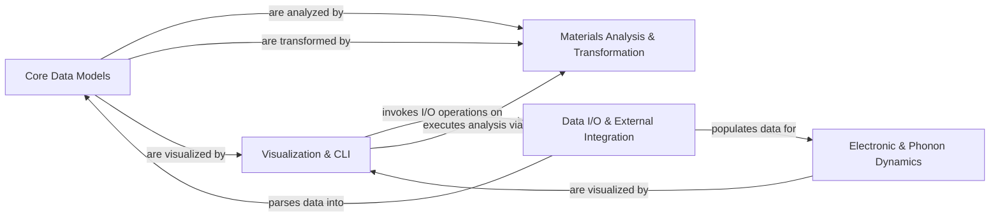

## Details

The `pymatgen` project is structured around a core set of data models that represent fundamental materials science entities. Data enters the system primarily through the `Data I/O & External Integration` component, which is responsible for parsing various file formats and interacting with external data sources, populating the `Core Data Models`. These models then serve as the foundation for advanced computations performed by the `Materials Analysis & Transformation` component, which offers a wide array of algorithms for analyzing and transforming materials data, including symmetry analysis and structural modifications. Specialized analysis of electronic and vibrational properties is handled by the `Electronic & Phonon Dynamics` component, which also receives data from the `Data I/O & External Integration` component. Finally, the `Visualization & CLI` component provides user interaction capabilities, allowing for the visualization of both `Core Data Models` and results from `Electronic & Phonon Dynamics`, and can also trigger I/O operations and analysis workflows. This modular design ensures clear separation of concerns, facilitating maintainability and extensibility.

### Core Data Models [[Expand]](./Core_Data_Models.md)
The central data representation for all materials science entities.

**Related Classes/Methods**:

- <a href="https://github.com/materialsproject/pymatgen/blob/master/src/pymatgen/core/structure.py" target="_blank" rel="noopener noreferrer">`pymatgen.core.structure`</a>
- <a href="https://github.com/materialsproject/pymatgen/blob/master/src/pymatgen/core/composition.py" target="_blank" rel="noopener noreferrer">`pymatgen.core.composition`</a>
- <a href="https://github.com/materialsproject/pymatgen/blob/master/src/pymatgen/core/lattice.py" target="_blank" rel="noopener noreferrer">`pymatgen.core.lattice`</a>

### Data I/O & External Integration [[Expand]](./Data_I_O_External_Integration.md)
Handles all data input/output operations, including parsing various file formats and interacting with external databases.

**Related Classes/Methods**:

- <a href="https://github.com/materialsproject/pymatgen/blob/master/src/pymatgen/io/cif.py" target="_blank" rel="noopener noreferrer">`pymatgen.io.cif`</a>
- <a href="https://github.com/materialsproject/pymatgen/blob/master/src/pymatgen/ext/matproj.py" target="_blank" rel="noopener noreferrer">`pymatgen.ext.matproj`</a>

### Materials Analysis & Transformation [[Expand]](./Materials_Analysis_Transformation.md)
Provides a comprehensive suite of algorithms for analyzing and transforming materials data.

**Related Classes/Methods**:

- <a href="https://github.com/materialsproject/pymatgen/blob/master/src/pymatgen/analysis/phase_diagram.py" target="_blank" rel="noopener noreferrer">`pymatgen.analysis.phase_diagram`</a>
- <a href="https://github.com/materialsproject/pymatgen/blob/master/src/pymatgen/symmetry/analyzer.py" target="_blank" rel="noopener noreferrer">`pymatgen.symmetry.analyzer`</a>
- <a href="https://github.com/materialsproject/pymatgen/blob/master/src/pymatgen/transformations/standard_transformations.py" target="_blank" rel="noopener noreferrer">`pymatgen.transformations.standard_transformations`</a>

### Electronic & Phonon Dynamics [[Expand]](./Electronic_Phonon_Dynamics.md)
Specializes in processing and interpreting electronic and vibrational properties of materials.

**Related Classes/Methods**:

- <a href="https://github.com/materialsproject/pymatgen/blob/master/src/pymatgen/electronic_structure/bandstructure.py" target="_blank" rel="noopener noreferrer">`pymatgen.electronic_structure.bandstructure`</a>
- <a href="https://github.com/materialsproject/pymatgen/blob/master/src/pymatgen/electronic_structure/dos.py" target="_blank" rel="noopener noreferrer">`pymatgen.electronic_structure.dos`</a>
- <a href="https://github.com/materialsproject/pymatgen/blob/master/src/pymatgen/phonon/bandstructure.py" target="_blank" rel="noopener noreferrer">`pymatgen.phonon.bandstructure`</a>

### Visualization & CLI [[Expand]](./Visualization_CLI.md)
Provides tools for visualizing materials data and a command-line interface for user interaction.

**Related Classes/Methods**:

- <a href="https://github.com/materialsproject/pymatgen/blob/master/src/pymatgen/vis/plotters.py" target="_blank" rel="noopener noreferrer">`pymatgen.vis.plotters`</a>

### [FAQ](https://github.com/CodeBoarding/GeneratedOnBoardings/tree/main?tab=readme-ov-file#faq)