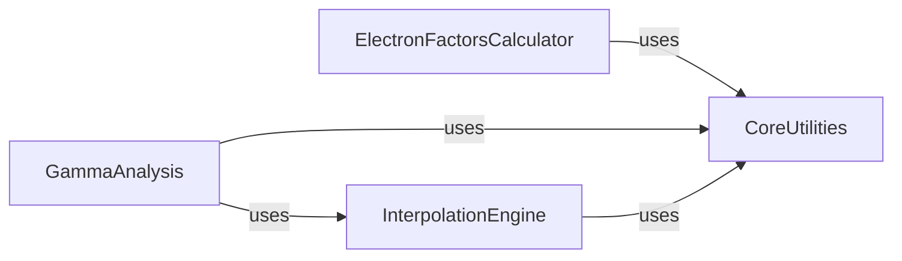

## Details

This subsystem is designed to perform quantitative analysis and quality assurance checks on medical physics data, alongside providing essential utility functions for the `pymedphys` application. It encapsulates core algorithms for data comparison and specialized calculations, supported by a robust set of general-purpose tools.

### ElectronFactorsCalculator
This component is responsible for calculating deformability factors for electron beams. These factors are crucial for accurate dose calculations in electron therapy, accounting for tissue inhomogeneities and ensuring treatment quality assurance. It provides the specialized algorithms required for electron beam QA.

**Related Classes/Methods**:

- <a href="https://github.com/pymedphys/pymedphys/lib/pymedphys/_electronfactors/core.py#L1-L1" target="_blank" rel="noopener noreferrer">`pymedphys._electronfactors.core` (1:1)</a>
- <a href="https://github.com/pymedphys/pymedphys/lib/pymedphys/_electronfactors/visualisation.py#L1-L1" target="_blank" rel="noopener noreferrer">`pymedphys._electronfactors.visualisation` (1:1)</a>

### GammaAnalysis
Implements the gamma index analysis, a widely adopted metric in radiation therapy quality assurance (QA) to compare two dose distributions (e.g., calculated vs. measured). It handles user inputs and performs iterative calculations to determine the agreement between distributions. This component is the core engine for dose distribution comparison.

**Related Classes/Methods**:

- <a href="https://github.com/pymedphys/pymedphys/lib/pymedphys/_gamma/implementation/shell.py#L1-L1" target="_blank" rel="noopener noreferrer">`pymedphys._gamma.implementation.shell` (1:1)</a>
- <a href="https://github.com/pymedphys/pymedphys/lib/pymedphys/_gamma/implementation/filter.py#L1-L1" target="_blank" rel="noopener noreferrer">`pymedphys._gamma.implementation.filter` (1:1)</a>
- <a href="https://github.com/pymedphys/pymedphys/lib/pymedphys/_gamma/api/core.py#L1-L1" target="_blank" rel="noopener noreferrer">`pymedphys._gamma.api.core` (1:1)</a>
- <a href="https://github.com/pymedphys/pymedphys/lib/pymedphys/_gamma/utilities/core.py#L1-L1" target="_blank" rel="noopener noreferrer">`pymedphys._gamma.utilities.core` (1:1)</a>

### InterpolationEngine
Provides robust 1D, 2D, and 3D linear interpolation functionalities. This component is a foundational mathematical utility, enabling data resampling, grid transformations, and spatial data manipulation across various medical physics applications, including dose analysis and profile comparisons. It serves as a crucial mathematical helper.

**Related Classes/Methods**:

- <a href="https://github.com/pymedphys/pymedphys/lib/pymedphys/_interp/interp.py#L354-L477" target="_blank" rel="noopener noreferrer">`pymedphys._interp.interp` (354:477)</a>

### CoreUtilities
Provides foundational utility functions and modules used across the entire `pymedphys` project. This includes general algorithms, file system operations, application configuration management, patient data handling, and testing utilities, ensuring consistency and reusability of common functionalities. It acts as the general-purpose helper and infrastructure manager.

**Related Classes/Methods**:

- `pymedphys._utilities` (1:1)
- <a href="https://github.com/pymedphys/pymedphys/lib/pymedphys/_config.py#L1-L1" target="_blank" rel="noopener noreferrer">`pymedphys._config` (1:1)</a>
- `pymedphys._utilities.algorithms` (1:1)
- `pymedphys._utilities.constants` (1:1)
- <a href="https://github.com/pymedphys/pymedphys/lib/pymedphys/_utilities/controlpoints.py#L1-L1" target="_blank" rel="noopener noreferrer">`pymedphys._utilities.controlpoints` (1:1)</a>
- <a href="https://github.com/pymedphys/pymedphys/lib/pymedphys/_utilities/createshells.py#L1-L1" target="_blank" rel="noopener noreferrer">`pymedphys._utilities.createshells` (1:1)</a>
- `pymedphys._utilities.filehash` (1:1)
- <a href="https://github.com/pymedphys/pymedphys/lib/pymedphys/_utilities/filesystem.py#L1-L1" target="_blank" rel="noopener noreferrer">`pymedphys._utilities.filesystem` (1:1)</a>
- <a href="https://github.com/pymedphys/pymedphys/lib/pymedphys/_utilities/patient.py#L1-L1" target="_blank" rel="noopener noreferrer">`pymedphys._utilities.patient` (1:1)</a>
- <a href="https://github.com/pymedphys/pymedphys/lib/pymedphys/_utilities/test.py#L1-L1" target="_blank" rel="noopener noreferrer">`pymedphys._utilities.test` (1:1)</a>
- `pymedphys._utilities.transforms` (1:1)

### [FAQ](https://github.com/CodeBoarding/GeneratedOnBoardings/tree/main?tab=readme-ov-file#faq)