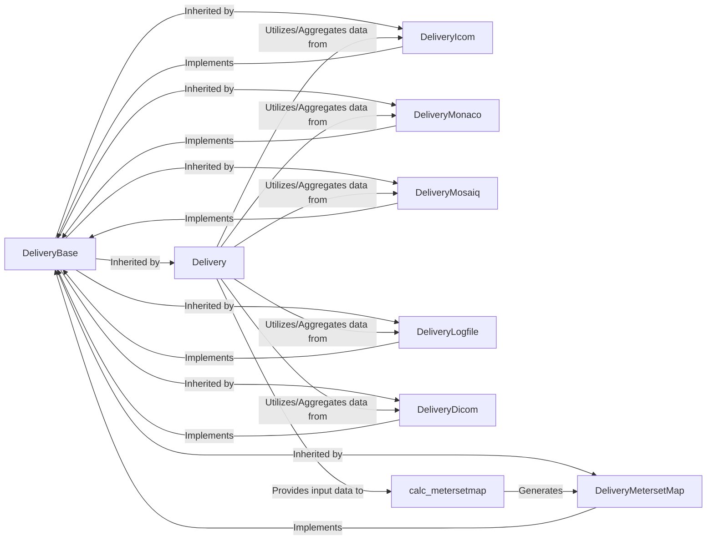

## Details

This component is the backbone for handling and structuring diverse treatment delivery data within `pymedphys`. It establishes a unified data model through an abstract base class and its specialized implementations, enabling consistent processing and analysis across various input sources. A key function of this component is the calculation of meterset maps, transforming raw delivery data into a critical analytical output.

### DeliveryBase
Defines the abstract interface and common properties for all treatment delivery data models, ensuring structural consistency and extensibility for new data sources.

**Related Classes/Methods**:

- `DeliveryBase` (1:1)

### Delivery
The primary concrete model that unifies and processes diverse raw delivery data into a structured format, building upon the `DeliveryBase` abstraction. It acts as a central orchestrator for various input types.

**Related Classes/Methods**:

- <a href="https://github.com/pymedphys/pymedphys/lib/pymedphys/_base/delivery.py#L1-L1" target="_blank" rel="noopener noreferrer">`Delivery` (1:1)</a>

### DeliveryIcom
Specializes in parsing and structuring treatment delivery data originating from ICOM systems, adhering to the `DeliveryBase` interface.

**Related Classes/Methods**:

- `DeliveryIcom` (1:1)

### DeliveryMonaco
Handles and structures treatment delivery data specifically from Monaco treatment planning systems, implementing the `DeliveryBase` interface.

**Related Classes/Methods**:

- `DeliveryMonaco` (1:1)

### DeliveryMosaiq
Manages and models treatment delivery data acquired from Mosaiq oncology information systems, implementing the `DeliveryBase` interface.

**Related Classes/Methods**:

- `DeliveryMosaiq` (1:1)

### DeliveryLogfile
Extracts and structures treatment delivery data from TRF logfiles, conforming to the `DeliveryBase` interface for consistent processing.

**Related Classes/Methods**:

- `DeliveryLogfile` (1:1)

### DeliveryDicom
Responsible for parsing and modeling treatment delivery data conforming to the DICOM standard, implementing the `DeliveryBase` interface.

**Related Classes/Methods**:

- `DeliveryDicom` (1:1)

### DeliveryMetersetMap
Represents the structured output data specifically for meterset maps, maintaining consistency with other delivery data models via `DeliveryBase`.

**Related Classes/Methods**:

- `DeliveryMetersetMap` (1:1)

### calc_metersetmap
The core function responsible for computing and generating meterset maps from structured delivery data provided by the `Delivery` models.

**Related Classes/Methods**:

- `calc_metersetmap` (1:1)

### [FAQ](https://github.com/CodeBoarding/GeneratedOnBoardings/tree/main?tab=readme-ov-file#faq)