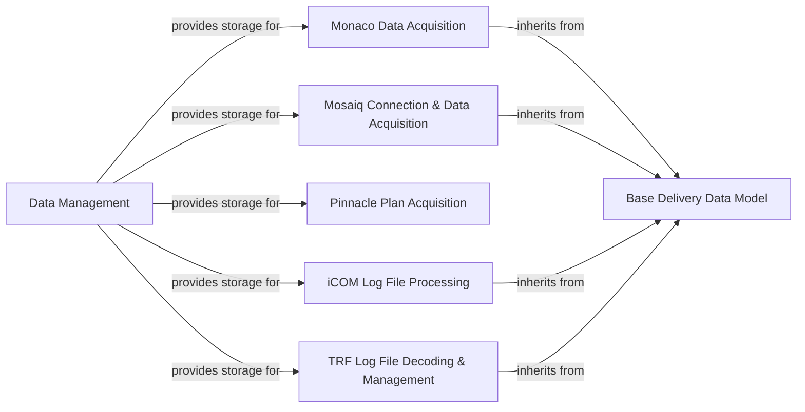

## Details

This subsystem is crucial for `pymedphys` as it acts as the primary gateway for ingesting diverse raw data from various clinical systems and linear accelerators. Its fundamental purpose is to abstract the complexities of data retrieval and initial processing, providing a standardized input for subsequent analysis and quality assurance workflows within `pymedphys`.

### Data Management
This component is responsible for the efficient downloading, caching, and local storage of all acquired data files. It ensures data persistence and quick access for other components, acting as the local repository for raw and initially processed data.

**Related Classes/Methods**:

- <a href="https://github.com/pymedphys/pymedphys/lib/pymedphys/_data/download.py#L103-L152" target="_blank" rel="noopener noreferrer">`pymedphys._data.download.data_path` (103:152)</a>

### Monaco Data Acquisition
Specializes in connecting to Monaco Treatment Planning Systems (TPS) to extract and structure treatment delivery data. It translates Monaco-specific data formats into a usable structure within `pymedphys`.

**Related Classes/Methods**:

- <a href="https://github.com/pymedphys/pymedphys/lib/pymedphys/_monaco/delivery.py#L25-L33" target="_blank" rel="noopener noreferrer">`pymedphys._monaco.delivery.DeliveryMonaco` (25:33)</a>

### Mosaiq Connection & Data Acquisition
Manages secure connections to the Mosaiq Oncology Information System (OIS) and is responsible for extracting and structuring patient and treatment delivery data from it.

**Related Classes/Methods**:

- <a href="https://github.com/pymedphys/pymedphys/lib/pymedphys/_mosaiq/connect.py#L100-L139" target="_blank" rel="noopener noreferrer">`pymedphys._mosaiq.connect.connect_with_credentials` (100:139)</a>
- <a href="https://github.com/pymedphys/pymedphys/lib/pymedphys/_mosaiq/delivery.py#L330-L366" target="_blank" rel="noopener noreferrer">`pymedphys._mosaiq.delivery.DeliveryMosaiq` (330:366)</a>

### Pinnacle Plan Acquisition
Focuses on parsing and representing comprehensive treatment plan data specifically from Pinnacle Treatment Planning Systems. It extracts details like beam configurations, dose distributions, and patient anatomy.

**Related Classes/Methods**:

- <a href="https://github.com/pymedphys/pymedphys/lib/pymedphys/_pinnacle/pinnacle_plan.py#L54-L448" target="_blank" rel="noopener noreferrer">`pymedphys._pinnacle.pinnacle_plan.PinnaclePlan` (54:448)</a>

### iCOM Log File Processing
Handles the real-time listening for and acquisition of data from iCOM linear accelerator log files. It then processes this raw log data into a structured delivery format suitable for analysis.

**Related Classes/Methods**:

- <a href="https://github.com/pymedphys/pymedphys/lib/pymedphys/_icom/listener.py#L39-L90" target="_blank" rel="noopener noreferrer">`pymedphys._icom.listener.listen` (39:90)</a>
- <a href="https://github.com/pymedphys/pymedphys/lib/pymedphys/_icom/delivery.py#L78-L85" target="_blank" rel="noopener noreferrer">`pymedphys._icom.delivery.DeliveryIcom` (78:85)</a>

### TRF Log File Decoding & Management
Provides functionalities for decoding raw TRF (Treatment Record File) log files from linear accelerators, indexing them for efficient retrieval, and structuring the contained delivery data into a standardized format.

**Related Classes/Methods**:

- <a href="https://github.com/pymedphys/pymedphys/lib/pymedphys/_trf/decode/table.py#L22-L39" target="_blank" rel="noopener noreferrer">`pymedphys._trf.decode.table.decode_trf_table` (22:39)</a>
- <a href="https://github.com/pymedphys/pymedphys/lib/pymedphys/_trf/manage/index.py#L268-L361" target="_blank" rel="noopener noreferrer">`pymedphys._trf.manage.index.index_logfiles` (268:361)</a>
- <a href="https://github.com/pymedphys/pymedphys/lib/pymedphys/_trf/decode/delivery.py#L31-L84" target="_blank" rel="noopener noreferrer">`pymedphys._trf.decode.delivery.DeliveryLogfile` (31:84)</a>

### Base Delivery Data Model
This is an abstract base class that defines a common interface and structure for all specific delivery data models (e.g., Monaco, Mosaiq, iCOM, TRF). It promotes consistency, reusability, and enables polymorphic handling of diverse delivery data throughout the `pymedphys` system.

**Related Classes/Methods**:

- <a href="https://github.com/pymedphys/pymedphys/lib/pymedphys/_base/delivery.py#L36-L216" target="_blank" rel="noopener noreferrer">`pymedphys._base.delivery.DeliveryBase` (36:216)</a>

### [FAQ](https://github.com/CodeBoarding/GeneratedOnBoardings/tree/main?tab=readme-ov-file#faq)