```mermaid
graph LR
    pymedphys_cli["pymedphys.cli"]
    pymedphys_cli_claude["pymedphys.cli.claude"]
    pymedphys__app["pymedphys._app"]
    pymedphys__streamlit_apps["pymedphys._streamlit.apps"]
    pymedphys__streamlit_apps_metersetmap_main["pymedphys._streamlit.apps.metersetmap.main"]
    pymedphys__experimental_streamlit_apps_mosaiq_claude_chat_app["pymedphys._experimental.streamlit.apps.mosaiq_claude_chat.app"]
    pymedphys__ai_sql_agent_conversation["pymedphys._ai.sql_agent.conversation"]
    pymedphys__ai_sql_agent__pipeline["pymedphys._ai.sql_agent._pipeline"]
    pymedphys__claude_respond["pymedphys._claude.respond"]
    pymedphys__streamlit_index["pymedphys._streamlit.index"]
    pymedphys_cli -- "routes AI-related commands to" --> pymedphys_cli_claude
    pymedphys_cli_claude -- "directs AI SQL queries from the CLI to" --> pymedphys__ai_sql_agent_conversation
    pymedphys_cli_claude -- "utilizes the Claude AI interface for general AI responses through" --> pymedphys__claude_respond
    pymedphys__app -- "serves as the entry point for all Streamlit applications within" --> pymedphys__streamlit_apps
    pymedphys__app -- "leverages" --> pymedphys__streamlit_index
    pymedphys__streamlit_apps -- "contains and manages" --> pymedphys__streamlit_apps_metersetmap_main
    pymedphys__streamlit_apps -- "contains and manages" --> pymedphys__experimental_streamlit_apps_mosaiq_claude_chat_app
    pymedphys__experimental_streamlit_apps_mosaiq_claude_chat_app -- "integrates AI SQL querying capabilities by using" --> pymedphys__ai_sql_agent_conversation
    pymedphys__ai_sql_agent_conversation -- "orchestrates the internal workflow of" --> pymedphys__ai_sql_agent__pipeline
    pymedphys__ai_sql_agent__pipeline -- "utilizes as part of its query generation and validation process" --> pymedphys__claude_respond
```

## Details

This subsystem provides the primary interaction points for users, encompassing both command-line tools and interactive web applications, and integrates AI capabilities for natural language querying of SQL databases.

### pymedphys.cli
The primary command-line interface, providing direct access to `pymedphys` functionalities for automation and scripting. It serves as the entry point for users who prefer a terminal-based interaction.

**Related Classes/Methods**:

- `pymedphys.cli` (1:1)

### pymedphys.cli.claude
Handles AI-specific interactions within the command-line interface, enabling natural language processing capabilities for CLI users. It acts as the bridge between CLI commands and the underlying AI models.

**Related Classes/Methods**:

- <a href="https://github.com/pymedphys/pymedphys/lib/pymedphys/cli/claude.py#L1-L1" target="_blank" rel="noopener noreferrer">`pymedphys.cli.claude` (1:1)</a>

### pymedphys._app
The central entry point for all web-based applications, responsible for launching and managing the Streamlit user interfaces. It orchestrates the serving of interactive web tools.

**Related Classes/Methods**:

- <a href="https://github.com/pymedphys/pymedphys/lib/pymedphys/_app.py#L1-L1" target="_blank" rel="noopener noreferrer">`pymedphys._app` (1:1)</a>

### pymedphys._streamlit.apps
A collection of all interactive Streamlit web applications, providing various graphical user interfaces for data visualization and specialized workflows. This component acts as a container for the diverse web UI functionalities.

**Related Classes/Methods**:

- `pymedphys._streamlit.apps` (1:1)

### pymedphys._streamlit.apps.metersetmap.main
The main function and entry point for the "metersetmap" Streamlit application, a concrete example of a specialized web UI for meterset map analysis. It represents a specific interactive data visualization tool.

**Related Classes/Methods**:

- <a href="https://github.com/pymedphys/pymedphys/lib/pymedphys/_streamlit/apps/metersetmap/main.py#L570-L787" target="_blank" rel="noopener noreferrer">`pymedphys._streamlit.apps.metersetmap.main` (570:787)</a>

### pymedphys._experimental.streamlit.apps.mosaiq_claude_chat.app
The application logic for an experimental Streamlit application that integrates AI (Claude) for chat-based interaction with Mosaiq data, showcasing advanced AI UI capabilities. This component demonstrates direct AI interaction within a web interface.

**Related Classes/Methods**:

- <a href="https://github.com/pymedphys/pymedphys/lib/pymedphys/_experimental/streamlit/apps/mosaiq_claude_chat/app.py#L1-L1" target="_blank" rel="noopener noreferrer">`pymedphys._experimental.streamlit.apps.mosaiq_claude_chat.app` (1:1)</a>

### pymedphys._ai.sql_agent.conversation
The core component for AI-driven natural language querying of SQL databases, translating user queries into database interactions. It is central to enabling non-technical users to extract insights from data.

**Related Classes/Methods**:

- <a href="https://github.com/pymedphys/pymedphys/lib/pymedphys/_ai/sql_agent/conversation.py#L1-L1" target="_blank" rel="noopener noreferrer">`pymedphys._ai.sql_agent.conversation` (1:1)</a>

### pymedphys._ai.sql_agent._pipeline
Manages the internal workflow and orchestration of the AI SQL agent, ensuring the correct sequence of operations for query generation and validation. It is crucial for the reliability and accuracy of the AI's output.

**Related Classes/Methods**:

- <a href="https://github.com/pymedphys/pymedphys/lib/pymedphys/_ai/sql_agent/_pipeline.py#L1-L1" target="_blank" rel="noopener noreferrer">`pymedphys._ai.sql_agent._pipeline` (1:1)</a>

### pymedphys._claude.respond
Provides the direct interface for communication with the Claude AI model, facilitating the generation of intelligent responses and SQL queries. This component is the direct link to the underlying AI capabilities.

**Related Classes/Methods**:

- <a href="https://github.com/pymedphys/pymedphys/lib/pymedphys/_claude/respond.py#L1-L1" target="_blank" rel="noopener noreferrer">`pymedphys._claude.respond` (1:1)</a>

### pymedphys._streamlit.index
Responsible for discovering and presenting the available Streamlit applications to the user, acting as a directory for the web UI. It ensures that users can easily find and access the various web applications.

**Related Classes/Methods**:

- <a href="https://github.com/pymedphys/pymedphys/lib/pymedphys/_streamlit/index.py#L51-L101" target="_blank" rel="noopener noreferrer">`pymedphys._streamlit.index` (51:101)</a>

### [FAQ](https://github.com/CodeBoarding/GeneratedOnBoardings/tree/main?tab=readme-ov-file#faq)