```mermaid
graph LR
    User_Interface_AI["User Interface & AI"]
    Data_Acquisition_Integration["Data Acquisition & Integration"]
    Core_Data_Processing_Models["Core Data Processing & Models"]
    DICOM_Medical_Imaging_Services["DICOM & Medical Imaging Services"]
    Analysis_QA_Utilities["Analysis, QA & Utilities"]
    User_Interface_AI -- "Initiates Data Operations" --> Data_Acquisition_Integration
    User_Interface_AI -- "Visualizes Processed Data" --> Core_Data_Processing_Models
    User_Interface_AI -- "Invokes DICOM Operations" --> DICOM_Medical_Imaging_Services
    User_Interface_AI -- "Displays Analysis Results" --> Analysis_QA_Utilities
    Data_Acquisition_Integration -- "Supplies Raw Data To" --> Core_Data_Processing_Models
    Data_Acquisition_Integration -- "Supplies Raw Data To" --> DICOM_Medical_Imaging_Services
    Core_Data_Processing_Models -- "Receives Raw Data From" --> Data_Acquisition_Integration
    Core_Data_Processing_Models -- "Provides Data For Analysis To" --> Analysis_QA_Utilities
    DICOM_Medical_Imaging_Services -- "Receives Raw Data From" --> Data_Acquisition_Integration
    DICOM_Medical_Imaging_Services -- "Provides Data For Analysis To" --> Analysis_QA_Utilities
    Analysis_QA_Utilities -- "Analyzes Data From" --> Core_Data_Processing_Models
    Analysis_QA_Utilities -- "Analyzes Data From" --> DICOM_Medical_Imaging_Services
    click User_Interface_AI href "https://github.com/CodeBoarding/GeneratedOnBoardings/blob/main/pymedphys/User_Interface_AI.md" "Details"
    click Data_Acquisition_Integration href "https://github.com/CodeBoarding/GeneratedOnBoardings/blob/main/pymedphys/Data_Acquisition_Integration.md" "Details"
    click Core_Data_Processing_Models href "https://github.com/CodeBoarding/GeneratedOnBoardings/blob/main/pymedphys/Core_Data_Processing_Models.md" "Details"
    click Analysis_QA_Utilities href "https://github.com/CodeBoarding/GeneratedOnBoardings/blob/main/pymedphys/Analysis_QA_Utilities.md" "Details"
```

## Details

PyMedPhys High-Level Architecture Overview

### User Interface & AI [[Expand]](./User_Interface_AI.md)
Provides the primary interaction points for users, including command-line tools and interactive web applications (Streamlit). It also integrates AI capabilities for natural language querying of SQL databases, enhancing user accessibility.

**Related Classes/Methods**:

- <a href="https://github.com/pymedphys/pymedphys/lib/pymedphys/cli/__init__.py#L129-L167" target="_blank" rel="noopener noreferrer">`pymedphys.cli.__init__.pymedphys_cli` (129:167)</a>
- <a href="https://github.com/pymedphys/pymedphys/lib/pymedphys/_app.py#L18-L19" target="_blank" rel="noopener noreferrer">`pymedphys._app.main` (18:19)</a>
- <a href="https://github.com/pymedphys/pymedphys/lib/pymedphys/_streamlit/apps/metersetmap/main.py#L570-L787" target="_blank" rel="noopener noreferrer">`pymedphys._streamlit.apps.metersetmap.main.main` (570:787)</a>
- <a href="https://github.com/pymedphys/pymedphys/lib/pymedphys/_ai/sql_agent/conversation.py#L161-L222" target="_blank" rel="noopener noreferrer">`pymedphys._ai.sql_agent.conversation._conversation_with_tool_use` (161:222)</a>

### Data Acquisition & Integration [[Expand]](./Data_Acquisition_Integration.md)
Responsible for gathering raw data from various external sources. This includes connecting to Treatment Planning Systems (Monaco, Pinnacle), Oncology Information Systems (Mosaiq), and processing log files from linear accelerators (iCOM, TRF). It also manages data downloading, caching, and local storage.

**Related Classes/Methods**:

- <a href="https://github.com/pymedphys/pymedphys/lib/pymedphys/_monaco/delivery.py#L25-L33" target="_blank" rel="noopener noreferrer">`pymedphys._monaco.delivery.DeliveryMonaco` (25:33)</a>
- <a href="https://github.com/pymedphys/pymedphys/lib/pymedphys/_mosaiq/connect.py#L100-L139" target="_blank" rel="noopener noreferrer">`pymedphys._mosaiq.connect.connect_with_credentials` (100:139)</a>
- <a href="https://github.com/pymedphys/pymedphys/lib/pymedphys/_mosaiq/delivery.py#L330-L366" target="_blank" rel="noopener noreferrer">`pymedphys._mosaiq.delivery.DeliveryMosaiq` (330:366)</a>
- <a href="https://github.com/pymedphys/pymedphys/lib/pymedphys/_pinnacle/pinnacle_plan.py#L54-L448" target="_blank" rel="noopener noreferrer">`pymedphys._pinnacle.pinnacle_plan.PinnaclePlan` (54:448)</a>
- <a href="https://github.com/pymedphys/pymedphys/lib/pymedphys/_icom/listener.py#L39-L90" target="_blank" rel="noopener noreferrer">`pymedphys._icom.listener.listen` (39:90)</a>
- <a href="https://github.com/pymedphys/pymedphys/lib/pymedphys/_icom/delivery.py#L78-L85" target="_blank" rel="noopener noreferrer">`pymedphys._icom.delivery.DeliveryIcom` (78:85)</a>
- <a href="https://github.com/pymedphys/pymedphys/lib/pymedphys/_trf/decode/table.py#L22-L39" target="_blank" rel="noopener noreferrer">`pymedphys._trf.decode.table.decode_trf_table` (22:39)</a>
- <a href="https://github.com/pymedphys/pymedphys/lib/pymedphys/_trf/manage/index.py#L268-L361" target="_blank" rel="noopener noreferrer">`pymedphys._trf.manage.index.index_logfiles` (268:361)</a>
- <a href="https://github.com/pymedphys/pymedphys/lib/pymedphys/_trf/decode/delivery.py#L31-L84" target="_blank" rel="noopener noreferrer">`pymedphys._trf.decode.delivery.DeliveryLogfile` (31:84)</a>
- <a href="https://github.com/pymedphys/pymedphys/lib/pymedphys/_data/download.py#L103-L152" target="_blank" rel="noopener noreferrer">`pymedphys._data.download.data_path` (103:152)</a>

### Core Data Processing & Models [[Expand]](./Core_Data_Processing_Models.md)
Defines the fundamental data structures and models for various types of treatment delivery data. It processes raw input from acquisition components into structured formats and performs core calculations, such as generating meterset maps.

**Related Classes/Methods**:

- <a href="https://github.com/pymedphys/pymedphys/lib/pymedphys/_base/delivery.py#L36-L216" target="_blank" rel="noopener noreferrer">`pymedphys._base.delivery.DeliveryBase` (36:216)</a>
- <a href="https://github.com/pymedphys/pymedphys/lib/pymedphys/_delivery.py#L9-L18" target="_blank" rel="noopener noreferrer">`pymedphys._delivery.Delivery` (9:18)</a>
- <a href="https://github.com/pymedphys/pymedphys/lib/pymedphys/_icom/delivery.py#L78-L85" target="_blank" rel="noopener noreferrer">`pymedphys._icom.delivery.DeliveryIcom` (78:85)</a>
- <a href="https://github.com/pymedphys/pymedphys/lib/pymedphys/_metersetmap/delivery/core.py#L21-L88" target="_blank" rel="noopener noreferrer">`pymedphys._metersetmap.delivery.core.DeliveryMetersetMap` (21:88)</a>
- <a href="https://github.com/pymedphys/pymedphys/lib/pymedphys/_monaco/delivery.py#L25-L33" target="_blank" rel="noopener noreferrer">`pymedphys._monaco.delivery.DeliveryMonaco` (25:33)</a>
- <a href="https://github.com/pymedphys/pymedphys/lib/pymedphys/_mosaiq/delivery.py#L330-L366" target="_blank" rel="noopener noreferrer">`pymedphys._mosaiq.delivery.DeliveryMosaiq` (330:366)</a>
- <a href="https://github.com/pymedphys/pymedphys/lib/pymedphys/_trf/decode/delivery.py#L31-L84" target="_blank" rel="noopener noreferrer">`pymedphys._trf.decode.delivery.DeliveryLogfile` (31:84)</a>
- <a href="https://github.com/pymedphys/pymedphys/lib/pymedphys/_metersetmap/metersetmap.py#L30-L248" target="_blank" rel="noopener noreferrer">`pymedphys._metersetmap.metersetmap.calc_metersetmap` (30:248)</a>

### DICOM & Medical Imaging Services
Offers comprehensive functionalities for handling DICOM (Digital Imaging and Communications in Medicine) data. This includes reading, writing, anonymization, network communication (listening for and sending DICOM objects), and specialized processing of RT Dose and RT Structure Sets.

**Related Classes/Methods**:

- <a href="https://github.com/pymedphys/pymedphys/lib/pymedphys/_dicom/collection.py#L25-L85" target="_blank" rel="noopener noreferrer">`pymedphys._dicom.collection.DicomBase` (25:85)</a>
- <a href="https://github.com/pymedphys/pymedphys/lib/pymedphys/_dicom/collection.py#L88-L122" target="_blank" rel="noopener noreferrer">`pymedphys._dicom.collection.DicomDose` (88:122)</a>
- <a href="https://github.com/pymedphys/pymedphys/lib/pymedphys/_dicom/collection.py#L125-L126" target="_blank" rel="noopener noreferrer">`pymedphys._dicom.collection.DicomImage` (125:126)</a>
- <a href="https://github.com/pymedphys/pymedphys/lib/pymedphys/_dicom/collection.py#L137-L138" target="_blank" rel="noopener noreferrer">`pymedphys._dicom.collection.DicomPlan` (137:138)</a>
- <a href="https://github.com/pymedphys/pymedphys/lib/pymedphys/_dicom/collection.py#L133-L134" target="_blank" rel="noopener noreferrer">`pymedphys._dicom.collection.DicomStructure` (133:134)</a>
- <a href="https://github.com/pymedphys/pymedphys/lib/pymedphys/_dicom/connect/base.py#L17-L42" target="_blank" rel="noopener noreferrer">`pymedphys._dicom.connect.base.DicomConnectBase` (17:42)</a>
- <a href="https://github.com/pymedphys/pymedphys/lib/pymedphys/_dicom/connect/listen.py#L37-L193" target="_blank" rel="noopener noreferrer">`pymedphys._dicom.connect.listen.DicomListener` (37:193)</a>
- <a href="https://github.com/pymedphys/pymedphys/lib/pymedphys/_dicom/connect/send.py#L22-L101" target="_blank" rel="noopener noreferrer">`pymedphys._dicom.connect.send.DicomSender` (22:101)</a>
- <a href="https://github.com/pymedphys/pymedphys/lib/pymedphys/_dicom/anonymise/api.py#L156-L267" target="_blank" rel="noopener noreferrer">`pymedphys._dicom.anonymise.api.anonymise_file` (156:267)</a>
- <a href="https://github.com/pymedphys/pymedphys/lib/pymedphys/_dicom/dose.py#L312-L376" target="_blank" rel="noopener noreferrer">`pymedphys._dicom.dose.sum_doses_in_datasets` (312:376)</a>
- <a href="https://github.com/pymedphys/pymedphys/lib/pymedphys/_dicom/structure/merge.py#L173-L201" target="_blank" rel="noopener noreferrer">`pymedphys._dicom.structure.merge.merge_contours` (173:201)</a>

### Analysis, QA & Utilities [[Expand]](./Analysis_QA_Utilities.md)
Contains algorithms for quantitative analysis of medical physics data, such as the gamma index for dose distribution comparison and electron beam factor calculations for quality assurance. This component also provides a collection of common helper functions, mathematical utilities (e.g., interpolation), file system operations, and manages application-wide settings.

**Related Classes/Methods**:

- <a href="https://github.com/pymedphys/pymedphys/lib/pymedphys/_gamma/implementation/shell.py#L33-L186" target="_blank" rel="noopener noreferrer">`pymedphys._gamma.implementation.shell.gamma_shell` (33:186)</a>
- <a href="https://github.com/pymedphys/pymedphys/lib/pymedphys/_electronfactors/core.py#L149-L213" target="_blank" rel="noopener noreferrer">`pymedphys._electronfactors.core.calculate_deformability` (149:213)</a>
- <a href="https://github.com/pymedphys/pymedphys/lib/pymedphys/_interp/interp.py#L354-L477" target="_blank" rel="noopener noreferrer">`pymedphys._interp.interp.interp` (354:477)</a>
- <a href="https://github.com/pymedphys/pymedphys/lib/pymedphys/_utilities/test.py#L48-L95" target="_blank" rel="noopener noreferrer">`pymedphys._utilities.test.get_executable_even_when_embedded` (48:95)</a>

### [FAQ](https://github.com/CodeBoarding/GeneratedOnBoardings/tree/main?tab=readme-ov-file#faq)