```mermaid
graph LR
    ModbusServerContext["ModbusServerContext"]
    ModbusDeviceContext["ModbusDeviceContext"]
    ModbusBaseDeviceContext["ModbusBaseDeviceContext"]
    RemoteDeviceContext["RemoteDeviceContext"]
    BaseModbusDataBlock["BaseModbusDataBlock"]
    ModbusSequentialDataBlock["ModbusSequentialDataBlock"]
    ModbusSparseDataBlock["ModbusSparseDataBlock"]
    ModbusSimulatorContext["ModbusSimulatorContext"]
    ModbusServerContext -- "Manages" --> ModbusDeviceContext
    ModbusDeviceContext -- "Uses" --> ModbusBaseDeviceContext
    ModbusDeviceContext -- "Uses" --> ModbusSequentialDataBlock
    ModbusDeviceContext -- "Uses" --> ModbusSparseDataBlock
    ModbusBaseDeviceContext -- "Implemented by" --> RemoteDeviceContext
    RemoteDeviceContext -- "Implements" --> ModbusBaseDeviceContext
    BaseModbusDataBlock -- "Implemented by" --> ModbusSequentialDataBlock
    BaseModbusDataBlock -- "Implemented by" --> ModbusSparseDataBlock
    ModbusSequentialDataBlock -- "Implements" --> BaseModbusDataBlock
    ModbusSparseDataBlock -- "Implements" --> BaseModbusDataBlock
    ModbusSimulatorContext -- "Provides" --> ModbusServerContext
```

## Details

Abstract Components Overview

### ModbusServerContext
Acts as the central manager for multiple Modbus device contexts, providing an interface for the Modbus server to manage and access data for different device IDs. It orchestrates data access across various connected devices or simulated instances.

**Related Classes/Methods**:

- `ModbusServerContext` (1:1)

### ModbusDeviceContext
Manages the data blocks (coils, discrete inputs, holding registers, input registers) for a single Modbus device. It initializes these blocks and delegates read/write operations to a base context, providing a device-specific view of the data.

**Related Classes/Methods**:

- `ModbusDeviceContext` (1:1)

### ModbusBaseDeviceContext
Provides the fundamental, abstract interface for reading and writing Modbus data, including asynchronous versions. It defines the core contract for data access, allowing different concrete implementations for in-memory or remote data.

**Related Classes/Methods**:

- `ModbusBaseDeviceContext` (1:1)

### RemoteDeviceContext
Specializes `ModbusBaseDeviceContext` to manage data interactions with an actual remote Modbus device. It handles the complexities of building internal data mappings from remote responses and extracting results for Modbus operations.

**Related Classes/Methods**:

- `RemoteDeviceContext` (1:1)

### BaseModbusDataBlock
Provides a common, abstract interface for all Modbus data storage blocks (coils, discrete inputs, holding registers, input registers). It defines the methods for accessing and modifying values within a data block, ensuring consistency across different storage implementations.

**Related Classes/Methods**:

- `BaseModbusDataBlock` (1:1)

### ModbusSequentialDataBlock
Implements a data block where Modbus registers/coils are stored in a contiguous, sequential manner. This is suitable for scenarios where data addresses are dense and ordered.

**Related Classes/Methods**:

- `ModbusSequentialDataBlock` (1:1)

### ModbusSparseDataBlock
Implements a data block optimized for storing Modbus registers/coils where addresses might be non-contiguous or sparse. It efficiently handles gaps in address ranges and manages parameter exceptions.

**Related Classes/Methods**:

- `ModbusSparseDataBlock` (1:1)

### ModbusSimulatorContext
Simulates the behavior of a Modbus device, including data validation, building values from registers, and implementing various dynamic actions. It provides a configurable environment for testing and development without needing physical hardware.

**Related Classes/Methods**:

- `ModbusSimulatorContext` (1:1)

### [FAQ](https://github.com/CodeBoarding/GeneratedOnBoardings/tree/main?tab=readme-ov-file#faq)