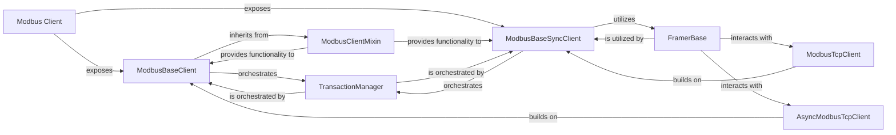

## Details

The Modbus Client subsystem provides the core functionality for initiating Modbus communication from an application to a Modbus server. It adheres to the "Client-Server Architecture" and "Modular Design" patterns, abstracting underlying transport complexities.

### Modbus Client [[Expand]](./Modbus_Client.md)
Serves as the primary, high-level user interface for applications to perform Modbus operations (e.g., read coils, write registers). It abstracts away the complexities of protocol framing, transport, and transaction management, offering both synchronous and asynchronous communication options.

**Related Classes/Methods**:

- `pymodbus.client`
- `pymodbus.client.base`
- `pymodbus.client.serial`
- `pymodbus.client.tcp`
- `pymodbus.client.tls`
- `pymodbus.client.udp`

### ModbusBaseClient
The abstract base class for all asynchronous Modbus clients, defining the common interface and core Modbus operations that concrete asynchronous clients must implement.

**Related Classes/Methods**:

- <a href="https://github.com/pymodbus-dev/pymodbus/blob/dev/pymodbus/client/base.py#L16-L122" target="_blank" rel="noopener noreferrer">`pymodbus.client.base.ModbusBaseClient` (16:122)</a>

### ModbusBaseSyncClient
The abstract base class for all synchronous Modbus clients, defining the common interface and core Modbus operations that concrete synchronous clients must implement.

**Related Classes/Methods**:

- <a href="https://github.com/pymodbus-dev/pymodbus/blob/dev/pymodbus/client/base.py#L125-L263" target="_blank" rel="noopener noreferrer">`pymodbus.client.base.ModbusBaseSyncClient` (125:263)</a>

### ModbusClientMixin
Provides shared functionalities and helper methods (e.g., common Modbus function calls) to both synchronous and asynchronous base client classes, promoting code reuse and consistency across client implementations.

**Related Classes/Methods**:

- <a href="https://github.com/pymodbus-dev/pymodbus/blob/dev/pymodbus/client/mixin.py#L22-L788" target="_blank" rel="noopener noreferrer">`pymodbus.client.mixin.ModbusClientMixin` (22:788)</a>

### TransactionManager
Manages the lifecycle of Modbus request-response cycles, including sending requests, receiving responses, and handling transaction IDs to ensure proper pairing of messages. It is central to the protocol's state management.

**Related Classes/Methods**:

- `pymodbus.transaction.TransactionManager`

### FramerBase
Responsible for encoding and decoding Modbus Application Data Units (ADUs) into the appropriate protocol frames (e.g., RTU, ASCII, TCP) for transmission over the underlying transport layer.

**Related Classes/Methods**:

- `pymodbus.transaction.FramerBase`

### ModbusTcpClient
A concrete implementation of a synchronous Modbus client specifically designed for TCP/IP-based communication. It handles the network connection and data transmission over TCP.

**Related Classes/Methods**:

- <a href="https://github.com/pymodbus-dev/pymodbus/blob/dev/pymodbus/client/tcp.py#L101-L320" target="_blank" rel="noopener noreferrer">`pymodbus.client.tcp.ModbusTcpClient` (101:320)</a>

### AsyncModbusTcpClient
A concrete implementation of an asynchronous Modbus client for TCP/IP-based communication, leveraging asynchronous I/O for non-blocking operations.

**Related Classes/Methods**:

- <a href="https://github.com/pymodbus-dev/pymodbus/blob/dev/pymodbus/client/tcp.py#L17-L98" target="_blank" rel="noopener noreferrer">`pymodbus.client.tcp.AsyncModbusTcpClient` (17:98)</a>

### [FAQ](https://github.com/CodeBoarding/GeneratedOnBoardings/tree/main?tab=readme-ov-file#faq)