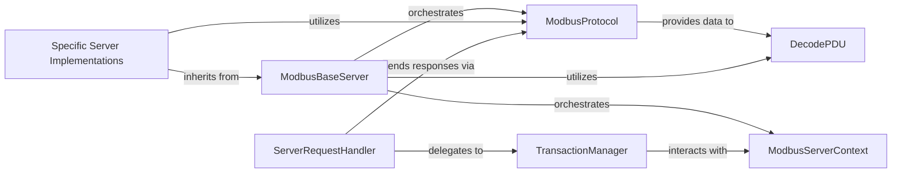

## Details

Component overview for the Modbus Server subsystem.

### ModbusBaseServer
The abstract foundation for all Modbus servers. It establishes the core server lifecycle (start/stop), initializes essential components like the transport protocol, PDU decoders, and the Modbus data store, providing a common framework for concrete server implementations.

**Related Classes/Methods**:

- <a href="https://github.com/pymodbus-dev/pymodbus/blob/dev/pymodbus/server/base.py#L17-L99" target="_blank" rel="noopener noreferrer">`pymodbus.server.base.ModbusBaseServer` (17:99)</a>

### Specific Server Implementations
Concrete server classes (e.g., TCP, TLS, UDP, Serial) that extend `ModbusBaseServer`. They configure and manage the communication parameters specific to their respective transport layers, enabling the server to operate over different network or serial interfaces.

**Related Classes/Methods**:

- `pymodbus.server.server`

### ModbusProtocol
Abstracts the underlying communication transport layer. It provides a standardized interface for listening for connections, sending, and receiving raw Modbus data, effectively decoupling the server's core logic from the specifics of network or serial communication.

**Related Classes/Methods**:

- <a href="https://github.com/pymodbus-dev/pymodbus/blob/dev/pymodbus/transport/transport.py#L1-L1" target="_blank" rel="noopener noreferrer">`pymodbus.transport.transport.ModbusProtocol` (1:1)</a>

### ServerRequestHandler
Responsible for processing individual incoming Modbus requests. It takes raw data, interacts with the `TransactionManager` to manage the request-response cycle, and formulates appropriate Modbus responses, including exception responses.

**Related Classes/Methods**:

- <a href="https://github.com/pymodbus-dev/pymodbus/blob/dev/pymodbus/server/requesthandler.py#L13-L125" target="_blank" rel="noopener noreferrer">`pymodbus.server.requesthandler.ServerRequestHandler` (13:125)</a>

### ModbusServerContext
Serves as the central data store for the Modbus server. It maintains the current state of all Modbus data points (coils, discrete inputs, holding registers, input registers) that the server exposes to clients, ensuring data consistency and accessibility.

**Related Classes/Methods**:

- <a href="https://github.com/pymodbus-dev/pymodbus/blob/dev/pymodbus/datastore/context.py#L143-L222" target="_blank" rel="noopener noreferrer">`pymodbus.datastore.context.ModbusServerContext` (143:222)</a>

### TransactionManager
Manages the state and flow of Modbus transactions. It handles the matching of requests to responses, processes incoming Protocol Data Units (PDUs) by interacting with the data store, and facilitates the sending of outgoing PDUs, ensuring proper message sequencing and integrity.

**Related Classes/Methods**:

- <a href="https://github.com/pymodbus-dev/pymodbus/blob/dev/pymodbus/transaction/transaction.py#L14-L235" target="_blank" rel="noopener noreferrer">`pymodbus.transaction.transaction.TransactionManager` (14:235)</a>

### DecodePDU
Decodes raw Modbus Protocol Data Units (PDUs) received from clients into structured Modbus request objects that can be understood and processed by the server. It also manages the registration of various PDU decoders for different Modbus function codes.

**Related Classes/Methods**:

- <a href="https://github.com/pymodbus-dev/pymodbus/blob/dev/pymodbus/pdu/decoders.py#L14-L121" target="_blank" rel="noopener noreferrer">`pymodbus.pdu.decoders.DecodePDU` (14:121)</a>

### [FAQ](https://github.com/CodeBoarding/GeneratedOnBoardings/tree/main?tab=readme-ov-file#faq)