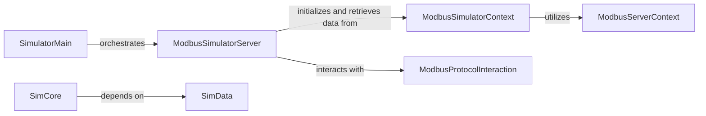

## Details

The Simulator/Tools subsystem provides a comprehensive environment for simulating Modbus devices, leveraging core pymodbus library components. It is designed as an application layer, offering a web-based interface for configuration and interaction, making it ideal for testing and development.

### SimulatorMain
The primary entry point for the Modbus simulator application. It handles command-line argument parsing, logging configuration, and orchestrates the initiation of the ModbusSimulatorServer.

**Related Classes/Methods**:

- <a href="https://github.com/pymodbus-dev/pymodbus/blob/dev/pymodbus/server/simulator/main.py#L121-L123" target="_blank" rel="noopener noreferrer">`pymodbus.server.simulator.main` (121:123)</a>

### ModbusSimulatorServer
Manages the HTTP interface for the Modbus simulator, processing incoming JSON and HTML requests. It also orchestrates the lifecycle (starting, stopping, running indefinitely) of the underlying Modbus server.

**Related Classes/Methods**:

- <a href="https://github.com/pymodbus-dev/pymodbus/blob/dev/pymodbus/server/simulator/http_server.py#L81-L722" target="_blank" rel="noopener noreferrer">`pymodbus.server.simulator.http_server.ModbusSimulatorServer` (81:722)</a>

### ModbusSimulatorContext
Provides a concrete, in-memory implementation of a Modbus data store specifically tailored for the simulator. It enables dynamic manipulation and retrieval of Modbus data (coils, registers, etc.) during simulation.

**Related Classes/Methods**:

- `pymodbus.simulator.ModbusSimulatorContext` (1:1)

### SimCore
Manages the overall configuration and internal structure of the Modbus simulation. This includes building and managing simulation blocks and their interrelationships.

**Related Classes/Methods**:

- <a href="https://github.com/pymodbus-dev/pymodbus/blob/dev/pymodbus/simulator/simcore.py#L6-L43" target="_blank" rel="noopener noreferrer">`pymodbus.simulator.simcore.SimCore` (6:43)</a>

### SimData
Defines and validates the data types and structures that are used throughout the simulation. It ensures that the simulated data conforms to expected formats and rules.

**Related Classes/Methods**:

- <a href="https://github.com/pymodbus-dev/pymodbus/blob/dev/pymodbus/simulator/simdata.py#L53-L202" target="_blank" rel="noopener noreferrer">`pymodbus.simulator.simdata.SimData` (53:202)</a>

### ModbusServerContext
A foundational context for Modbus data storage, providing the base for the simulator's data handling. This component is part of the core pymodbus server library, leveraged by the simulator.

**Related Classes/Methods**:

- `pymodbus.server.ModbusServerContext` (1:1)

### ModbusProtocolInteraction
Handles Modbus protocol specifics, enabling the simulator to correctly process and respond to Modbus requests. This component is part of the core pymodbus server library, interacted with by the simulator.

**Related Classes/Methods**:

- `pymodbus.server.ModbusProtocolInteraction` (1:1)

### [FAQ](https://github.com/CodeBoarding/GeneratedOnBoardings/tree/main?tab=readme-ov-file#faq)