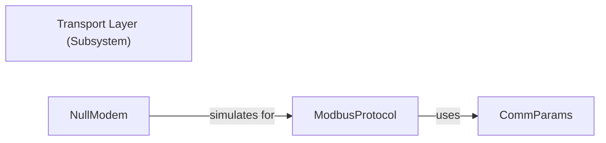

## Details

One paragraph explaining the functionality which is represented by this graph. What the main flow is and what is its purpose.

### Transport Layer (Subsystem)
The overarching component that manages the physical transmission and reception of Modbus data, abstracting the specifics of the communication medium. It provides the foundational communication infrastructure for the Modbus protocol.

**Related Classes/Methods**:

- `pymodbus.transport` (1:1)
- <a href="https://github.com/pymodbus-dev/pymodbus/blob/dev/pymodbus/transport/transport.py#L1-L1" target="_blank" rel="noopener noreferrer">`pymodbus.transport.transport` (1:1)</a>

### ModbusProtocol
This is the central component within the transport layer responsible for handling the low-level Modbus protocol framing. It manages listening for incoming connections/data and sending outgoing data over the chosen transport medium. It acts as the direct interface between higher-level Modbus logic and the specific communication channel.

**Related Classes/Methods**:

- <a href="https://github.com/pymodbus-dev/pymodbus/blob/dev/pymodbus/transport/transport.py#L1-L1" target="_blank" rel="noopener noreferrer">`pymodbus.transport.transport.ModbusProtocol` (1:1)</a>

### CommParams
Encapsulates and provides all necessary configuration parameters for establishing and managing communication over different transport types (e.g., host, port, serial device settings, SSL certificates). It ensures that the ModbusProtocol can correctly configure and utilize the underlying communication channel.

**Related Classes/Methods**:

- <a href="https://github.com/pymodbus-dev/pymodbus/blob/dev/pymodbus/transport/transport.py#L1-L1" target="_blank" rel="noopener noreferrer">`pymodbus.transport.transport.CommParams` (1:1)</a>

### NullModem
A specialized utility or implementation within the transport layer, likely used for testing or specific serial communication scenarios where a virtual null modem connection is simulated. It interacts closely with the ModbusProtocol for these specific use cases.

**Related Classes/Methods**:

- <a href="https://github.com/pymodbus-dev/pymodbus/blob/dev/pymodbus/transport/transport.py#L1-L1" target="_blank" rel="noopener noreferrer">`pymodbus.transport.transport.NullModem` (1:1)</a>

### [FAQ](https://github.com/CodeBoarding/GeneratedOnBoardings/tree/main?tab=readme-ov-file#faq)