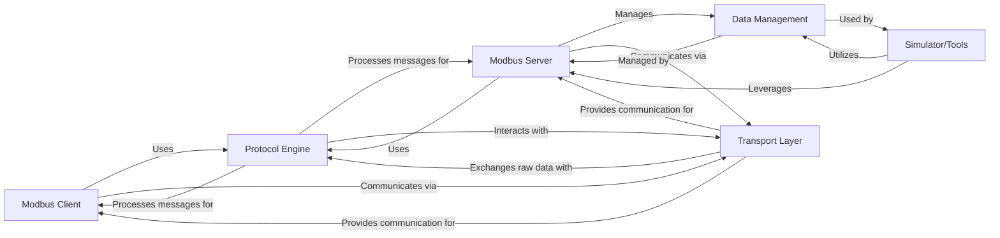

## Details

Abstract Components Overview of a Modbus system

### Modbus Client [[Expand]](./Modbus_Client.md)
Provides a high-level, user-facing interface for applications to initiate Modbus requests (e.g., read coils, write registers) to a Modbus server. It abstracts away the complexities of protocol framing, transport, and transaction management, offering both synchronous and asynchronous communication options.

**Related Classes/Methods**:

- `pymodbus.client`
- `pymodbus.client.base`
- `pymodbus.client.serial`
- `pymodbus.client.tcp`
- `pymodbus.client.tls`
- `pymodbus.client.udp`

### Modbus Server [[Expand]](./Modbus_Server.md)
Manages incoming Modbus requests from clients, processes them, interacts with the data store to fulfill requests, and constructs appropriate responses. It handles the server-side logic for various Modbus function codes and manages client connections.

**Related Classes/Methods**:

- `pymodbus.server`
- `pymodbus.server.base`
- `pymodbus.server.server`
- `pymodbus.server.requesthandler`

### Protocol Engine [[Expand]](./Protocol_Engine.md)
This is the core of the Modbus protocol implementation, responsible for the encoding and decoding of Modbus Application Data Unit (ADU) messages, specifically the Protocol Data Unit (PDU). It handles the parsing of incoming requests, construction of outgoing responses, applies/removes message framing (e.g., RTU, ASCII, TCP), and manages transaction IDs for request-response matching.

**Related Classes/Methods**:

- `pymodbus.pdu`
- `pymodbus.framer`
- `pymodbus.pdu.decoders`
- <a href="https://github.com/pymodbus-dev/pymodbus/blob/dev/pymodbus/framer/base.py" target="_blank" rel="noopener noreferrer">`pymodbus.framer.base`</a>
- <a href="https://github.com/pymodbus-dev/pymodbus/blob/dev/pymodbus/framer/ascii.py" target="_blank" rel="noopener noreferrer">`pymodbus.framer.ascii`</a>
- `pymodbus.framer.rtu`
- `pymodbus.framer.socket`
- `pymodbus.framer.tls`

### Transport Layer [[Expand]](./Transport_Layer.md)
Manages the underlying communication channels for sending and receiving raw Modbus frames. It provides an abstraction for network (TCP, UDP, TLS) or serial communication, handling connection establishment, data transmission, and reception at a low level.

**Related Classes/Methods**:

- `pymodbus.transport`
- <a href="https://github.com/pymodbus-dev/pymodbus/blob/dev/pymodbus/transport/transport.py" target="_blank" rel="noopener noreferrer">`pymodbus.transport.transport`</a>

### Data Management [[Expand]](./Data_Management.md)
Provides an abstraction for storing and managing Modbus register and coil data. It supports different storage mechanisms (e.g., in-memory, sparse, sequential, remote device contexts) for Modbus servers, allowing the server to read from and write to simulated or actual device data.

**Related Classes/Methods**:

- `pymodbus.datastore`
- `pymodbus.datastore.context`
- <a href="https://github.com/pymodbus-dev/pymodbus/blob/dev/pymodbus/datastore/store.py" target="_blank" rel="noopener noreferrer">`pymodbus.datastore.store`</a>
- `pymodbus.datastore.simulator`

### Simulator/Tools [[Expand]](./Simulator_Tools.md)
Provides tools and components for simulating Modbus devices and their data, often including a web-based interface for interaction and configuration. This component is an application layer built on top of the core library, useful for testing and development.

**Related Classes/Methods**:

- `pymodbus.simulator`
- `pymodbus.simulator.simcore`
- `pymodbus.simulator.simdata`
- `pymodbus.server.simulator.http_server`
- <a href="https://github.com/pymodbus-dev/pymodbus/blob/dev/pymodbus/server/simulator/main.py#L121-L123" target="_blank" rel="noopener noreferrer">`pymodbus.server.simulator.main` (121:123)</a>

### [FAQ](https://github.com/CodeBoarding/GeneratedOnBoardings/tree/main?tab=readme-ov-file#faq)