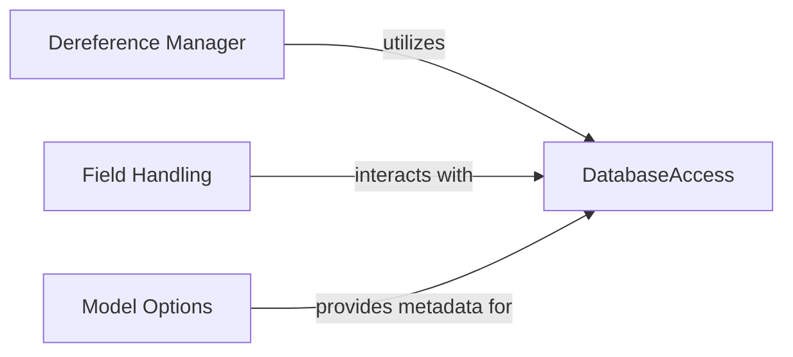

## Component Details

This graph illustrates the core components of the PyMODM's data access and model management subsystem. The central `DatabaseAccess` component handles all interactions with MongoDB, including connection management and file storage via GridFS. The `Dereference Manager` is responsible for resolving references within models by querying the database. `Field Handling` ensures proper conversion and interaction for specific field types like `FileField`, which in turn leverages `DatabaseAccess` for file operations. Finally, `Model Options` provides essential metadata for models, guiding how `DatabaseAccess` interacts with specific collections.

### DatabaseAccess
Manages connections to MongoDB and handles low-level data storage and retrieval operations, including GridFS for file management.

**Related Classes/Methods**:

- <a href="https://github.com/mongodb/pymodm/blob/master/pymodm/connection.py#L44-L81" target="_blank" rel="noopener noreferrer">`pymodm.connection:connect` (44:81)</a>
- <a href="https://github.com/mongodb/pymodm/blob/master/pymodm/connection.py#L84-L92" target="_blank" rel="noopener noreferrer">`pymodm.connection:_get_connection` (84:92)</a>
- <a href="https://github.com/mongodb/pymodm/blob/master/pymodm/connection.py#L95-L97" target="_blank" rel="noopener noreferrer">`pymodm.connection:_get_db` (95:97)</a>
- <a href="https://github.com/mongodb/pymodm/blob/master/pymodm/files.py#L67-L141" target="_blank" rel="noopener noreferrer">`pymodm.files.GridFSStorage` (67:141)</a>
- <a href="https://github.com/mongodb/pymodm/blob/master/pymodm/files.py#L312-L351" target="_blank" rel="noopener noreferrer">`pymodm.files.GridFSFile` (312:351)</a>
- <a href="https://github.com/mongodb/pymodm/blob/master/pymodm/files.py#L207-L275" target="_blank" rel="noopener noreferrer">`pymodm.files.FieldFile` (207:275)</a>

### Dereference Manager
This component is responsible for managing the dereferencing of ReferenceFields within MongoModel instances. It orchestrates the process of finding references, resolving them from the database, and attaching the resolved objects back to the model instance. It utilizes a context manager to temporarily disable auto-dereferencing during the scanning phase for efficiency.

**Related Classes/Methods**:

- <a href="https://github.com/mongodb/pymodm/blob/master/pymodm/dereference.py#L167-L198" target="_blank" rel="noopener noreferrer">`pymodm.dereference:dereference` (167:198)</a>
- <a href="https://github.com/mongodb/pymodm/blob/master/pymodm/dereference.py#L69-L87" target="_blank" rel="noopener noreferrer">`pymodm.dereference:_find_references` (69:87)</a>
- <a href="https://github.com/mongodb/pymodm/blob/master/pymodm/dereference.py#L90-L99" target="_blank" rel="noopener noreferrer">`pymodm.dereference:_resolve_references` (90:99)</a>
- <a href="https://github.com/mongodb/pymodm/blob/master/pymodm/dereference.py#L144-L164" target="_blank" rel="noopener noreferrer">`pymodm.dereference:_attach_objects` (144:164)</a>

### Field Handling
This component is responsible for the proper handling and conversion of different field types, specifically `FileField`. It ensures that file references are correctly converted to `FieldFile` objects and manages the interaction with the file storage system.

**Related Classes/Methods**:

- `pymodm.fields.FileField:_to_field_file` (full file reference)
- `pymodm.fields.FileField:__get__` (full file reference)

### Model Options
This component encapsulates the metadata and options associated with a MongoModel, such as the collection name. It provides access to these options, which are crucial for interacting with the database.

**Related Classes/Methods**:

- <a href="https://github.com/mongodb/pymodm/blob/master/pymodm/base/options.py#L59-L69" target="_blank" rel="noopener noreferrer">`pymodm.base.options.MongoOptions:collection` (59:69)</a>

### [FAQ](https://github.com/CodeBoarding/GeneratedOnBoardings/tree/main?tab=readme-ov-file#faq)