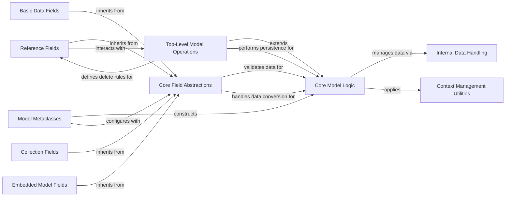

## Component Details

The ModelManagement subsystem in PyMODM defines the core structure and behavior of MongoDB models. It encompasses the foundational classes for defining fields, handling data serialization and deserialization, performing validation, and managing persistence operations with the MongoDB database. This subsystem provides the necessary abstractions and concrete implementations for users to define their data models, including basic data types, collections, embedded documents, and references to other top-level documents, ensuring data integrity and efficient interaction with MongoDB.

### Core Field Abstractions
This component provides the foundational classes for all PyMODM fields, defining common attributes, initialization, validation mechanisms, and the core logic for converting values between Python objects and MongoDB BSON. It includes base classes for general fields and those specifically designed for related models (both referenced and embedded).

**Related Classes/Methods**:

- <a href="https://github.com/mongodb/pymodm/blob/master/pymodm/base/fields.py#L25-L220" target="_blank" rel="noopener noreferrer">`pymodm.base.fields.MongoBaseField` (25:220)</a>
- <a href="https://github.com/mongodb/pymodm/blob/master/pymodm/base/fields.py#L223-L267" target="_blank" rel="noopener noreferrer">`pymodm.base.fields.RelatedModelFieldsBase` (223:267)</a>
- <a href="https://github.com/mongodb/pymodm/blob/master/pymodm/base/fields.py#L270-L300" target="_blank" rel="noopener noreferrer">`pymodm.base.fields.RelatedEmbeddedModelFieldsBase` (270:300)</a>

### Basic Data Fields
This component encompasses concrete field implementations for fundamental data types commonly used in MongoDB documents, such as character strings, object identifiers, dates, file storage, and geographical data. These fields inherit core functionalities from the Core Field Abstractions to manage their specific data representations and validations.

**Related Classes/Methods**:

- <a href="https://github.com/mongodb/pymodm/blob/master/pymodm/fields.py#L100-L103" target="_blank" rel="noopener noreferrer">`pymodm.fields.CharField` (100:103)</a>
- <a href="https://github.com/mongodb/pymodm/blob/master/pymodm/fields.py#L110-L113" target="_blank" rel="noopener noreferrer">`pymodm.fields.ObjectIdField` (110:113)</a>
- <a href="https://github.com/mongodb/pymodm/blob/master/pymodm/fields.py#L116-L119" target="_blank" rel="noopener noreferrer">`pymodm.fields.DateTimeField` (116:119)</a>
- <a href="https://github.com/mongodb/pymodm/blob/master/pymodm/fields.py#L200-L203" target="_blank" rel="noopener noreferrer">`pymodm.fields.FileField` (200:203)</a>
- <a href="https://github.com/mongodb/pymodm/blob/master/pymodm/base/fields.py#L303-L334" target="_blank" rel="noopener noreferrer">`pymodm.base.fields.GeoJSONField` (303:334)</a>

### Collection Fields
This component provides field types designed to store collections of data within a MongoDB document, specifically supporting dictionary-like structures and lists. These fields extend the basic field functionalities to handle the complexities of managing multiple values or key-value pairs.

**Related Classes/Methods**:

- <a href="https://github.com/mongodb/pymodm/blob/master/pymodm/fields.py#L313-L320" target="_blank" rel="noopener noreferrer">`pymodm.fields.DictField` (313:320)</a>
- <a href="https://github.com/mongodb/pymodm/blob/master/pymodm/fields.py#L303-L310" target="_blank" rel="noopener noreferrer">`pymodm.fields.ListField` (303:310)</a>

### Embedded Model Fields
This component manages fields that allow for the embedding of other PyMODM models or documents directly within a parent document. It includes fields for single embedded models and lists of embedded models, facilitating complex, nested document structures without requiring separate collections.

**Related Classes/Methods**:

- <a href="https://github.com/mongodb/pymodm/blob/master/pymodm/fields.py#L293-L320" target="_blank" rel="noopener noreferrer">`pymodm.fields.EmbeddedModelField` (293:320)</a>
- <a href="https://github.com/mongodb/pymodm/blob/master/pymodm/fields.py#L323-L330" target="_blank" rel="noopener noreferrer">`pymodm.fields.EmbeddedDocumentField` (323:330)</a>
- <a href="https://github.com/mongodb/pymodm/blob/master/pymodm/fields.py#L333-L360" target="_blank" rel="noopener noreferrer">`pymodm.fields.EmbeddedModelListField` (333:360)</a>
- <a href="https://github.com/mongodb/pymodm/blob/master/pymodm/fields.py#L363-L370" target="_blank" rel="noopener noreferrer">`pymodm.fields.EmbeddedDocumentListField` (363:370)</a>

### Reference Fields
This component is dedicated to fields that establish relationships between different top-level PyMODM models by storing references (typically ObjectIDs) to documents in other collections. It handles the logic for dereferencing these references to retrieve the actual linked model instances.

**Related Classes/Methods**:

- <a href="https://github.com/mongodb/pymodm/blob/master/pymodm/fields.py#L373-L400" target="_blank" rel="noopener noreferrer">`pymodm.fields.ReferenceField` (373:400)</a>

### Model Metaclasses
This component is responsible for the dynamic creation and configuration of PyMODM model classes. It intercepts the class creation process to discover and register fields, set up metadata, and ensure proper inheritance of field definitions, forming the backbone of the PyMODM ORM.

**Related Classes/Methods**:

- <a href="https://github.com/mongodb/pymodm/blob/master/pymodm/base/models.py#L34-L141" target="_blank" rel="noopener noreferrer">`pymodm.base.models.MongoModelMetaclass` (34:141)</a>
- <a href="https://github.com/mongodb/pymodm/blob/master/pymodm/base/models.py#L144-L183" target="_blank" rel="noopener noreferrer">`pymodm.base.models.TopLevelMongoModelMetaclass` (144:183)</a>

### Core Model Logic
This component provides the fundamental functionalities for all PyMODM models, serving as the base class for defining document structures. It includes mechanisms for model initialization, internal data management, conversion between Python objects and MongoDB BSON documents, and a basic validation framework.

**Related Classes/Methods**:

- <a href="https://github.com/mongodb/pymodm/blob/master/pymodm/base/models.py#L186-L399" target="_blank" rel="noopener noreferrer">`pymodm.base.models.MongoModelBase` (186:399)</a>
- <a href="https://github.com/mongodb/pymodm/blob/master/pymodm/base/models.py#L371-L384" target="_blank" rel="noopener noreferrer">`pymodm.base.models.MongoModelBase:full_clean` (371:384)</a>
- <a href="https://github.com/mongodb/pymodm/blob/master/pymodm/base/models.py#L292-L314" target="_blank" rel="noopener noreferrer">`pymodm.base.models.MongoModelBase:to_son` (292:314)</a>
- <a href="https://github.com/mongodb/pymodm/blob/master/pymodm/base/models.py#L268-L290" target="_blank" rel="noopener noreferrer">`pymodm.base.models.MongoModelBase:from_document` (268:290)</a>

### Top-Level Model Operations
This component extends the core model logic to provide specific functionalities for top-level PyMODM models that correspond directly to MongoDB collections. It handles critical persistence operations such as saving new or updated documents to the database, refreshing model instances with the latest data from the database, and performing comprehensive validity checks before persistence.

**Related Classes/Methods**:

- <a href="https://github.com/mongodb/pymodm/blob/master/pymodm/base/models.py#L402-L528" target="_blank" rel="noopener noreferrer">`pymodm.base.models.TopLevelMongoModel` (402:528)</a>
- <a href="https://github.com/mongodb/pymodm/blob/master/pymodm/base/models.py#L531-L600" target="_blank" rel="noopener noreferrer">`pymodm.base.models.MongoModel` (531:600)</a>
- <a href="https://github.com/mongodb/pymodm/blob/master/pymodm/base/models.py#L603-L605" target="_blank" rel="noopener noreferrer">`pymodm.base.models.EmbeddedMongoModel` (603:605)</a>
- <a href="https://github.com/mongodb/pymodm/blob/master/pymodm/base/models.py#L440-L479" target="_blank" rel="noopener noreferrer">`pymodm.base.models.TopLevelMongoModel:save` (440:479)</a>
- <a href="https://github.com/mongodb/pymodm/blob/master/pymodm/base/models.py#L499-L520" target="_blank" rel="noopener noreferrer">`pymodm.base.models.TopLevelMongoModel:refresh_from_db` (499:520)</a>
- <a href="https://github.com/mongodb/pymodm/blob/master/pymodm/base/models.py#L481-L483" target="_blank" rel="noopener noreferrer">`pymodm.base.models.TopLevelMongoModel:delete` (481:483)</a>

### Internal Data Handling
This component manages the internal representation and manipulation of data within PyMODM models, particularly focusing on efficient handling of field values and their conversion. It includes mechanisms for lazy decoding of MongoDB values into Python types and setting values for model attributes.

**Related Classes/Methods**:

- <a href="https://github.com/mongodb/pymodm/blob/master/pymodm/base/models.py#L608-L673" target="_blank" rel="noopener noreferrer">`pymodm.base.models._LazyDecoder` (608:673)</a>

### Context Management Utilities
This component provides utility context managers that allow for temporary modification of PyMODM's behavior, such as controlling the automatic dereferencing of ReferenceField instances, switching connections or collections, and modifying collection options. This enables fine-grained control over how related documents are loaded and how database interactions occur.

**Related Classes/Methods**:

- <a href="https://github.com/mongodb/pymodm/blob/master/pymodm/context_managers.py#L140-L167" target="_blank" rel="noopener noreferrer">`pymodm.context_managers.no_auto_dereference` (140:167)</a>
- <a href="https://github.com/mongodb/pymodm/blob/master/pymodm/context_managers.py#L16-L48" target="_blank" rel="noopener noreferrer">`pymodm.context_managers.switch_connection` (16:48)</a>
- <a href="https://github.com/mongodb/pymodm/blob/master/pymodm/context_managers.py#L51-L77" target="_blank" rel="noopener noreferrer">`pymodm.context_managers.switch_collection` (51:77)</a>
- <a href="https://github.com/mongodb/pymodm/blob/master/pymodm/context_managers.py#L80-L137" target="_blank" rel="noopener noreferrer">`pymodm.context_managers.collection_options` (80:137)</a>

### [FAQ](https://github.com/CodeBoarding/GeneratedOnBoardings/tree/main?tab=readme-ov-file#faq)