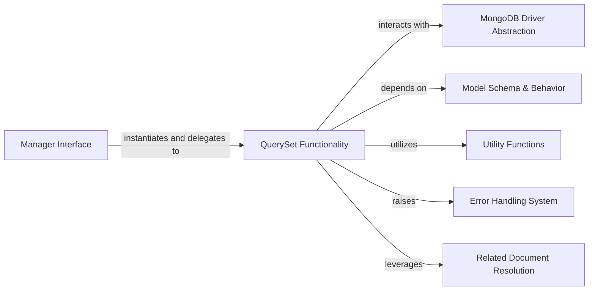

## Component Details

The Query and Manipulation subsystem in PyMODM provides a robust API for interacting with MongoDB, enabling developers to construct complex queries, perform data retrieval, and execute various data modification operations (create, update, delete) on PyMODM models. It acts as an ORM-like layer, abstracting direct MongoDB driver interactions and offering a more Pythonic interface for database management.

### QuerySet Functionality
Provides the comprehensive API for building, executing, and manipulating database queries, including filtering, ordering, projection, iteration, and bulk data operations (create, update, delete) on models. It manages the internal state of a query.

**Related Classes/Methods**:

- <a href="https://github.com/mongodb/pymodm/blob/master/pymodm/queryset.py#L26-L564" target="_blank" rel="noopener noreferrer">`pymodm.queryset.QuerySet` (26:564)</a>
- <a href="https://github.com/mongodb/pymodm/blob/master/pymodm/queryset.py#L32-L55" target="_blank" rel="noopener noreferrer">`pymodm.queryset.QuerySet:__init__` (32:55)</a>
- <a href="https://github.com/mongodb/pymodm/blob/master/pymodm/queryset.py#L61-L73" target="_blank" rel="noopener noreferrer">`pymodm.queryset.QuerySet:_clone` (61:73)</a>
- <a href="https://github.com/mongodb/pymodm/blob/master/pymodm/queryset.py#L75-L117" target="_blank" rel="noopener noreferrer">`pymodm.queryset.QuerySet:get` (75:117)</a>
- <a href="https://github.com/mongodb/pymodm/blob/master/pymodm/queryset.py#L119-L123" target="_blank" rel="noopener noreferrer">`pymodm.queryset.QuerySet:count` (119:123)</a>
- <a href="https://github.com/mongodb/pymodm/blob/master/pymodm/queryset.py#L125-L130" target="_blank" rel="noopener noreferrer">`pymodm.queryset.QuerySet:first` (125:130)</a>
- <a href="https://github.com/mongodb/pymodm/blob/master/pymodm/queryset.py#L132-L179" target="_blank" rel="noopener noreferrer">`pymodm.queryset.QuerySet:aggregate` (132:179)</a>
- <a href="https://github.com/mongodb/pymodm/blob/master/pymodm/queryset.py#L185-L187" target="_blank" rel="noopener noreferrer">`pymodm.queryset.QuerySet:all` (185:187)</a>
- <a href="https://github.com/mongodb/pymodm/blob/master/pymodm/queryset.py#L189-L199" target="_blank" rel="noopener noreferrer">`pymodm.queryset.QuerySet:select_related` (189:199)</a>
- <a href="https://github.com/mongodb/pymodm/blob/master/pymodm/queryset.py#L201-L218" target="_blank" rel="noopener noreferrer">`pymodm.queryset.QuerySet:raw` (201:218)</a>
- <a href="https://github.com/mongodb/pymodm/blob/master/pymodm/queryset.py#L220-L231" target="_blank" rel="noopener noreferrer">`pymodm.queryset.QuerySet:order_by` (220:231)</a>
- <a href="https://github.com/mongodb/pymodm/blob/master/pymodm/queryset.py#L233-L249" target="_blank" rel="noopener noreferrer">`pymodm.queryset.QuerySet:reverse` (233:249)</a>
- <a href="https://github.com/mongodb/pymodm/blob/master/pymodm/queryset.py#L251-L276" target="_blank" rel="noopener noreferrer">`pymodm.queryset.QuerySet:project` (251:276)</a>
- <a href="https://github.com/mongodb/pymodm/blob/master/pymodm/queryset.py#L278-L299" target="_blank" rel="noopener noreferrer">`pymodm.queryset.QuerySet:only` (278:299)</a>
- <a href="https://github.com/mongodb/pymodm/blob/master/pymodm/queryset.py#L301-L322" target="_blank" rel="noopener noreferrer">`pymodm.queryset.QuerySet:exclude` (301:322)</a>
- <a href="https://github.com/mongodb/pymodm/blob/master/pymodm/queryset.py#L324-L333" target="_blank" rel="noopener noreferrer">`pymodm.queryset.QuerySet:limit` (324:333)</a>
- <a href="https://github.com/mongodb/pymodm/blob/master/pymodm/queryset.py#L335-L344" target="_blank" rel="noopener noreferrer">`pymodm.queryset.QuerySet:skip` (335:344)</a>
- <a href="https://github.com/mongodb/pymodm/blob/master/pymodm/queryset.py#L346-L350" target="_blank" rel="noopener noreferrer">`pymodm.queryset.QuerySet:values` (346:350)</a>
- <a href="https://github.com/mongodb/pymodm/blob/master/pymodm/queryset.py#L352-L364" target="_blank" rel="noopener noreferrer">`pymodm.queryset.QuerySet:collation` (352:364)</a>
- <a href="https://github.com/mongodb/pymodm/blob/master/pymodm/queryset.py#L370-L391" target="_blank" rel="noopener noreferrer">`pymodm.queryset.QuerySet:create` (370:391)</a>
- <a href="https://github.com/mongodb/pymodm/blob/master/pymodm/queryset.py#L393-L434" target="_blank" rel="noopener noreferrer">`pymodm.queryset.QuerySet:bulk_create` (393:434)</a>
- <a href="https://github.com/mongodb/pymodm/blob/master/pymodm/queryset.py#L436-L490" target="_blank" rel="noopener noreferrer">`pymodm.queryset.QuerySet:delete` (436:490)</a>
- <a href="https://github.com/mongodb/pymodm/blob/master/pymodm/queryset.py#L492-L514" target="_blank" rel="noopener noreferrer">`pymodm.queryset.QuerySet:update` (492:514)</a>
- <a href="https://github.com/mongodb/pymodm/blob/master/pymodm/queryset.py#L521-L525" target="_blank" rel="noopener noreferrer">`pymodm.queryset.QuerySet.raw_query` (521:525)</a>
- <a href="https://github.com/mongodb/pymodm/blob/master/pymodm/queryset.py#L527-L534" target="_blank" rel="noopener noreferrer">`pymodm.queryset.QuerySet._get_raw_cursor` (527:534)</a>
- <a href="https://github.com/mongodb/pymodm/blob/master/pymodm/queryset.py#L536-L544" target="_blank" rel="noopener noreferrer">`pymodm.queryset.QuerySet.__iter__` (536:544)</a>
- <a href="https://github.com/mongodb/pymodm/blob/master/pymodm/queryset.py#L546-L547" target="_blank" rel="noopener noreferrer">`pymodm.queryset.QuerySet.__next__` (546:547)</a>
- <a href="https://github.com/mongodb/pymodm/blob/master/pymodm/queryset.py#L551-L564" target="_blank" rel="noopener noreferrer">`pymodm.queryset.QuerySet.__getitem__` (551:564)</a>

### Manager Interface
Provides the entry point for interacting with MongoModel instances and their associated QuerySets, acting as a descriptor to allow QuerySet methods to be called directly from a model.

**Related Classes/Methods**:

- <a href="https://github.com/mongodb/pymodm/blob/master/pymodm/manager.py#L23-L108" target="_blank" rel="noopener noreferrer">`pymodm.manager.BaseManager` (23:108)</a>
- <a href="https://github.com/mongodb/pymodm/blob/master/pymodm/manager.py#L111-L166" target="_blank" rel="noopener noreferrer">`pymodm.manager.Manager` (111:166)</a>

### MongoDB Driver Abstraction
Represents the direct interaction layer with the underlying PyMongo library for executing database commands.

**Related Classes/Methods**:

- `pymongo` (full file reference)
- <a href="https://github.com/mongodb/pymodm/blob/master/pymodm/queryset.py#L58-L59" target="_blank" rel="noopener noreferrer">`pymodm.queryset.QuerySet._collection` (58:59)</a>

### Model Schema & Behavior
Defines the structure of MongoDB documents as Python objects, including field types, primary keys, and rules for cascading deletes or other related document behaviors.

**Related Classes/Methods**:

- <a href="https://github.com/mongodb/pymodm/blob/master/pymodm/base/models.py#L402-L528" target="_blank" rel="noopener noreferrer">`pymodm.base.models.TopLevelMongoModel` (402:528)</a>
- `pymodm.fields.ReferenceField` (full file reference)

### Utility Functions
A collection of reusable helper functions for common tasks such as dynamic module importing and various data type validations.

**Related Classes/Methods**:

- <a href="https://github.com/mongodb/pymodm/blob/master/pymodm/common.py#L43-L52" target="_blank" rel="noopener noreferrer">`pymodm.common._import` (43:52)</a>
- <a href="https://github.com/mongodb/pymodm/blob/master/pymodm/common.py#L169-L180" target="_blank" rel="noopener noreferrer">`pymodm.common.validate_ordering` (169:180)</a>
- <a href="https://github.com/mongodb/pymodm/blob/master/pymodm/common.py#L162-L166" target="_blank" rel="noopener noreferrer">`pymodm.common.validate_mapping` (162:166)</a>
- <a href="https://github.com/mongodb/pymodm/blob/master/pymodm/common.py#L136-L140" target="_blank" rel="noopener noreferrer">`pymodm.common.validate_boolean` (136:140)</a>
- <a href="https://github.com/mongodb/pymodm/blob/master/pymodm/common.py#L149-L153" target="_blank" rel="noopener noreferrer">`pymodm.common.validate_list_or_tuple` (149:153)</a>

### Error Handling System
Provides custom exception classes to signal specific operational or data-related issues within the PyMODM library.

**Related Classes/Methods**:

- <a href="https://github.com/mongodb/pymodm/blob/master/pymodm/errors.py#L82-L83" target="_blank" rel="noopener noreferrer">`pymodm.errors.OperationError` (82:83)</a>
- <a href="https://github.com/mongodb/pymodm/blob/master/pymodm/errors.py#L19-L20" target="_blank" rel="noopener noreferrer">`pymodm.errors.DoesNotExist` (19:20)</a>
- <a href="https://github.com/mongodb/pymodm/blob/master/pymodm/errors.py#L23-L24" target="_blank" rel="noopener noreferrer">`pymodm.errors.MultipleObjectsReturned` (23:24)</a>

### Related Document Resolution
Manages the process of fetching and integrating related documents into a primary query result, typically for ReferenceField types.

**Related Classes/Methods**:

- <a href="https://github.com/mongodb/pymodm/blob/master/pymodm/dereference.py#L167-L198" target="_blank" rel="noopener noreferrer">`pymodm.dereference.dereference` (167:198)</a>

### [FAQ](https://github.com/CodeBoarding/GeneratedOnBoardings/tree/main?tab=readme-ov-file#faq)