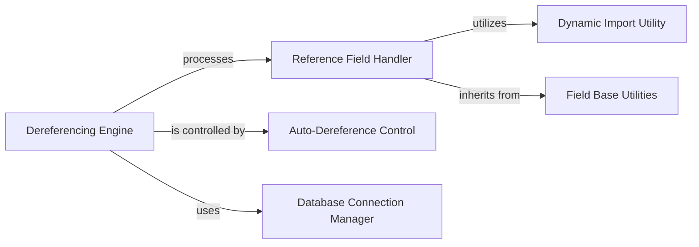

## Component Details

The `ReferenceResolution` component in PyMODM is responsible for automatically resolving and attaching referenced MongoDB documents (DBRefs) to their corresponding model instances. It achieves this by traversing model fields to identify `ReferenceField` instances, querying the database for the linked documents, and then integrating these resolved objects back into the original model structure. This process is managed by the `Dereferencing Engine`, which interacts with the `Database Connection Manager` to access MongoDB and is influenced by the `Auto-Dereference Control` to enable or disable automatic dereferencing. The `Reference Field Handler` defines the specific behavior of `ReferenceField`s during this resolution, leveraging `Dynamic Import Utility` for model resolution and inheriting core functionalities from `Field Base Utilities`.

### Dereferencing Engine
Orchestrates the process of finding, resolving, and attaching referenced MongoDB documents to PyMODM model instances. It manages the traversal of model fields, queries the database for referenced documents, and integrates them back into the model structure.

**Related Classes/Methods**:

- <a href="https://github.com/mongodb/pymodm/blob/master/pymodm/dereference.py#L167-L198" target="_blank" rel="noopener noreferrer">`pymodm.dereference.dereference` (167:198)</a>
- <a href="https://github.com/mongodb/pymodm/blob/master/pymodm/dereference.py#L69-L87" target="_blank" rel="noopener noreferrer">`pymodm.dereference._find_references` (69:87)</a>
- <a href="https://github.com/mongodb/pymodm/blob/master/pymodm/dereference.py#L53-L65" target="_blank" rel="noopener noreferrer">`pymodm.dereference._find_references_in_object` (53:65)</a>
- <a href="https://github.com/mongodb/pymodm/blob/master/pymodm/dereference.py#L90-L99" target="_blank" rel="noopener noreferrer">`pymodm.dereference._resolve_references` (90:99)</a>
- <a href="https://github.com/mongodb/pymodm/blob/master/pymodm/dereference.py#L102-L106" target="_blank" rel="noopener noreferrer">`pymodm.dereference._get_reference_document` (102:106)</a>
- <a href="https://github.com/mongodb/pymodm/blob/master/pymodm/dereference.py#L144-L164" target="_blank" rel="noopener noreferrer">`pymodm.dereference._attach_objects` (144:164)</a>
- <a href="https://github.com/mongodb/pymodm/blob/master/pymodm/dereference.py#L109-L141" target="_blank" rel="noopener noreferrer">`pymodm.dereference._attach_objects_in_path` (109:141)</a>

### Reference Field Handler
Defines the specific behavior of `ReferenceField` instances, including how they handle dereferencing when accessed and their conversion to Python types.

**Related Classes/Methods**:

- `pymodm.fields.ReferenceField:dereference_if_needed` (full file reference)
- `pymodm.fields.ReferenceField:to_python` (full file reference)
- `pymodm.fields.ReferenceField:__get__` (full file reference)

### Auto-Dereference Control
Provides mechanisms to enable or disable automatic dereferencing, primarily through a context manager, influencing how the Dereferencing Engine operates.

**Related Classes/Methods**:

- <a href="https://github.com/mongodb/pymodm/blob/master/pymodm/context_managers.py#L140-L167" target="_blank" rel="noopener noreferrer">`pymodm.context_managers.no_auto_dereference` (140:167)</a>
- <a href="https://github.com/mongodb/pymodm/blob/master/pymodm/base/options.py#L72-L73" target="_blank" rel="noopener noreferrer">`pymodm.base.options.MongoOptions:auto_dereference` (72:73)</a>

### Database Connection Manager
Manages and provides access to the underlying PyMongo database connection required for resolving references.

**Related Classes/Methods**:

- <a href="https://github.com/mongodb/pymodm/blob/master/pymodm/connection.py#L95-L97" target="_blank" rel="noopener noreferrer">`pymodm.connection._get_db` (95:97)</a>

### Field Base Utilities
Offers foundational methods and properties inherited by all field types, including `ReferenceField`, contributing to their basic functionality.

**Related Classes/Methods**:

- <a href="https://github.com/mongodb/pymodm/blob/master/pymodm/base/fields.py#L114-L116" target="_blank" rel="noopener noreferrer">`pymodm.base.fields.MongoBaseField.is_blank` (114:116)</a>
- <a href="https://github.com/mongodb/pymodm/blob/master/pymodm/base/fields.py#L83-L94" target="_blank" rel="noopener noreferrer">`pymodm.base.fields.MongoBaseField.__get__` (83:94)</a>

### Dynamic Import Utility
A common utility used for dynamically importing Python modules and classes, which is crucial for resolving model references within `ReferenceField`s.

**Related Classes/Methods**:

- <a href="https://github.com/mongodb/pymodm/blob/master/pymodm/common.py#L43-L52" target="_blank" rel="noopener noreferrer">`pymodm.common._import` (43:52)</a>

### [FAQ](https://github.com/CodeBoarding/GeneratedOnBoardings/tree/main?tab=readme-ov-file#faq)