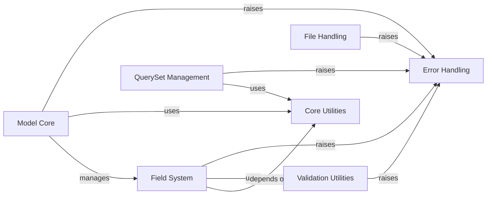

## Component Details

This architecture overview details the core components of the PyMODM library, focusing on its modular design for data modeling, validation, error handling, and database interaction. Key components include the `Model Core` for defining data structures, the `Field System` for mapping Python types to MongoDB, `Validation Utilities` for ensuring data integrity, and a dedicated `Error Handling` component for managing exceptions. `QuerySet Management` facilitates database operations, while `File Handling` addresses GridFS interactions, and `Core Utilities` provide foundational helper functions across the system. The main flow involves defining models, validating data through fields and utilities, persisting to MongoDB via query sets, and robustly handling errors throughout these operations.

### Error Handling
This component defines and manages all custom exceptions used within PyMODM, including validation, configuration, operation, and model-related errors. It provides a centralized mechanism for error propagation and handling.

**Related Classes/Methods**:

- <a href="https://github.com/mongodb/pymodm/blob/master/pymodm/errors.py#L86-L87" target="_blank" rel="noopener noreferrer">`pymodm.errors.ConfigurationError` (86:87)</a>
- <a href="https://github.com/mongodb/pymodm/blob/master/pymodm/errors.py#L41-L79" target="_blank" rel="noopener noreferrer">`pymodm.errors.ValidationError` (41:79)</a>
- <a href="https://github.com/mongodb/pymodm/blob/master/pymodm/errors.py#L82-L83" target="_blank" rel="noopener noreferrer">`pymodm.errors.OperationError` (82:83)</a>
- <a href="https://github.com/mongodb/pymodm/blob/master/pymodm/errors.py#L36-L38" target="_blank" rel="noopener noreferrer">`pymodm.errors.InvalidModel` (36:38)</a>
- <a href="https://github.com/mongodb/pymodm/blob/master/pymodm/errors.py#L31-L33" target="_blank" rel="noopener noreferrer">`pymodm.errors.ModelDoesNotExist` (31:33)</a>
- <a href="https://github.com/mongodb/pymodm/blob/master/pymodm/errors.py#L52-L69" target="_blank" rel="noopener noreferrer">`pymodm.errors.ValidationError._get_message` (52:69)</a>
- <a href="https://github.com/mongodb/pymodm/blob/master/pymodm/errors.py#L72-L73" target="_blank" rel="noopener noreferrer">`pymodm.errors.ValidationError.message` (72:73)</a>

### Field System
This component encompasses all the various field types in PyMODM, responsible for defining how Python data types are mapped to MongoDB BSON types. It includes base field classes, specific field implementations (e.g., ObjectIdField, DateTimeField, ImageField), and their associated data conversion (to_mongo) and validation logic.

**Related Classes/Methods**:

- `pymodm.fields.ObjectIdField:to_mongo` (full file reference)
- `pymodm.fields.BinaryField:to_mongo` (full file reference)
- `pymodm.fields.DateTimeField:to_mongo` (full file reference)
- `pymodm.fields.Decimal128Field:__init__` (full file reference)
- `pymodm.fields.Decimal128Field:to_mongo` (full file reference)
- `pymodm.fields.EmailField:__init__` (full file reference)
- `pymodm.fields.ImageField:__init__` (full file reference)
- `pymodm.fields.FloatField:to_mongo` (full file reference)
- `pymodm.fields.GenericIPAddressField:__init__` (full file reference)
- `pymodm.fields.URLField:__init__` (full file reference)
- `pymodm.fields.UUIDField:to_mongo` (full file reference)
- `pymodm.fields.JavaScriptField:to_mongo` (full file reference)
- `pymodm.fields.TimestampField:to_mongo` (full file reference)
- `pymodm.fields.DictField:__init__` (full file reference)
- `pymodm.fields.DictField:to_mongo` (full file reference)
- `pymodm.fields.OrderedDictField:to_mongo` (full file reference)
- `pymodm.fields.PointField:validate_coordinates` (full file reference)
- `pymodm.fields.LineStringField:validate_coordinates` (full file reference)
- `pymodm.fields.PolygonField:validate_coordinates` (full file reference)
- `pymodm.fields.MultiPointField:validate_coordinates` (full file reference)
- `pymodm.fields.MultiLineStringField:validate_coordinates` (full file reference)
- `pymodm.fields.MultiPolygonField:validate_coordinates` (full file reference)
- `pymodm.fields.GeometryCollectionField:validate_geometries` (full file reference)
- `pymodm.fields.EmbeddedModelField:__init__` (full file reference)
- `pymodm.fields.EmbeddedModelListField:__init__` (full file reference)
- `pymodm.fields.ReferenceField:to_mongo` (full file reference)
- <a href="https://github.com/mongodb/pymodm/blob/master/pymodm/base/fields.py#L70-L81" target="_blank" rel="noopener noreferrer">`pymodm.base.fields.MongoBaseField:_validate_mongo_name` (70:81)</a>
- <a href="https://github.com/mongodb/pymodm/blob/master/pymodm/base/fields.py#L149-L160" target="_blank" rel="noopener noreferrer">`pymodm.base.fields.MongoBaseField:_validate_choices` (149:160)</a>
- <a href="https://github.com/mongodb/pymodm/blob/master/pymodm/base/fields.py#L162-L185" target="_blank" rel="noopener noreferrer">`pymodm.base.fields.MongoBaseField:validate` (162:185)</a>
- <a href="https://github.com/mongodb/pymodm/blob/master/pymodm/base/fields.py#L114-L116" target="_blank" rel="noopener noreferrer">`pymodm.base.fields.MongoBaseField.is_blank` (114:116)</a>
- <a href="https://github.com/mongodb/pymodm/blob/master/pymodm/base/fields.py#L130-L138" target="_blank" rel="noopener noreferrer">`pymodm.base.fields.MongoBaseField.to_python` (130:138)</a>
- <a href="https://github.com/mongodb/pymodm/blob/master/pymodm/base/fields.py#L252-L267" target="_blank" rel="noopener noreferrer">`pymodm.base.fields.RelatedModelFieldsBase:_model_to_document` (252:267)</a>
- <a href="https://github.com/mongodb/pymodm/blob/master/pymodm/base/fields.py#L241-L250" target="_blank" rel="noopener noreferrer">`pymodm.base.fields.RelatedModelFieldsBase:related_model` (241:250)</a>
- <a href="https://github.com/mongodb/pymodm/blob/master/pymodm/base/fields.py#L290-L300" target="_blank" rel="noopener noreferrer">`pymodm.base.fields.RelatedEmbeddedModelFieldsBase:related_model` (290:300)</a>
- `pymodm.fields.FileField.__init__` (full file reference)
- <a href="https://github.com/mongodb/pymodm/blob/master/pymodm/base/fields.py#L32-L68" target="_blank" rel="noopener noreferrer">`pymodm.base.fields.MongoBaseField.__init__` (32:68)</a>
- <a href="https://github.com/mongodb/pymodm/blob/master/pymodm/base/fields.py#L273-L287" target="_blank" rel="noopener noreferrer">`pymodm.base.fields.RelatedEmbeddedModelFieldsBase.__init__` (273:287)</a>

### Model Core
This component forms the foundation for defining PyMODM models, including the metaclass for model creation, base model classes, and mechanisms for converting data to and from MongoDB documents. It also manages model-level validation and configuration options.

**Related Classes/Methods**:

- <a href="https://github.com/mongodb/pymodm/blob/master/pymodm/base/models.py#L37-L119" target="_blank" rel="noopener noreferrer">`pymodm.base.models.MongoModelMetaclass:__new__` (37:119)</a>
- `pymodm.base.models.MongoModelMetaclass.__new__.should_inherit_field` (full file reference)
- <a href="https://github.com/mongodb/pymodm/blob/master/pymodm/base/models.py#L268-L290" target="_blank" rel="noopener noreferrer">`pymodm.base.models.MongoModelBase:from_document` (268:290)</a>
- <a href="https://github.com/mongodb/pymodm/blob/master/pymodm/base/models.py#L341-L369" target="_blank" rel="noopener noreferrer">`pymodm.base.models.MongoModelBase:clean_fields` (341:369)</a>
- <a href="https://github.com/mongodb/pymodm/blob/master/pymodm/base/models.py#L245-L265" target="_blank" rel="noopener noreferrer">`pymodm.base.models.MongoModelBase._set_attributes` (245:265)</a>
- <a href="https://github.com/mongodb/pymodm/blob/master/pymodm/base/models.py#L186-L399" target="_blank" rel="noopener noreferrer">`pymodm.base.models.MongoModelBase` (186:399)</a>
- <a href="https://github.com/mongodb/pymodm/blob/master/pymodm/base/models.py#L499-L520" target="_blank" rel="noopener noreferrer">`pymodm.base.models.TopLevelMongoModel:refresh_from_db` (499:520)</a>
- <a href="https://github.com/mongodb/pymodm/blob/master/pymodm/base/options.py#L92-L121" target="_blank" rel="noopener noreferrer">`pymodm.base.options.MongoOptions:add_field` (92:121)</a>
- <a href="https://github.com/mongodb/pymodm/blob/master/pymodm/base/options.py#L84-L86" target="_blank" rel="noopener noreferrer">`pymodm.base.options.MongoOptions.get_field` (84:86)</a>
- <a href="https://github.com/mongodb/pymodm/blob/master/pymodm/base/options.py#L88-L90" target="_blank" rel="noopener noreferrer">`pymodm.base.options.MongoOptions.get_field_from_attname` (88:90)</a>

### Validation Utilities
This component provides a collection of reusable functions for validating various data types and structures, such as strings, lists, mappings, and GeoJSON formats. These utilities are crucial for ensuring data integrity before persistence to MongoDB.

**Related Classes/Methods**:

- <a href="https://github.com/mongodb/pymodm/blob/master/pymodm/validators.py#L26-L33" target="_blank" rel="noopener noreferrer">`pymodm.validators.validator_for_func` (26:33)</a>
- <a href="https://github.com/mongodb/pymodm/blob/master/pymodm/validators.py#L36-L48" target="_blank" rel="noopener noreferrer">`pymodm.validators.validator_for_type` (36:48)</a>
- <a href="https://github.com/mongodb/pymodm/blob/master/pymodm/validators.py#L51-L60" target="_blank" rel="noopener noreferrer">`pymodm.validators.validator_for_geojson_type` (51:60)</a>
- <a href="https://github.com/mongodb/pymodm/blob/master/pymodm/validators.py#L63-L72" target="_blank" rel="noopener noreferrer">`pymodm.validators.validator_for_min_max` (63:72)</a>
- <a href="https://github.com/mongodb/pymodm/blob/master/pymodm/validators.py#L75-L85" target="_blank" rel="noopener noreferrer">`pymodm.validators.validator_for_length` (75:85)</a>
- <a href="https://github.com/mongodb/pymodm/blob/master/pymodm/common.py#L111-L119" target="_blank" rel="noopener noreferrer">`pymodm.common.validate_mongo_keys` (111:119)</a>
- <a href="https://github.com/mongodb/pymodm/blob/master/pymodm/common.py#L122-L127" target="_blank" rel="noopener noreferrer">`pymodm.common.validate_mongo_keys_in_list` (122:127)</a>
- <a href="https://github.com/mongodb/pymodm/blob/master/pymodm/common.py#L92-L108" target="_blank" rel="noopener noreferrer">`pymodm.common.validate_mongo_field_name` (92:108)</a>
- <a href="https://github.com/mongodb/pymodm/blob/master/pymodm/common.py#L130-L133" target="_blank" rel="noopener noreferrer">`pymodm.common.validate_mongo_field_name_or_none` (130:133)</a>
- <a href="https://github.com/mongodb/pymodm/blob/master/pymodm/common.py#L79-L83" target="_blank" rel="noopener noreferrer">`pymodm.common.validate_string` (79:83)</a>
- <a href="https://github.com/mongodb/pymodm/blob/master/pymodm/common.py#L86-L89" target="_blank" rel="noopener noreferrer">`pymodm.common.validate_string_or_none` (86:89)</a>
- <a href="https://github.com/mongodb/pymodm/blob/master/pymodm/common.py#L149-L153" target="_blank" rel="noopener noreferrer">`pymodm.common.validate_list_or_tuple` (149:153)</a>
- <a href="https://github.com/mongodb/pymodm/blob/master/pymodm/common.py#L156-L159" target="_blank" rel="noopener noreferrer">`pymodm.common.validate_list_tuple_or_none` (156:159)</a>
- <a href="https://github.com/mongodb/pymodm/blob/master/pymodm/common.py#L162-L166" target="_blank" rel="noopener noreferrer">`pymodm.common.validate_mapping` (162:166)</a>
- <a href="https://github.com/mongodb/pymodm/blob/master/pymodm/common.py#L169-L180" target="_blank" rel="noopener noreferrer">`pymodm.common.validate_ordering` (169:180)</a>

### QuerySet Management
This component provides the API for interacting with MongoDB collections, allowing users to perform operations such as querying, ordering, and deleting documents. It encapsulates the logic for building and executing database commands.

**Related Classes/Methods**:

- <a href="https://github.com/mongodb/pymodm/blob/master/pymodm/queryset.py#L220-L231" target="_blank" rel="noopener noreferrer">`pymodm.queryset.QuerySet:order_by` (220:231)</a>
- <a href="https://github.com/mongodb/pymodm/blob/master/pymodm/queryset.py#L436-L490" target="_blank" rel="noopener noreferrer">`pymodm.queryset.QuerySet:delete` (436:490)</a>
- <a href="https://github.com/mongodb/pymodm/blob/master/pymodm/queryset.py#L61-L73" target="_blank" rel="noopener noreferrer">`pymodm.queryset.QuerySet._clone` (61:73)</a>
- <a href="https://github.com/mongodb/pymodm/blob/master/pymodm/queryset.py#L119-L123" target="_blank" rel="noopener noreferrer">`pymodm.queryset.QuerySet.count` (119:123)</a>
- <a href="https://github.com/mongodb/pymodm/blob/master/pymodm/queryset.py#L346-L350" target="_blank" rel="noopener noreferrer">`pymodm.queryset.QuerySet.values` (346:350)</a>

### File Handling
This component specifically deals with the storage and retrieval of files, such as images, using MongoDB's GridFS. It provides mechanisms for interacting with file data and handles file-specific validation.

**Related Classes/Methods**:

- <a href="https://github.com/mongodb/pymodm/blob/master/pymodm/files.py#L286-L294" target="_blank" rel="noopener noreferrer">`pymodm.files.ImageFieldFile:image` (286:294)</a>
- <a href="https://github.com/mongodb/pymodm/blob/master/pymodm/files.py#L330-L341" target="_blank" rel="noopener noreferrer">`pymodm.files.GridFSFile:file` (330:341)</a>

### Core Utilities
This component contains fundamental utility functions that support various operations across the PyMODM library, including module imports, document retrieval, and common data transformations like snake_case. It also includes vendor-specific utilities like date parsing.

**Related Classes/Methods**:

- <a href="https://github.com/mongodb/pymodm/blob/master/pymodm/common.py#L43-L52" target="_blank" rel="noopener noreferrer">`pymodm.common._import` (43:52)</a>
- <a href="https://github.com/mongodb/pymodm/blob/master/pymodm/common.py#L60-L72" target="_blank" rel="noopener noreferrer">`pymodm.common.get_document` (60:72)</a>
- <a href="https://github.com/mongodb/pymodm/blob/master/pymodm/common.py#L37-L40" target="_blank" rel="noopener noreferrer">`pymodm.common.snake_case` (37:40)</a>
- <a href="https://github.com/mongodb/pymodm/blob/master/pymodm/common.py#L55-L57" target="_blank" rel="noopener noreferrer">`pymodm.common.register_document` (55:57)</a>
- <a href="https://github.com/mongodb/pymodm/blob/master/pymodm/vendor.py#L45-L73" target="_blank" rel="noopener noreferrer">`pymodm.vendor.parse_datetime` (45:73)</a>

### [FAQ](https://github.com/CodeBoarding/GeneratedOnBoardings/tree/main?tab=readme-ov-file#faq)